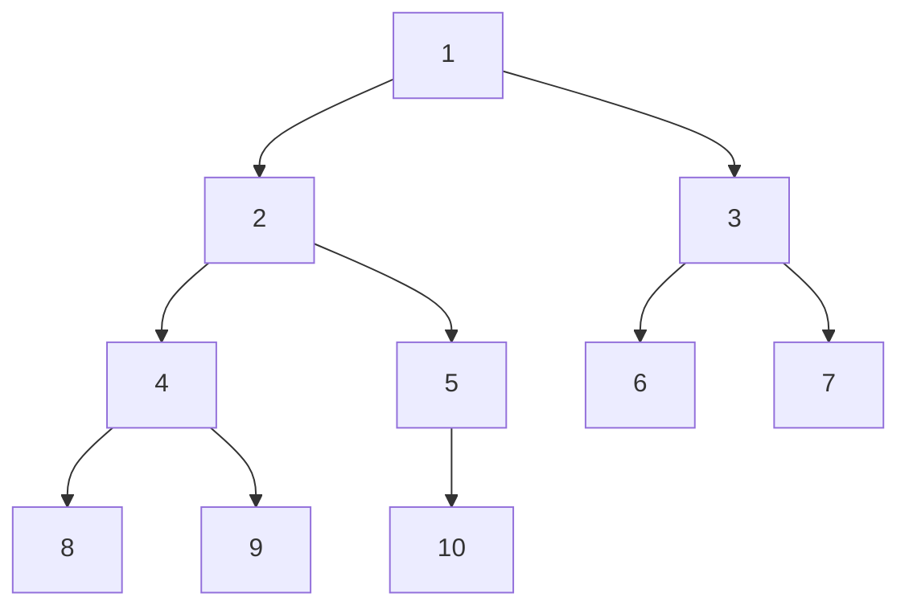
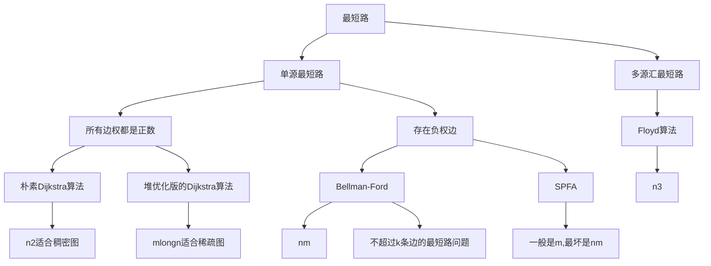
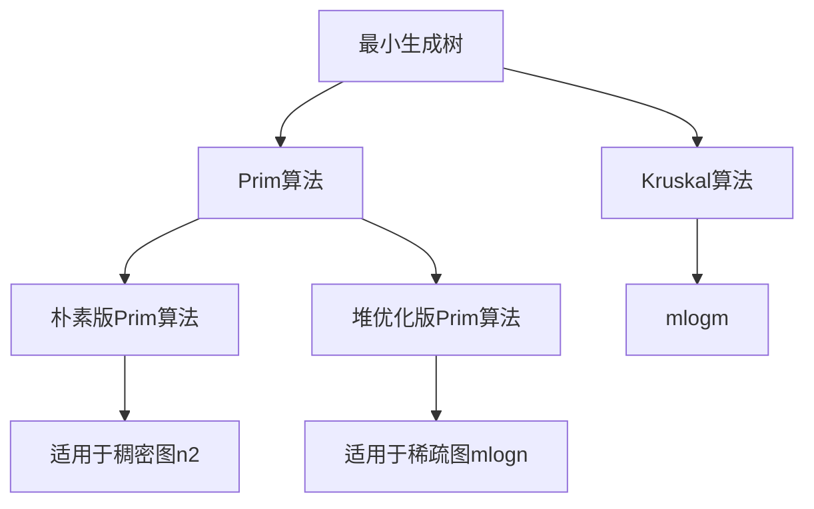
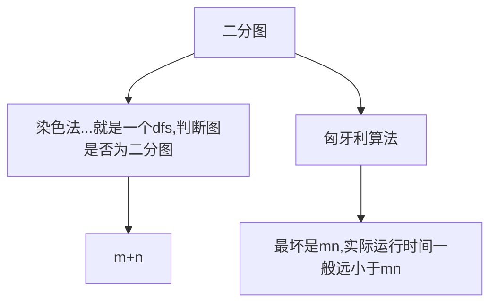
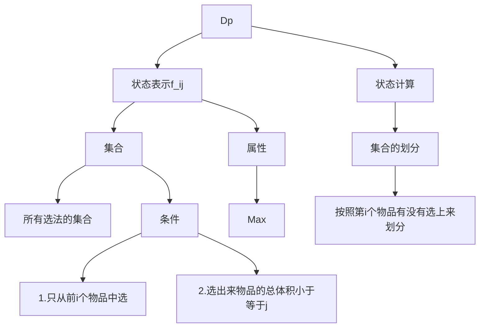
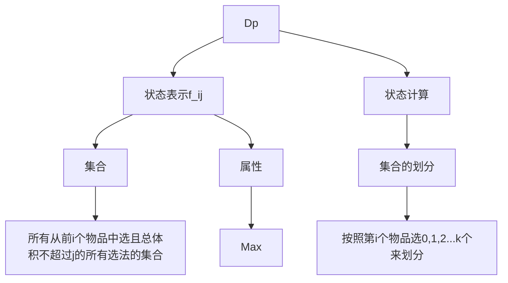
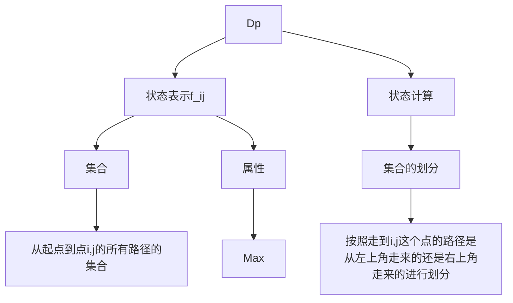
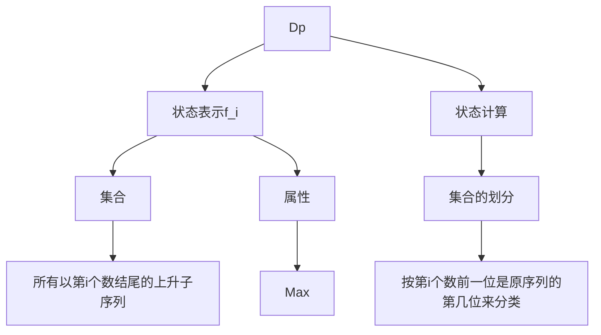
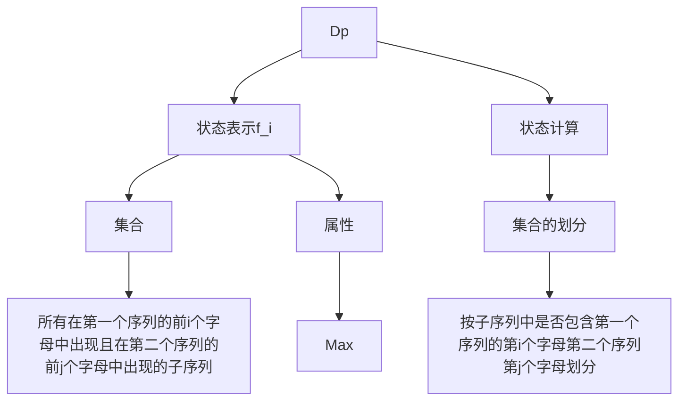
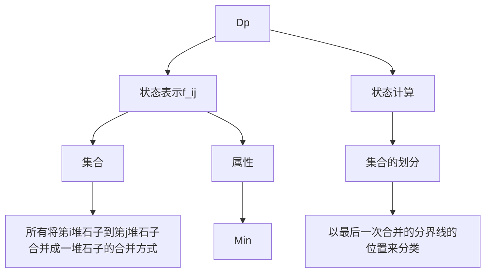

# 算法总结


## 基础算法

### 1. 快速排序

<font color=#dd0000>**平均为$nlog_2 n$ ，最坏为$n^2$，分治思想**</font>


1. 选择分界点`x` <br />
    $x=q[l] 或 q[(l+r)/2] 或 q[r]$ 
2. 调整区间       **重难点**
3. 递归处理左右两段


**思想**：通过设置两个指针i，j分别指向初始序列的两端
 i 和 j 相遇后只可能会出现  `i == j`   和   `i = j + 1`  两种情况


**注意  i = l - 1 ,   r = r + 1**

```c++
#include "iostream"

using namespace std;

const int N = 1e5 + 10;
int n;
int q[N];

void quick_sort(int q[], int l, int r)
{
    if (l >= r) return;
    
    // x 取q的中间值万能
    int x = q[(l + r) / 2], i = l - 1, j = r + 1;
    
    // 指针i 和 j 一旦相遇就结束
    while(i < j)
    {
        do i++; while(q[i] < x);
        do j--; while(q[j] > x);  // 注意是j--
        if (i < j) swap(q[i], q[j]);
    }
    
    /* 
    注意若取j j+1，则x=q[*]，*不能取右边界 
    若取i-1 i，则x=q[*]，不能取左边界
    */
    quick_sort(q, l, j);
    quick_sort(q, j + 1, r);
    /*
    quick_sort(q, l, i - 1);
    quick_sort(q, i, r);
    */
}

int main()
{
    scanf("%d", &n);
    for (int i = 0; i < n; i++) scanf("%d", &q[i]);
    
    quick_sort(q, 0, n-1);
    
    for (int i = 0; i < n; i++) printf("%d ", q[i]);

    return 0;
}
```


### 2. 快速选择
<font color=#dd0000>**O(n)**</font>


与快速排序差不多，只是快速选择需要再输入一个 k 值，最后不用对左右两个区间递归，而只需要对左或右区间进行递归


```c++
// C++里面的函数参数与全局变量重名，优先使用局部变量
```


### 3. 归并排序

<font color=#dd0000>**O(nlogn)，分治思想**</font>


1. 确定分界点  x = (l + r) / 2
2. 递归排序左右两端
3. 对左右两端排序好的序列归并（合二为一） **重难点**


```c++
#include "iostream"

using namespace std;

const int N = 1e6 + 10;

int n;
int q[N], tmp[N];
// 因为q[N]已经是全局变量了， 所以函数参数有没有q无所谓 了

void merge_sort(int q[], int l, int r)
{
    if (l >= r) return;
    
    int mid = l + r >> 1;
    
    merge_sort(q, l, mid); merge_sort(q, mid + 1, r);
    
    int k = 0, i = l, j = mid + 1;
    while(i <= mid && j <= r)
    	if (q[i] <= q[j]) tmp[k++] = q[i++];
    	else tmp[k++] = q[j++];
    while (i <= mid) tmp[k++] = q[i++];
    while (j <= r) tmp[k++] = q[j++];
    
    for (i = l, j = 0; i <= r; i++, j++) q[i] = tmp[j];
}

int main()
{
    scanf("%d", &n);
    
    for (int i = 0; i < n; i++) scanf("%d", &q[i]);
    
    merge_sort(q, 0, n-1);
    
    for (int i = 0; i < n; i++) printf("%d ", q[i]);
    
    return 0;
}
```


### 4. 二分
<font color=#dd0000>**<u>用来查找</u>**</font>

#### 4.1 整数二分

- 二分的本质是找到一个**性质**，可以确定一个边界问题
- 有单调性一定可以二分， 而可以二分的不一定有单调性
- 求最值考虑一下二分


<font color=#FF00>**板子**</font>

```c++
// 区间[l, r]被划分成[l, mid]和[mid + 1, r]时使用
int bsearch_1(int l, int r)
{
    while(l < r)
    {
        int mid = l + r >> 1;
        if (check(mid)) r = mid;
        else l = mid + 1;
    }
    return l;
}

// 区间[l, r]被划分成[l, mid - 1]和[mid, r]时使用
int bsearch_2(int l, int r)
{
    while(l < r)
    {
        int mid = l + r + 1 >> 1;
        if (check(mid)) l = mid;
        else r = mid - 1;
    }
    return l;
}
```

- while里面的模板直接使用，具体`check函数`根据题目来分析
- 二分一定是有解的；无解情况取决于题目性质
- 每次二分之后保证答案在所选区间内部


```c++
// 找到第一个大于等于 x 的位置
// 可以这么思考：数轴上有若干个连续分布着的 x ，且mid左右两边都有x存在，则q[mid] >= x的判定条件即可将区间划分为[l, mid]，逐次进行即可找到第一个x；反之，q[mid] <= x的判定条件即可将区间划分为[mid, r]
while (l < r)
{
    int mid = (l + r) >> 1;
    if (q[mid] >= x) r = mid;
    else l = mid + 1;
}
```


#### 4.2 浮点数二分


```c++
int dou_bsearch_1(int l, int r)
{
    while(l - r > 1e-8)
    {
        double mid = l + r >> 1;
        if (check(mid)) r = mid;
        else l = mid;
    }
    return l;
}

int dou_bsearch(int l, int r)
{
    while(l - r > 1e-8)
    {
        double mid = l + r >> 1;
        if (check(mid)) l = mid;
        else r = mid;
    }
    return l;
}
```

- 一般1e8这个地方看题目要求， 总是比题目要求保留小数位数多2
`eg`：保留4位小数，1e6


### 5. 高精度

#### 5.1 高精度相加

```
A + B      len(A), len(B) <= 1e6
```

#### 5.2 高精度相减

```
A - B       len(A), len(B) <= 1e6
```

#### 5.3 高精度乘法

```
A * a      len(A) <= 1e6      a <= 1e9
```

#### 5.4 高精度除法

```
A * a      len(A) <= 1e6      a <= 1e9
```


#### 5.5 大整数


- 大整数在c++里面用数组来表示（存储）
- 把大整数的每一位存到数组里面，按照低位在前进行存储（即第零位存个位）
    > `原因`：两个数进行运算会出现进位的可能，这时将高位数放到数组最后一位会使得数据处理起来更方便（否则便会从数组第一位依次后移，效率降低）（栈？？？）
- 用库函数<vector>来表示一个大整数，一个size函数， 表示一个数组的长度，就不用再额外开一个内存来存储数组的长度了
- 模拟人工加法


### 6. 前缀和 
<font color=#dd0000>**数组下标从1开始**</font>

#### 6.1 一维前缀和
$S_i = a_1 + a_2 + ... + a_i$

意味着$S_0 = 0$，对应于后面，与后面$S_r - S_{l-1}$ 保持一致


如何求$S_i$            
**一维前缀和**
```c++
for (int i = 1; i < n; i++)
    S_i = S_{i - 1} + a_i
```

作用：**能够快速地求出原数组中一段数的和**

区间`[l, r]`这一段的和：$S_r - S_{l-1}$

前缀和$S[i] = a[1] + a[2] + ... a[i]$

原数组中一段数的和$a[l] + ... + a[r] = S[r] - S[l - 1]$


#### 6.2 二维前缀和


- S[i, j] 表示 第 i 行 j 列格子左上部分所有元素的和
    > $S[i, j] = S[i - 1][j] + S[i][j - 1] - S[i - 1][j - 1] + a[i][j]$

- 以 ( x1 ,  y1 ) 为左上角， ( x2 ,  y2 ) 为右下角的子矩阵的和为：
    > $S[x2, y2] - S[x1 - 1, y2] - S[x2, y1 - 1] + S[x1 - 1, y1 - 1]$


### 7. 差分 
<font color=#dd0000>**数组下标从1开始**</font>

**前缀和的逆运算**

#### 7.1 一维差分

```c++
给定a[1], a[2], ... , a[n]，构造差分数组b[N] ，使得 a[i] = b[1] + b[2] + ... + b[i]，即 a 数组是 b 数组的一个前缀和
```

```c++
核心操作：将a[L, R]区间所有数字加上C， 等价于 b[L] += C, b[R + 1] -= C
```

 

**构造b数组**---即假设a数组全为0， 则b数组也全为0，但实际上，a数组不全为0。这里需要构造一个插入函数，


#### 7.2 二维差分


```c++
给以(x1, y1)为左上角，(x2, y2)为右下角的子矩阵中的所有元素加上c：
S[x1, y1] += c, S[x2 + 1, y1] -= c, S[x1, y2 + 1] -= c, S[x2 + 1, y2 + 1] += c
```


### 8. 双指针算法
<font color=#dd0000>**优化**</font>


- **单调** 考虑二分或双指针
- 先写出暴力解法，再看枚举时i j 的单调关系


**核心思想**：将双重for循环的O(n^2)的暴力法优化到O(n)


```c++
for (int i = 0; i < n; i++)
{
    int j = i;
    while (j < i && check()) j++;
    
    // check()寻找i j 之间的关系（比如单调性）
    // 以上是基本模板格式，下面具体问题具体分析
}
```


### 9.位运算

#### 9.1 n的二进制表示中第k位是几（个位是第0位，依次）

1. 先把n的第k位移到第0位   n >> k
2. 再看个位数是几   (n >> k) & 1
3. 综述        (n >> k) & 1


#### 9.2 lobit(x)   

```c++
return x&-x; // 与运算，将x变为二进制进行与运算  
```

- 返回x的二进制的最右边的一个1 
    > 例如：lowbit(100100) => 100


### 10. 离散化

类似于在一个很大的给定区间范围上，但是可以用到的区域占比很小（类比稀疏矩阵）

通过将所需要用到的数据点坐标映射为1， 2， 3， ... 这样的有序（因为提前将数据进行了排序去重）序列（二分实现），来达到离散化算法的功效。

在大数轴上有很多数据，但是仅仅只用到了很少的一部分，我们只需要将用到过的数据，比如将数据值`x`的坐标映射到1，2，3...这个小数轴上面的坐标值即可。如果需要计算大数轴上面`L~R`之间的数据和，只需要将`L`与`R`分别映射到小数轴上面的`l`与`r`，再在小数轴上面求前缀和即可。最终避免了开很大的数组造成的空间浪费。

- 必须加入下面这两行代码（先排序，再去重）

```c++
sort(alls.begin(), alls.end())
alls.erase(unique(alls.begin(), alls.end()), alls.end())
```

**Java/Python**实现unique()函数
```c++
// 双指针算法
// 满足性质：第一个数 或者 当前这个数与前一个数不同 说明这个数是第一次出现
for (int i = 0, j = 0; i < n; i++)
    if (!i || a[i] != a[i - 1])
        a[j++] = a[i];

// a[0]~a[j - 1]即为a[n]中所有不重复元素 
```


### 11.区间合并
<font color=#dd0000>**贪心思想**</font>

> 跟区间有关的题目，大部分都是贪心；可以对区间左端点 || 右端点 || 左右端点双关键字排序 

将有交集的区间合并为一个区间（取并集） 

1. 按区间左端点进行排序
2. 对于当前所维护的区间`I`而言，其下一个区间`J`与当前的区间`I`仅可能存在3种位置关系
   1. `J`完全包含于`I`区间中；此时答案为`I`
   2. `J`与`I`有部分交集；此时两个区间取并集
   3. `J`与`I`没有交集；此时即可将`I`区间存放如答案中，以`J`区间作为下一个维护的区间进行讨论

```c++
void merge(vector<PII> &segs)
{
    vector<PII> res;
    
    sort(segs.begin(), segs.end());
    
    int st = -2e9, ed = -2e9;
    for (auto seg : segs)
        if (ed < seg.first)
        {
            if (st != -2e9) res.push_back({st, ed});
            st = seg.first, ed = seg.second;
        } 
        else ed = max(ed, seg.second);
    if (st != -2e9) res.push_back({st, ed});
    
    segs = res;
}
```


## 数据结构


* <u>~~都是用来做优化的~~</u>


### 1. 链表

#### 1.1 单链表

在算法中用的最多的是邻接表（n个链表）

邻接表主要存储数和图

用数组模拟链表（用于笔试）

结构体指针构造链表会超时（用于面试）

```c++
const int N = 100010;

// head表示头结点的下标
// e[i]表示结点i的值
// ne[i]表示结点i的next指针是多少
// idx表示当前所用的是第几个结点
int head, e[N], ne[N], idx;

void init()
{
    head = -1, idx = 0;
}

// 将x插入到头结点
int add_to_head(int x)
{
    e[idx] = x, ne[idx] = head, head = idx++;
}

// 将x插入到下标是k的结点的后面
int add(int k, int x)
{
    e[idx] = x, ne[idx] = ne[k], ne[k] = idx++;
}

// 将下标是k的点的后面的点删掉
int remove(int k)
{
    ne[k] = ne[ne[k]];
}
```


#### 1.2 双链表

用来优化某些问题

```c++
const int N = 100010;

int e[Nl, l[N], r[N], idx;

// 初始化
void init()
{
    // 0表示左端点，1表示右端点
    r[0] = 1, l[1] = 0;
    idx = 2;
}

// 在下标是k的点的右边，插入x
// 在下标是k的点的左边插入x只要执行操作add(l[k], x);
int add(int k, int x)
{
    e[idx] = x;
    l[idx] = k;
    r[idx] = r[k];
    l[r[k]] = idx;
    r[k] = idx;
}

// 删除第k个点
int remove(int k)
{
    r[l[k]] = r[k];
    l[r[k]] = l[k];
}

```


### 2. 栈

```c++
const int N = 100010;

int stk[N], tt = 0;

// 插入
stk[++tt] = x;

// 弹出
tt--;

// 判断栈是否为空
if (tt > 0) not empty;
else empty;

// 取出栈顶元素
stk[tt];

```


#### 单调栈应用

给定一个序列，求序列中每一个数左边离它最近的且比它小的数字，若不存在则返回-1

与双指针思路类似，先暴力求解，再探究规律


### 3. 队列

```c++
const int N = 100010;

// 在队尾插入元素，在队头弹出元素
int q[N], hh, tt = -1;

// 插入
q[++tt] = x;

// 弹出
hh++;

// 判断队列是否为空
if (hh <= tt) not empty
else empty

// 取出队头元素
q[hh]
```

#### 单调队列

典型应用：**滑动窗口** 求滑动窗口里面的最大值或最小值

与双指针思路类似，先暴力求解，再探究规律，删去没有用的元素，就得到单调性了，利用单调性求极值


- 比如要**寻找一个滑动块内的最小值** 利用队列来维护滑动块内的信息
>  假设有队列`q`（数组存储的是下标），队头`hh`，队尾`tt`，滑动块长度为`k`，队头处存储的永远是滑动块内的最小值的下标
> 
> 假设滑动块移动到了某一区域，此时在滑动区间内有最小值`x`，坐标为`q[hh]`；随着滑动块的移动，只要这个`x`还未移出滑动块内（`i - k + 1 <= q[hh]`），那么滑动块内的最小值就仍是`x`，保持不变；如果随着滑动块的移动，此时从队尾入队的元素`y`，有`y <= 队头元素所存储的最小值，即x`，则`x`出队`y`入队，`y`的坐标就变为了`q[hh]`。循环往复...

**代码参考**
```c++
int hh = 0, tt = -1;
for (int i = 0; i < n; i++) 
{
    if (hh <= tt && q[hh] < i - k + 1) hh++;
    while (hh <= tt && a[q[tt]] >= a[i]) tt--;
    q[++tt] = i;
    if (i - k + 1 >= 0) cout << a[q[hh]] << ' ';
}
```


### 4. KMP
$O(n)$

- **`next`数组**
`next[i] = j`的含义：模板串`P`中以`i`为终点的后缀子串和以`1`开始的前缀子串长度相等，均为`j`，且有子串的长度最长；即`P[1 ~ j] = P[i - j + 1 ~ i]`

- **`KMP`匹配过程**
在对目标串`S`进行匹配时，假设匹配到`S`串的第`i - 1`个位置与`P`串的第`j`个位置之前都是相等的；但是当匹配到`S`串的第`i`个位置与`P`串的第`j + 1`个位置时，有`S[i] != P[j + 1]`而且此时模板串的指针还没有回退到模板串的起始位置，则此时调用`next`数组，将模板串`P`向前移动`next[j]`再继续看`S`串的第`i`个位置与`P`串的第`next[j] + 1`个位置是否相等，若不等且此时模板串的指针还没有回退到模板串的起始位置则继续移动`next[next[j]]`，否则如果相等，则指针向前移动，直至结束匹配；匹配结束时，仍要令模板串向前移动`next[指针位置]`（因为匹配成功后，目标串可能还有剩余的元素未进行匹配，进行`next`操作以进行后续的下一次匹配

**代码参考**
```c++
// 求next数组
// 由于next[1] = 0，故从i = 2开始
for (int i = 2, j = 0; i <= n; i++)
{
    while (j && p[i] != p[j + 1]) j = ne[j];
    if (p[i] == p[j + 1]) j++;
    ne[i] = j;
}

// KMP匹配过程
for (int i = 1, j = 0; i <= m; i++)
{
    while (j && s[i] != p[j + 1]) j = ne[j];
    if (s[i] == p[j + 1]) j++;
    if (j == n)
    {
        cout << i - n << ' ';
        j = ne[j];
    }
}
```

可以用来求循环节，其他体型好像都不如字符串前缀哈希了


### 5. Trie
应用：AC自动机

<u>**一般出现的字符串类型：全是小写字母、全是大写字母、只有数字、只有0/1**</u>

<u>用来快速（高效）**存储**和**查找**字符串集合的数据结构</u>

**Trie树的存储**
构造过程可以想想FP_tree的构造过程（~~关联规则的一种方法，如果还可以想起来的话~~；Trie树会在每个字符串的结尾处做一个标记，表示这个字符串的结束


**代码参考**
```c++
// son[N][26]表示存储的是`Trie`树中每个节点的所有儿子；cnt[N]表示以当前节点结尾的元素有多少个；idx表示当前用到了哪个下标（下标为0的点，既是根节点也是空结点） 
// 插入节点，建立Trie树
void insert(string str)
{
    int p = 0;
    for (int i = 0; str[i]; i++)
    {
        int t = str[i] - 'a';
        if (!son[p][t]) son[p][t] = ++idx;
        p = son[p][t];
    }
    cnt[p]++;
}

// 查询
int query(string str)
{
    int p = 0;
    for (int i = 0; str[i]; i++)
    {
        int t = str[i] - 'a';
        if (!son[p][t]) return 0;
        p = son[p][t];
    }
    return cnt[p];
}
```


### 6. 并查集
**~~面试笔试    思维~~**

- 应用之一：Kruskal

**用途：**
1. 将两个集合合并
2. 询问两个元素是否在一个集合中

近乎$O(1)$的时间复杂度，快速地支持上面的两个操作

**基本原理**：每个集合用一棵**树**来表示。树根的编号就是整个集合的编号。每个节点存储它的父节点，即p[x]表示x的父节点。

**问题**
1. 判断树根： `if（p[x] == x）`
2. 求x的集合编号：`while（p[x] != x） x = p[x];`；此时该操作的复杂度还是很高，可以看出，与树高成正比
    > **优化**：**路径压缩**：节点x沿着它的父亲节点一路找，一旦找到根节点，就将节点x寻找根节点路径上的所有节点都指向根节点
3. 合并两个集合：设p[x]是x的集合编号，p[y]是y的集合编号。则合并操作：`p[x] = y`或`p[y] = x`

<u>**核心操作**</u>

```c++
// 寻找x结点的祖宗节点 + 路径优化
int find(int x)
{
	if (p[x] != x) p[x] = find(p[x]);
	return p[x];
}
```

<!-- **食物链**
不论两个动物之间是不是同一种生物、是不是被吃的关系，都将它们放到一个集合中，即一个树中

那么如何确定其中两个动物之间的关系呢？记录一下每个点与根节点之间的关系；只要我们知道了每个点与根节点的关系了，就可以知道每两个点之间的关系了

利用每个点与根节点之间的距离表示其与根节点之间的关系

- 距离 % 3 = 1 表示可以吃根节点
- 距离 % 3 = 2 表示可以被根节点吃
- 距离 % 3 = 0 表示与根节点同类

在这道题中，利用并查集维护每个点到根节点的距离   -->


### 7. 堆

<u>维护一个数据集合</u>


* 基本操作
* 插入与删除都只与树的高度有关，故是logn的

1. 向集合中插入一个数
2. 求集合当中的最小值
3. 在集合中删除最小值
4. 删除集合中任意一个元素
5. 修改集合中任意一个元素


这里规定高度/深度/层数都是从1开始的

直接建堆是O(nlogn)的       -PS：因为插入是logn的

可以使用O(n)来建堆

```c++
for (int i = n / 2; i ; i--) down(i);
```

完全二叉树的第n/2个结点是最后一个非叶子节点


代码

```c++
// 设堆是heap[], 堆的大小是size
//1.
heap[++size] = x; up(size);
//2.
heap[1];
//3.  拿最后一个结点把第一个结点覆盖掉，再down      PS：因为是用一维数组存储的，所有删掉第一个元素是O(n)的，而删除最后一个元素是O(1)的
heap[1] = heap[size]; size--; down(1);
//4.
heap[k] = heap[size]; size--; down(k) / up(k);
//5.
heap[k] = x; down(k) / up(k);
```


堆是一个完全二叉树           堆中某个节点的值总是不大于或不小于其父节点的值

小根堆：每个节点的值都 ≤ 它的左右儿子的值


* 堆的存储结构（堆状数据结构/完全二叉树）：一维数组         一维数组就可以存下一棵树

***1号点是根节点   下标是x的结点的左儿子下标是2x，右儿子下标是2x+1***

下面的一维数组即表示下面的小根堆

| 1   | 2   | 3   | 4   | 5   | 6   | 7   | 8   | 9   | 10  |
| --- | --- | --- | --- | --- | --- | --- | --- | --- | --- |




***基本操作***

1. down(x)（将结点往下调整）
2. up(x)（将结点往上调整）


### 8. Hash

- **离散化**
  - 离散化是一种特殊的hash   
  - 离散化 = 排序 + hash
  - 离散化保证了映射后原数据的顺序保持不变，hash并没有保证
  - 离散化是nlogn（maybe），hash是O(1)的


把一堆数据映射到$0$~$N$的小空间（$N$=$10^5$~$10^6$）

<!-- 将所有的数放在小空间中，解决冲突问题 -->

**冲突问题是指利用hash函数映射后，可能会出现多个数映射到同一个数的情况**

利用hash函数进行映射，一般取对$10^5$取模这个操作作为hash函数 $h(x) = x\mod10^5$，**其中$10^5$取质数，且取距离2的整次幂尽可能远**（冲突的概率是最低的）


根据处理冲突问题的不同的解决方案，分为**开放寻址法**和**拉链法**

#### 8.1 哈希表的存储结构
hashmap是拉链法，threadlocal是开放寻址法？？？？

hash在算法题中一般只有插入和查找这两个操作，没有删除


#### 8.2 开放寻址法

开了一个一维数组，数组大小为题目要求大小的2~3倍

**插入过程** 先找到`k=hash(x)`，然后从`k`开始往后找，直到找到第一个空的坑位为止，插进去

**查找过程** 先找到`k=hash(x)`，从前往后找，先看一下当前位置有没有人，如果**当前位置有人且这个人为x**，那么就找到了`x`；如果当前位置有人但是这个人不是`x`，就继续看下一个位置；如果当前位置没有人，则`x`不存在

**删除过程** 按照查找的方式找`x`，当找到`x`后，给他一个标记，代表删除了


```c++
// 核心函数
// find函数  如果x在哈希表中已经存在，就返回x所在的位置；如果x在哈希表中不存在，则返回x应该存储的位置
int find(int x)
{
    int k = (x % N + N) % N;
    
    // 茅厕寻址法：当当前坑位有人且当前坑位中的人不是你要找的人才进入循环
    // null = 0x3f3f3f3f > 1e9
    while (h[k] != null && h[k] != x)
    {
        k++;
        if (k == N) k = 0;
	}
    
    return k;
}
```

#### 8.3 拉链法

利用邻接链表的结构存储hash的映射值

开一个一维数组来存储所有的hash值，该一维数组每个结点都表示一个表头
> 其中数组大小为“利用hash函数进行映射，一般取对$10^5$取模这个操作作为hash函数 $h(x)$=$x \mod 10^5$，其中$10^5$取质数，且取距离$2$的整次幂尽可能远（冲突的概率是最低的）“这样大小的）

**插入过程** 若经过hash映射后，出现了两个相同的映射值，则依次将这两个数插到对应一维数组头节点下面，形成邻接链表。

**查找过程** 对于要查找的x的映射值，有hash(x)，找到对应的位置，再对该位置的链表进行遍历

**删除过程** 开一个bool数组，把要进行删除的元素打一个标记

```cpp
void insert(int x)
{
    int k = (x % N + N) % N;
    e[idx] = x, ne[idx] = h[k], h[k] = idx++;
}

bool find(int x)
{
    int k = (x % N + N) % N;
    
    for (int i = h[k]; i != -1; i = ne[i])
        if (e[i] == x)
            return true;
    
    return false;
}
```


#### 8.4 字符串前缀哈希法
假定不存在冲突

快速判断两个字符串是否相等

---

1. 先预处理出所有前缀的哈希值
2. 求出所有的前缀字符串的哈希值
3. 利用这些前缀字符串哈希值可以表示出字符串中任意子串

---

---

**<u>将任意字符串转化为哈希值的方法：</u>**

把字符串看作p进制数

把p进制数转化为10进制数

对该字符串哈希值mod Q

则对于任意一个字符串，都可以将其表示为0~Q-1的一个数字（通常不将字符串映射成0）

***取p = 131或13331，Q = 2^64***

---


## 搜索与图论


DFS和BFS都可以对整个空间搜索，搜索结构都是树的形式。

但是DFS尽可能往深了搜，一旦达到叶节点就会回溯

BFS会将当前这一层搜索完了才会继续搜索下一层


### 1. DFS

**思路比较奇怪就用DFS或对空间要求比较高**

依靠stack

空间复杂度为 O(h)   即与高度成正比

不具有最短路性质


时间复杂度为线性的


DFS俗称“暴搜”

要考虑好**顺序**


从搜索树的角度考虑


回溯


剪枝


### 2. BFS

**问最短距离，最小步数，最少操作几次** （前提是每个边的权重都是一样的）


依靠queue

空间复杂度为O(2^h)

具有最短路性质


### 3. 树和图的存储


树是无环连通图，是一种特殊的图


可以把无向图变成两个方向的有向图，只用考虑有向图的存储即可实现无向图的存储


存储方式分为**邻接矩阵**和**邻接表**两种


**邻接矩阵** 用一个二维数组实现 g\[a\]\[b\] 存储边a到边b的信息（即权重）不能存储重边 适合存储稠密图  O(n^2)

**邻接表** 就是n个单链表（其中n表示节点个数），每个单链表用来存储这个结点可以到达的结点 

往邻接表中插入数据时，选择在链表头进行插入


常用**邻接表**来存储


### 4. 树和图的遍历


分为深度优先遍历和广度优先遍历，每个点只需遍历一次   时间复杂度是O(n + m)   n为节点数，m为边数


只用考虑有向图的遍历即可（无向图是一种特殊的有向图，树是一种特殊的图）


遍历只需要找到一条路即可，不必再像dfs中再恢复现场


这两种搜索方式的思想就是dfs和bfs


####深度优先遍历
```cpp
void add(int a, int b)
{
    e[idx] = b, ne[idx] = h[a], h[a] = idx++;
}

void dfs(int u)
{
    st[u] = true;

    for (int i = h[u]; i != -1; i = ne[i])
    {
        int j = e[i];
        if (!st[j]) dfs(j);
    }
}
```

dfs会求得每一个子树的大小


####广度优先遍历
```cpp

```


### 5. 拓扑序列

针对有向图，无向图没有拓扑序列


是广度优先算法的应用


有向无环图一定存在一个拓扑序列    有向无环图也被称为拓扑图

有向环图一定不存在拓扑序列


所有入度为0的点都可以排在当前序列中最前面的位置


### 6. 最短路


n表示结点数，m表示边数




最短路问题的核心是如何把题干抽象为一个图，如何定义点和边来确定最短路问题


#### 6.1 朴素Dijkstra算法

```cpp
// 1.初始化dist数组
dist[1] = 0, dist[i] = 0x3f3f3f3f; // i = 2,3,...,n

// 2.
for (int i = 0; i < n; i++)
{
    // （1）
    先找出不在s中的最短距离的点t
    
    // （2）
    将此最短距离的点t加入最短路数组s中
        
    // （3）
    用此次的最短距离的点t来更新其他点的距离
}
```


#### 6.2 堆优化版Dijkstra算法

```cpp
// 初始化dist数组
dist[1] = 0, dist[i] = 0x3f3f3f3f;

利用priority_queue来存储，可以将朴素Dijkstra的（1）优化到O(1)
priority_queue 更新操作是logn的，而低（3）步一共需要更新所有的边共m次，故时间复杂度为mlogn
但是priority_queue 中不支持修改任意一个元素，只能接受冗余的存在，即每次修改都往堆里面插入一个新的数
所以本来堆里面是有n个数（手写堆可以保证），但是此时用的STL，priority_queue里面会有m个数
所以实际上的时间复杂度为mlogm
// 2.
for (int i = 0; i < n; i++)
{
    // （1）
    先找出不在s中的最短距离的点t // O(1)
    
    // （2）
    将此最短距离的点t加入最短路数组s中 // O(1)
        
    // （3）
    用此次的最短距离的点t来更新其他点的距离 // logn
}
```


#### 6.3 Bellman-Ford算法

如果图中存在负权回路，则最短路可能会不存在（为-∞）

```cpp
for (int i = 0; i < n; i++)
{
    备份dist
    for (循环所有边 a b w  由a->b，权重为w)
        更新每一条边 dist[b] = min(dist[b], dist[a] + w); // 松弛操作
}
```


​	

#### 6.4 SPFA

只要图中没有负环，就可以用SPFA

```cpp
// 初始化队列
q.push(1);

// 队列中存储的是从起点到该节点距离变小的结点

//
while (q.size())
{
    取出队列的首元素t，弹出首元素
    
    更新t的所有出边，并把对应的出边的结点加到队列里面（因为t的所有出边由于t是变小的，所以它的所有出边也变小了，也要加入到队列中）（如果队列里面有了就不用了）
}
```


#### 6.5 Floyd

```cpp
// 邻接矩阵存储所有的边
for (int k = 1; k <= n; k++)
    for (int i = 1; i <= n; i++)
        for (int j = 1; j <= n; j++)
            d[i][j] = min(d[i][j], d[i][k] + d[k][j]);
```


### 7. 最小生成树


最小生成树一般涉及到的图都是无向图


稠密图，一般就用朴素版Prim算法

稀疏图，一般用Kruskal算法

堆优化版Prim算法不常用



#### 7.1 朴素版Prim算法

```cpp
初始化dist[N] <- 0x3f3f3f3f

for (int i = 0; i < n; i++) // 循环n次
{
    找到集合外距离最近的点t
    
    用t来更新其他点到集合的距离
        
    st[t] = true;
}
```


#### 7.2 Kruskal算法

```cpp
将所有边按权重从小到大进行排序  //O(mlongm)
    
// 并查集思想   并查集是O(1) 总共就是O(m)
枚举每条边a-b，权重为c
    若a-b不连通，则将a-b这条边加入到集合中
```


### 8. 二分图




#### 8.1 染色法

一个图是二分图当且仅当图中不含奇数环

```cpp
for (int i = 1; i <= n; i++)
    if (i未被染色)
        dfs(i, color)
```


#### 8.2 匈牙利算法[NTR算法bushi]

存储用邻接表


最坏时间复杂度是


## 数学知识


### 1. 数论


#### 1.1 质数

在大于1的整数中，如果只包含1和其本身这两个约数，则该数就称为质数/素数


##### 1.1.1 质数的判定----试除法

```cpp
// 从定义来
// O(n)
bool is_prime(int x)
{
	if (x < 2) return false;
    for (int i = 2; i < x; i++)
        if (x % i == 0)
            return false;
   	return true;
}

// 优化后
// O(sqrt(n))
bool is_prime(int x)
{
    if (x < 2) return false;
    for (int i = 2; i <= n / i; i++)
        if (x % i == 0)
            return false;
   	return true;
}
// 原理见下方的数学块中内容
```

$$
如果d|n，则\frac{n}{d}|n。因此若要枚举n的所有大于1的约数，只需要有d \lt \frac{n}{d}，即枚举到\frac{n}{d}即可\\
$$


##### 1.1.2 分解质因数----试除法

$$
分解质因数：一个数x可以分解为，x = {p_1}^{\alpha_1}{p_2}^{\alpha_2}...{p_k}^{\alpha_k}，其中p_1,p_2,...,p_k均为质数
$$


$$
一个数x中至多只包含一个大于\sqrt{n}的质因数
$$

```cpp
// 最坏是O(sqrt(x))，最好的O(logn)---比如x=2^k;
void divide(int x)
{
    for (int i = 2; i <= x / i; i++)
        if (x % i == 0)
        {
            int num = 0;
			while (x % i == 0)
            {
                x /= i;
                num++;
            }
            cout << i << ' ' << num << endl;
        }
    if (x > 1) cout << x << ' ' << 1 << endl;
}
```


##### 1.1.3 筛质数

将所有小于等于x的质数筛出来


###### 1.1.3.1 朴素筛法

```cpp
int primes[N]; // 用来存储筛出来的质数
bool st[N]; // 如果当前这个数被筛去了，则赋值为true

// 朴素筛法 O(nlogn)
void get_primes(int x)
{
    for (int i = 2; i <= n; i++)
    {
        if (!st[i]) primes[cnt++] = i;
    	for (int j = i + i; j <= n; j += i) st[j] = true;
    }
}
```

**朴素筛法时间复杂度分析**
$$
朴素筛法时间复杂度分析：当i=2时，第二层循环循环\frac{n}{2}；当i=3时，第二层循环循环\frac{n}{3}...当i=n时，第三层循环循环1次。\\故第二层循环总的循环次数为\frac{n}{2} + ... + \frac{n}{n}=n(\frac{1}{2} + ... + \frac{1}{n})，取极限有\lim_{t->+\infty}n(\frac{1}{2} + ... + \frac{1}{n})≈nlnn≈nlogn
$$

$$
\lim_{t->+\infty}(1 + \frac{1}{2} + ... + \frac{1}{n}) = lnn + C，其中C为欧拉常数，lnn为log_en
$$


###### 1.1.3.2 埃氏筛法

```cpp
实际上，上面的第二层循环将2~x中所有数的倍数都枚举了一遍，但实际上，只需要将2~x中的所有质数的倍数枚举删去它们即可，故可做优化
// 埃氏筛法 O(nloglogn)    
void get_primes(int x)
{
    for (int i = 2; i <= n; i++)
        if (!st[i]) 
        {
            primes[cnt++] = i;
        	for (int j = i + i; j <= n; j += i) st[i] = true;
        }
}
```

**埃氏筛法时间复杂度分析**
$$
埃氏筛法时间复杂度分析：由于只用筛去质数的所有倍数，故有\lim_{t->+\infty}n({\frac{1}{2} + ... + \frac{1}{n}}_{质数})≈nlnn/lnn≈nlogn/lnn≈n\\
实际上真实的理论上的时间复杂度为O(nloglogn)
$$

$$
质数定理：1-n当中一共有\frac{n}{lnn}个质数
$$


###### 1.1.3.3 线性筛法

```cpp
// 线性筛法
// 把每一个合数只会被它的最小质因子筛掉
// O(n)
void get_primes(int x)
{
    for (int i = 2; i <= n; i++)
    {
        if (!st[i]) primes[cnt++] = i;
        for (int j = 0; primes[j] <= n / i; j++)
        {
			st[primes[j] * i] = true;
            if (i % primes[j] == 0) break; // primes[j]一定是i的最小质因子
        }
        // 从小到大枚举的所有质数
        // 1. i % primes[j] == 0    primes[j]一定是i的最小质因子,primes[j]一定是primes[j]*i的最小质因子
        // 2. i % primes[j] != 0	primes[j]一定小于i的所有质因子,primes[j]一定是primes[j]*i的最小质因子
        //
        // 对于一个合数x，假设primes[j]是x的最小质因子，则当i枚举到x / primes[j]时，该合数x一定会被筛掉，而且仅用最小质因子来筛，又每个数只有一个最小质因子，所以每个合数只会被筛掉一次，所以是线性的
        //
	}
}
```


#### 1.2. 约数


##### 1.2.1 试除法求一个数的所有约数

```cpp
vertor<int> get_divitors(int x)
{
    vector<int> res;
    for (int i = 1; i <= x / i; i++)
        if (x % i == 0)
        {
			res.push_back(i);
            if (i != x / i) res.push_back(n / i);
        }
    return res;
}
```


##### 1.2.2 约数个数

$$
算数基本定理\\
任何一个数x可以进行质因数分解，分解为x = {p_1}^{\alpha_1}{p_2}^{\alpha_2}...{p_k}^{\alpha_k}，其中p_1,p_2,...,p_k均为质数
$$


**约数个数为**
$$
(\alpha_1+1)(\alpha_2+1)...(\alpha_k+1)
$$

$$
由于一个数x可以进行质因数分解，分解为x = {p_1}^{\alpha_1}{p_2}^{\alpha_2}...{p_k}^{\alpha_k}\\
假设x的其中一个约数为d，则d也可以进行质因数分解，分解为d = {p_1}^{\beta_1}{p_2}^{\beta_2}...{p_k}^{\beta_k}\\
由于每个数的质因数分解形式都是一样的，且对于不同的指数的组合，对应不同的数，所以约数个数就是\beta_1,...,\beta_k的选法的个数\\
又0 \leq \beta_i \leq \alpha_i，因此\beta_i共有\alpha_i + 1种取法\\
所以由乘法原理有约数个数为(\alpha_1+1)(\alpha_2+1)...(\alpha_k+1)
$$

int范围内，拥有最多约数的数的约数个数仅为1536


##### 1.2.3 约数之和

$$
(p_1^0+p_1^1+...+p_1^{\alpha_1})...(p_k^0+p_k^1+...+p_k^{\alpha_k})
$$


#### 1.3. 欧几里得算法/辗转相除法

$$
(a, b) = (b, a \% b)\\
a \% b <===> a-\lfloor \frac{a}{b} \rfloor *b\\
Proof:\\
必要性：如果d=(a, b),则d|a, d|b,即d为a，b的最大公约数；又有d|(ax+by),所以d|(a-\lfloor \frac{a}{b} \rfloor *b)=d|(a\%b),所以d=(b, a \% b)\\
充分性：如果d=(b, a \% b),有d|b,d|(a\%b)=d|(a-\lfloor \frac{a}{b} \rfloor *b),所以d|(a-\lfloor \frac{a}{b} \rfloor *b + \lfloor \frac{a}{b} \rfloor *b)=d|a,所以d=(a,b)
$$

```cpp
int gcd(int a, int b)
{
    return b ? gcd(g, a % b) : a;
}
```


#### 1.4. 欧拉函数

$$
欧拉函数，记作\varphi(n)，表示1-n中与n互质的数的个数（互质就是指两个数的gcd=1）
$$

$$
求欧拉函数的公式：\\
设数N的质因数分解为N={p_1}^{\alpha_1}{p_2}^{\alpha_2}...{p_k}^{\alpha_k}，则\varphi(N)=N(1-\frac{1}{p_1})(1-\frac{1}{p_2})...(1-\frac{1}{p_k})
$$


$$
欧拉函数公式证明（用到了容斥原理）\\
要想求得1-N中和N互质的数的个数就要：①从1-N中减去p_1,p_2,...,p_k的所有倍数;②加上所有p_i*p_j的倍数;③减去所有p_i*p_j*p_k的倍数;④加上所有...\\
就有个数为N-\frac{N}{p_1}-\frac{N}{p_2}-...-\frac{N}{p_k}+\frac{N}{p_1*p_2}+\frac{N}{p_1*p_3}-...+\frac{N}{p_{k-1}*p_k}-\frac{N}{p_1*p_2*p_3}-\frac{N}{p_1*p_2*p_4}-...-\frac{N}{p_{k-2}p_{k-1}*p_k}+...=欧拉函数
$$


```cpp
// 时间复杂度主要取决于分解质因数
// O(logx)-O(sqrt(x))
int euler_func(int x)
{
    int res = x;
    for (int i = 2; i <= x / i; i++)
        if (x % i == 0)
        {
			while (x % i == 0) x /= i;
            res = res / i * (i - 1);
        }
   	if (x > 1) res = res / x * (x - 1);
    return res;
}
```


```markdown
求1-N中每一个数的欧拉函数，用上述做法，就要将每一个数进行质因数分解，则时间复杂度为O(Nsqrt(N))

利用线性筛法来去欧拉函数，会使得时间复杂度降低到O(N)
```

```cpp
void get_eulers(int n)
{
    phi[1] = 1;
    for (int i = 2; i <= n; i++)
    {
        if (!st[i]) 
        {
            primes[cnt++] = i;
            phi[i] = i - 1;
        }
        for (int j = 0; primes[j] <= n / i; j++)
        {
            st[primes[j] * i] = true;
            if (i % primes[j] == 0) 
            {
                // 如果i % primes[j] == 0，则primes[j]是i的最小质因数，即i的质因数分解和i * primes[j]的质因数分解得到的质数是相同的（有相同的质因数），因此phi[i * primes[j]]与phi[i]只差primes[j]倍
                phi[i * primes[j]] = phi[i] * primes[j];
                break;
            }
            // 如果i % primes[j] != 0，则primes[j]是i * primes[j]的最小质因数，就有phi[i * primes[j]] = phi[i] * phi[j]，而j是质因数，所以phi[j] = primes[j] - 1
            phi[i * primes[j]] = phi[i] * (primes[j] - 1);
        }
    }
}
```


**欧拉定理**
$$
若a与n互质，则a^{\varphi(n)}\equiv1(mod \ \ n)，其中\varphi(n)为欧拉函数
$$

$$
Proof:\\
假设1-n中与n互质的数分别为a_1,a_2,...,a_{\varphi(n)}(因为欧拉函数为\varphi(n)),则又由于a与n互质，可知有aa_1,aa_2,...,aa_{\varphi(n)}也与n互质，\\且互不相同（反证法）,而且aa_1,aa_2,...,aa_{\varphi(n)}在模n的情况下是与a_1,a_2,...,a_{\varphi(n)}为同一组数。因此有\\a^{\varphi(n)}a_1a_2...a_{\varphi(n)}\equiv a_1a_2...a_{\varphi(n)}(mod \ n)---->a^{\varphi(n)}\equiv 1(mod \ n)
$$


**费马小定理**
$$
在欧拉定理中，当n为质数时，有a^{n-1}\equiv 1(mod \ n)\\
因为\varphi(n)=n-1
$$


#### 1.5. 快速幂
- 快速幂的**核心思路**：反复平方法
- 能够快速地求出$a^k\ mod\ p$
- 可以在$O(logk)$的时间复杂度下求得上面的结果，其中$0\le a,\ k,\ p\le10^9$


**二进制思想**
预处理出来$logk$个基值 $a^{2^0}mod\ p，a^{2^1}mod\ p，...，a^{2^{log{k}}}mod\ p$

$a^k$可以由上面预处理出来的基来表示（即将`k`转换为二进制表示），而且上面的基有关系为$(a^{2^0})^2=a^{2^1},(a^{2^1})^2=a^{2^2}...$，即当前的数=上一个数的平方再模`p`

```cpp
int qmi(int a, int k, int p)
{
    int res = 1;
    while (k)
    {
    	if (k & 1) res = (long long)res * a % p;
        k >>= 1;
        a = (long long)a * a % p;
    }
    return res;
}
```


**利用快速幂求逆元**

**乘法逆元**的定义：若整数$b$，$m$互质，并且对于任意的整数$a$，如果满足$b|a$，则存在一个整数$x$，使得$\frac{a}{b}≡a×x(mod \ m)$，则称$x$为$b$的模$m$乘法逆元，记为$b^{−1}(mod\ m)$。

b存在乘法逆元的充要条件是$b$与模数$m$互质。

当模数$m$为质数时，$b^{m−2}$即为$b$的乘法逆元。（参见费马小定理）


当$x$为$b$的乘法逆元时，有$x=b^{-1}(mod \ m)$。带入乘法逆元定义式，有$\frac{a}{b}\equiv a×b^{-1}(mod\ m)$，化简得$bb^{-1}\equiv 1(mod\ m)$
由于$m$为质数，由费马小定理可知，$b^{m-1}\equiv1(mod\ m)$，联立有$b^{-1}(mod\ m)=b^{m-2}$


#### 1.6. 扩展欧几里得算法
**裴蜀定理**
$$
对于任意的正整数a，b，一定存在非零整数x，y，使得ax+by=gcd(a, b)
$$
利用扩展欧几里得算法可以求得一组x,y使得x,y满足ax+by=gcd(a,b)


**线性同余方程**


#### 1.7. 中国剩余定理

$$
有m_1,m_2,...m_k两两互质，则对于如下的线性同余方程组\\
\begin{cases}
x = a_1(mod \ m_1) \\
x = a_2(mod \ m_2) \\
...\\
x = a_k(mod \ m_k)
\end{cases}\\
有解为x=a_1M_1M_1^{-1}+a_2M_2M_2^{-1}+...+a_kM_kM_k^{-1}\\
其中M=m_1m_2...m_k,M_i=\frac{M}{m_{i}},M_i^{-1}表示M_i模m_i的逆
$$


### 2. 组合计数


### 3. 高斯消元


### 4. 简单博弈论


## DP


时间复杂度分析：状态数量*计算每个状态需要的计算量


### 1. 背包问题

N个物品和容量为V的背包，每个物品的体积v_i，价值w_i

#### 1.1 0-1背包问题

每件物品最多只能用一次


状态---未知数

状态表示指的是整个问题需要用几维的状态来表示，背包问题一般为两维

状态计算指的是如何一步一步把每一个状态算出来


Dp问题的优化是对状态方程/程序做一个等价变形


每一个状态表示的都是一个集合，集合里面是一堆选法，是所有选法的一个集合

状态计算就是考虑如何把当前的集合划分为若干个更小的子集，使得每一个子集都可以用更小的集合表示出来

集合划分的原则---不重不漏（求num），不漏（求max，min）




#### 1.2 完全背包问题

每件物品可以用无限次



三维时的状态转移方程为 f[i, j] = f[i - 1, j - k * v[i]] + k * w[i]

枚举k将状态转移方程展开

f[i, j] = max(f[i - 1, j], f[i - 1, j - v] + w, f[i - 1, j - 2v] + 2w + ...)

f[i, j - v] =           max(f[i - 1, j - v], f[i - 1, j - 2v] + w, ...)

因此状态转移方程优化为f[i, j] = max(f[i - 1, j], f[i, j - v] + w)


#### 1.3 多重背包问题

每件物品最多只能用s_i次


优化：二进制优化

每件物品最多可以用s_i次
通过二进制优化，可以将s_i拆解为logs_i个（1,2,4,8...），且拆解出来的每一项仅可用一次
因此，所有的物品总共会最多拆解出Nlogs_i个
而每件拆解出来的物品又只能用一次
因此变为了一个0-1背包问题
时间复杂度由NVs降为NVlogs


#### 1.4 分组背包问题

物品有N组，每一组物品有若干种物品，每一组里最多只能选一种物品


### 2. 线性Dp

递推的顺序有一个明显的线性顺序


#### 2.1 数字三角形



左上角走来的状态转移方程f[i - 1, j - 1] + a[i, j]

右上角走来的状态转移方程f[i - 1, j] + a[i, j]

#### 2.2 最长上升子序列

动态规划时间复杂度分析：
状态数量*计算每一个状态需要的的时间


这个算法的时间复杂度为O(n^2)



动态规划求方案就是把状态转移记录下来

#### 2.3 最长公共子序列




#### 2.4 区间Dp

##### 2.4.1 石子划分

以最后一次分界的位置来分类

区间Dp要保证算每个f_ij所依赖的状态都已经算好了
顺序：枚举区间长度，从小到大枚举




## NOTE

- 数据规模在100万以上，采用scanf和printf，否则cin和cout与他俩效率差不多
- bits/stdc++.h  -------     万能头文件

$$
S_i
$$


## STL

* `vector`（变长数组），倍增的思想，支持比较运算（按字典序）
  	定义：：
          `vector <int> a`; 定义：一个vector数组a
          `vector <int> a(10)`; 定义：一个长度为10的vector数组a
          `vector <int> a(10,3)`; 定义：一个长度为10的vector数组a，并且所有元素都为3
      **常用函数**：：
          size(); 返回元素个数  O(1)
          empty(); 返回是否是空  O(1)
          clear(); 清空
          front(); 返回vector的第一个数
          back(); 返回vector的最后一个数
          push_back(); 向vector的最后插入一个数
          pop_back(); 把vector的最后一个数删掉
          begin(); vector的第0个数
          end(); vector的最后一个的数的后面一个数
      **倍增的思想**：    

  ​			操作系统为某一进程分配空间时所花费的时间与空间大小无关，而与申请的次数有关。

  ​			************************************

  ​    **遍历方法**
  ​        假设有个vector <int> a;

  ​		a.begin() = a[0],   a.end() = a[s.size()]

  ​        第一种

  ```c++
   for(int i = 0; i < a.size(); i++) 
       cout << a[i] << ' ';
  ```

  ​        第二种

  ```c++
  for(vector <int>::iterator i = a.begin(); i != a.end(); i++)
      cout << *i << ' ';  
  //vector <int>::iterator可以写为auto
  for(auto i = a.begin(); i != a.end(); i++)
      cout << *i << ' ';  
  ```

  ​        第三种       

  ```c++
  for(auto x : a) 
      cout << x << ' ';
  ```

​		**支持比较运算**

​					按字典序比较，从第一个值开始比较，如果当前值小于则小于，如果等于则比较下一位


* `pair`，支持比较运算，以first为第一关键字，以second为第二关键字（按字典序）
      定义：：

  ​        pair <类型,类型> 变量名; 存储一个二元组    两个类型可以不同
  ​    初始化方式：
  ​        假设有个pair <int,string> p;
  ​        第一种        

  ```c++
  p = make_pair(10,"abc");
  ```

  ​        第二种         

  ```c++
  p = {10,"abc");
  ```

  ​		也可以用pair存两个以上的不同类型的值

  ```c++
  pair<int, pair<int, string>> p;
  ```

  常用函数：：
          first(); 第一个元素
          second(); 第二个元素

  

* `string`（字符串）
      常用函数：：
          substr(); 返回某一个子串
          c_str(); 返回string对应的字符数组的头指针
          size(); 返回字母个数
          length(); 返回字母个数
          empty(); 返回字符串是否为空
          clear(); 把字符串清空

  ```c++
  string  a = "sgl";
  
  a += 'def';
  
  cout << a.substr( , ) << endl;
  
  // printf无法直接输出string，依靠string头指针来进行输出
  printf("%s\n", a.c_str());
  ```

  

* `queue`（队列）队尾插入队头弹出
      定义：：
          queue <类型> 变量名;
      常用函数：：
          size(); 这个队列的长度
          empty(); 返回这个队列是否为空
          push(); 往队尾插入一个元素
          front(); 返回队头元素
          back(); 返回队尾元素
          pop(); 把队头弹出
          注意：队列没有clear函数！！！
      清空queue：     

  ``` 
  变量名 = queue <int> ();
  ```

  

* `priority_queue`（优先队列，是一个堆）
      注意：默认是大根堆！！！
      定义：：

  ```c++
          大根堆：priority_queue <类型> 变量名;
          小根堆：priority_queue <类型,vecotr <类型>,greater <类型>> 变量名
  ```

  ​    常用函数：
  ​        size(); 这个堆的长度
  ​        empty(); 返回这个堆是否为空
  ​        push();往堆里插入一个元素
  ​        top(); 返回堆顶元素
  ​        pop(); 弹出堆顶元素
  ​        注意：堆没有clear函数！！！

`stack`（栈）
    常用函数：
        size(); 这个栈的长度
        empty(); 返回这个栈是否为空
        push(); 向栈顶插入一个元素
        top(); 返回栈顶元素
        pop(); 弹出栈顶元素

`deque`（双端队列）队头队尾都可以插入删除，支持随机访问
    常用函数：
        size(); 这个双端队列的长度
        empty(); 返回这个双端队列是否为空
        clear(); 清空这个双端队列
        front(); 返回第一个元素
        back(); 返回最后一个元素
        push_back(); 向最后插入一个元素
        pop_back(); 弹出最后一个元素
        push_front(); 向队首插入一个元素
        pop_front(); 弹出第一个元素
        begin(); 双端队列的第0个数
        end(); 双端队列的最后一个的数的后面一个数

​		[] 类似数组

`set`，`map`，`multiset`，`multimap` 基于平衡二叉树（红黑树：一种平衡二叉树），动态维护**有序序列**
    `set/multiset`
        注意：set不允许元素重复，如果有重复就会被忽略，但multiset允许！！！
        常用函数：
            size(); 返回元素个数
            empty(); 返回set是否是空的
            clear(); 清空
            begin(); 第0个数，支持++或--，返回前驱和后继
            end(); 最后一个的数的后面一个数，支持++或--，返回前驱和后继
            insert(); 插入一个数
            find(); 查找一个数
            count(); 返回某一个数的个数
            erase();
                （1）输入是一个数x，删除所有x    O(k + log n)      k是x的个数
                （2）输入一个迭代器，删除这个迭代器
            lower_bound(x); 返回大于等于x的最小的数的迭代器
            upper_bound(x); 返回大于x的最小的数的迭代器
    `map/multimap`  类似python字典
        常用函数：
            insert(); 插入一个数，插入的数是一个pair
            erase(); 
                （1）输入是pair
                （2）输入一个迭代器，删除这个迭代器
            find(); 查找一个数
            lower_bound(x); 返回大于等于x的最小的数的迭代器
            upper_bound(x); 返回大于x的最小的数的迭代器

​			[] 数组类似，但是是O(logn) 增删改查都是O(logn)

`unordered_set`，`unordered_map`，`unordered_muliset`, `unordered_multimap` 基于哈希表实现
    和上面类似，增删改查的时间复杂度是O(1)
    不支持lower_bound()和upper_bound()，迭代器++--；；；；；；凡是和排序有关的操作都不支持

`bitset` 压位

​	可以将一字节的大小存储在1bit中，即可以把内存大小减少为原来的1/8

​    定义：
​        bitset <个数> 变量名;
​    支持：
​        ~，&，|，^
​        >>，<<
​        ==，!=
​        []
​    常用函数：
​        count(); 返回有多少个1
​        any(); 判断是否至少有一个1
​        none(); 判断是否全为0
​        set(); 把所有位置赋值为1
​        set(k,v); 将第k位变成v
​        reset(); 把所有位变成0
​        flip(); 把所有位取反，等价于~
​        flip(k); 把第k位取反

