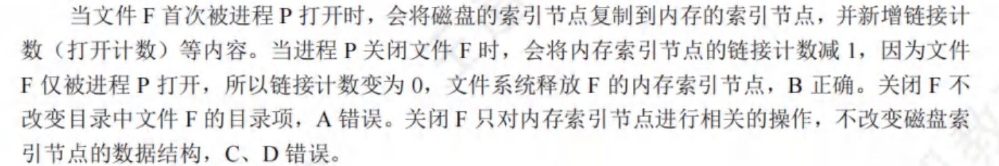
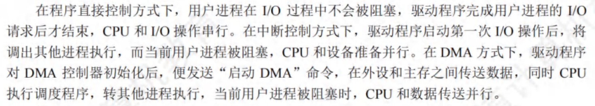
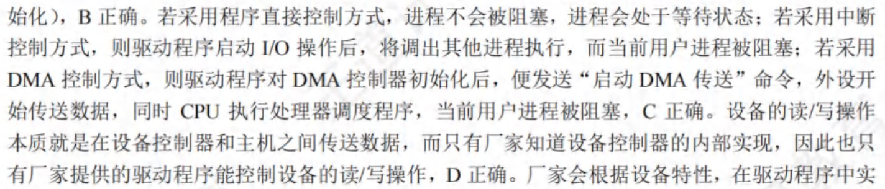

# 操作系统

## 第1章 计算机系统概述

- 操作系统向用户提供命令接口和系统调用（程序接口），此外还提供图形接口（调用了系统调用而实现的功能）
  > 按命令控制方式的不同，命令接口又分为联机用户接口和脱机用户接口

  > 库函数是是高级语言中提供的与系统调用对应的函数（也存在一些库函数，与系统调用无关），但是库函数属于用户程序而非系统调用
- 通用操作系统中，使用时间片轮转调度算法，
  > 执行用户程序不需要预定执行时间，但是需要确定其实地址，从起始地址开始执行
- 批处理OS的主要缺点是缺少交互性
- 外部中断 是由**CPU外部**的事件引起的，如：I/O设备的请求、时钟信号等；内部中断（异常）是由**CPU内部**的事件引起的（即与程序的执行过程有关），如：陷入指令、缺页异常等
- 中断
  - 用户进程的上下文被内核的中断程序保存起来（上下文保存到了自己的0特权级栈），开始执行一段内核中的代码
  - PC、PSW的值由硬件保存（中断隐指令）
  - 现场信息（通用寄存器值）和中断屏蔽字由操作系统保存
  - TLB、Cache值由硬件机构保存

**系统调用命令**

- 过程：
  1. 向正在运行的进程传递系统调用参数
  2. 执行trap指令，用户态->内核态，将返回地址压入堆栈
  3. CPU执行内核态服务程序
  4. 返回用户态
- **系统调用是面向硬件的**，运行在内核态；
- 系统调用是由用户发起，请求操作系统服务的；
- 用户在*用户态*下使用系统调用命令，该命令经过编译后，形成若干参数和*陷入命令*（系统调用需要出发陷入指令）；
  > 用户程序在用户态下使用特权指令会引起访管中断（陷入中断），即用户程序通过一条陷入指令，将运行在用户态的CPU切换到内核态（硬件CPU实现切换），以请求操作系统内核提供服务；
- 用户程序通过系统调用进行进程控制，用户程序创建一个新进程，需要使用操作系统提供的系统调用接口；
- 执行系统调用时，通过*中断*，由用户态到内核态；系统调用返回后，继续执行用户程序，CPU状态由内核态到用户态；
- 在中断发生时后，进入中断处理的程序是操作系统程序（被中断的程序可能是用户程序也可能是内核程序）；
- 不同的操作系统提供的系统调用接口是不一样的；
- 创建新进程（fork指令）通过系统调用实现
  > 而页面置换、进程调度都是完全由操作系统完成的；

**系统调用和一般过程调用**
- 系统调用需要保存PSW和PC；
- 一般过程调用只需要保存PC；（因为子程序调用不改变程序的状态，即标志位不变；正是因为标志位发生了变化，因此子程序才被顺利调用，在返回被调用程序后，该标志位也就没有用了）
- 系统调用的被调用过程是操作系统中的程序；
- 一般过程调用的被调用程序与调用程序运行在**同一个状态**，可能是内核态，也可能是用户态；

**内核态、用户态**

- 用户态和内核态是针对CPU来讲的，是指CPU运行在用户态（特权3级）还是内核态（特权0级）；

- read系统调用、中断（内外中断）、系统调用、除0、软中断（触发一个中断并跳转到相应的中断处理程序）、访存（可能出现的缺页），使得由用户态切换到内核态

- 在内核态执行（是否需要访问特权资源【如直接操作**硬件**、修改系统表、**内核数据结构**等】，是否需要管理硬件资源和进程状态）
  - 有关对I/O设备操作的指令、有关访问程序状态的指令
  - 输入输出指令（涉及中断）
  - I/O指令
  - 系统调用（发生在用户态，执行在内核态）
  - 关中断指令
  - 屏蔽中断指令
  - 设置时钟指令
  - 停机指令
  - 修改页表
  - 缺页处理程序（在用户态发生缺页中断，进入内核态执行中断处理程序）
  - 修改中断向量
  - 磁盘调度程序
  - 中断处理程序（外部中断发生在用户态，在内核态执行中断处理程序）
  - 进程调度程序
  - 系统调用命令
  - 时钟中断处理程序
  - 文件I/O
  - 进程切换
  - 关中断指令

- 在用户态执行（考虑是否可以由汇编语言实现）
  - 修改内存单元的值（进程只能访问自己的用户空间）
  - 读时钟指令
  - 内存取数指令、将数据装入内存
  - 寄存器清零
  - 命令解释程序
  - trap指令
  - 压栈指令
  - 跳转指令
  - 数据传送
  - 设置断点

**操作系统设计**

- 层次结构操作系统中，每个层次都可以访问**相邻的高层或低层**，但是不能跨越多个层次
- 层次结构设计困难
- 模块化操作系统各个功能模块都在内核中，模块之间相互调用、相互依赖，任何一个模块出错，都会导致整个系统崩溃
- 放在微内核中的操作
  - 进程通信机制
  - 低级I/O
  - 低级进程管理和调度
  - 中断和陷入处理
- 拥有外核的操作系统中，外核只负责硬件资源的分配、回收、保护等，进程管理的工作仍由内核负责
- **引导程序**
  1. 一种是位于ROM中的自举程序（BIOS的组成部分），用于**启动具体的设备**
  2. 一种是位于装有操作系统硬盘的活动分区的引导扇区中的引导程序，用于**引导操作系统**
- 计算机启动过程
  1. CPU加电，PC指向FFFF0H（0xFFFF0）地址（BIOS入口地址）
  2. 执行JMP指令跳转到BIOS（存放在主板中ROM的一段程序）
  3. 登记BIOS中断程序的入口地址（BIOS程序在内存最开始的空间构建中断向量表和相应的服务程序，后续的POST（通电自检）需要用到中断调试等功能）
  4. 硬件自检
  5. BIOS开始读取Boot Sequence（通过CMOS里保存的启动顺序或与用户交互的方式），查找引导设备
  > 将控制权交给启动顺序排在第一位的存储设备，然后CPU将该存储设备引导扇区的内容加载到内存（若该存储设备为不可引导的，则检查下一个设备，直至找到引导盘）；
  6. 把引导盘的0号扇区调入到内存，即MBR（主引导记录：分为磁盘引导程序和硬盘分区表），由MBR检查分区表，查找活动分区
  7. MBR再将控制权转交给该活动分区的引导扇区（即，PBR：分区引导记录），PBR加载到内存
  8. PBR寻找并激活活动分区根目录下用于引导操作系统的程序（管理器），加载启动管理器
  9.  将操作系统的初始化程序加载到内存中执行（常驻内存的只是操作系统的内核，其他部分仅在需要时才调入）
- 

## 第2章 进程、线程

### CPU调度

**调度**

1. 高级调度（作业调度）：从外存换到内存
2. 中级调度（内存调度）：从内存换到外存
    - 目的：提高内存利用率
    - 是存储系统中的*对换功能*：将暂时不能运行的进程调到外存等待，此时称为挂起态
3. 低级调度（进程调度）
    >在对就绪队列进行调度时，会发生两对上下文的切换
    >> 第一次：当前进程的上下文保存到其PCB中，再加载操作系统内核中调度程序的上下文，执行内核中的调度程序，选择下一个要运行的进程
    >> 第二次：保存内核调度程序的上下文，加载被调度进程的上下文（将其CPU信息装入CPU的各个寄存器中）

**进程相关知识**

0. 任一进程中所拥有的资源包括
    - 受到分别保护的用户地址空间
    - 用于实现进程间和线程间同步和通信的机制
    - 已打开的文件和已申请到的I/O设备
    - 一张由核心进程维护的地址映射表，该表用于实现用户程序的逻辑地址到其内存物理地址的映射

1. PCB 可以被操作系统中的多个模块读或修改，如被调度程序、资源分配程序、中断处理程序以及监督和分析程序等读或修改。
    > 当进程由于某种原因而暂停执行时，又须将其断点的处理机环境(由处理及中的各种寄存器组成)保存在PCB中。
    >> 包括通用寄存器、PC、PSW、用户栈指针

2. 原子操作在管态下执行，常驻内存

3. 引起创建进程的事件
    - 系统内核创建
        - 用户登录
        - 作业调度
        - 提供服务：eg：用户进程请求对文件进行打印，则系统内核为其创建一个打印进程，使得打印进程和用户进程并发执行
    - 用户创建（应用请求）：由用户自己创建新进程

4. 阻塞：系统往往设置一些具有某特定功能的系统进程，每当这种进程完成任务后，便把自己阻塞起来以等待新任务到来。例如，系统中的发送进程，其主要工作是发送数据，若已有的数据已全部发送完成而又无新的发送请求，这时(发送)进程将使自己进入阻塞状态；仅当又有进程提出新的发送请求时，才将发送进程唤醒。

5. 进程通信
    - 共享存储区
    - 消息传递：也应用于微内核系统中，微内核与服务器之间的通信
    - 管道通信

6. 对于通常的进程，无论是系统进程还是用户进程，进程的创建、  撤消，以及要求由系统设备完成的I/O 操作，都是**利用系统调用**而进入内核，再由内核中的相应处理程序予以完成的。进程的切换同样是在内核的支持下实现的。因此我们说，不论什么进程，它们都是在操作系统内核的支持下运行的，是与内核紧密相关的

**线程相关知识**

1. 线程自己不拥有系统资源，只拥有一点在运行中必不可少的资源，但是它可以与同属一个进程的其他线程共享进程所拥有的全部资源，并共享进程的地址空间
2. **一个线程可以创建和撤销另一个线程**
3. 线程可以访问其隶属进程的系统资源（属于同一进程的所有线程都具有相同的地址空间）
4. *不同的线程可以执行相同的程序*
5. 各个线程都可以访问进程地址空间中的每个单元，所以一个线程可以读、写，甚至清除另一个线程的堆栈
6. **线程可以访问进程所拥有的已打开文件、定时器、信号量机构
等**
7. 线程完成自己的任务后，或线程在运行中出现异常而被强制终止时，由于终止线程调用相应的函数执行终止操作。但是系统线程一旦被建立，就一直运行而不会终止。线程被终止后并不立即释放它所占有的资源，只有当进程中的其他线程执行了分离函数后，被终止线程才与资源分离，此时的资源才能被其他线程利用。被终止但尚未释放资源的线程仍可被其他线程调用，以使被终止线程重新恢复运行。为此，调用者线程须调用一条被称为“等待线程终止”的连接命令，来与该线程进行连接。如果在一个调用者线程调用“等待线程终止”的连接命令试图与指定线程相连接时，若指定线程尚未被终止，则调用连接命令的线程将会阻塞，直至指定线程被终止后才能实现它与调用者线程的连接并继续执行；若指定线程已被终止，则调用者线程不会被阻塞而是继续执行。
8. 对于系统级线程，在有的系统中为了减少创建和撤消一个线程时的开销，在撤消一个线程时，并不立即回收该线程的资源和 TCB，当以后再要创建一个新线程时，便可直接利用已被撤消但仍保持有资源和TCB 的线程作为新线程

**父子进程**

- 子进程可以继承父进程所拥有的资源，例如，`继承父进程打开的文件，继承父进程所分配到的缓冲区等`。当子进程被撤消时，应将其从父进程那里获得的资源归还给父进程。此外，在撤消父进程时，也必须同时撤消其所有的子进程。

- 由于父进程具有终止自己的任何子孙进程的权力，因而当父进程提出
请求时，系统将终止该进程

### 同步互斥PV操作   频繁考点 

**读者-写者问题**  未看 

**哲学家进餐**  未看 

**吸烟者问题**  未看 

**管程**

- 管程定义了系统中的共享数据结构资源与能对该数据结构进行操作的一组函数（P和V操作） 类似于私有类，其内部的资源访问只能通过函数来进行
    >组成
    >> 管程名称、共享数据结构、一组函数、对共享数据结构设置初值的语句

- 每次仅允许一个进程进入管程

### 死锁

- 多个进程因竞争资源（互相等待对方手里的资源）而造成的僵局，使各个进程都被阻塞

- 产生死锁的必要条件
    1. 互斥条件：如打印机这种资源
    2. 不可剥夺条件
    3. 请求与保持条件
    4. 循环等待条件
    > 死锁必然产生循环等待，而发生循环等待则不一定死锁（仅当同类资源数为1时，才是等价命题）

**死锁和饥饿的区别**

- 饥饿只涉及一个进程、死锁涉及多个进程（大于等于2个进程）

- >发生饥饿可能处于`就绪态`（长期得不到CPU，如SJF短作业调度算法），也可能发生在`阻塞态`（长期得不到I/O设备）
  
  > 但是死锁的进程必然处于阻塞态

**死锁处理策略**

- 死锁预防：破坏4个必要条件之一
    - 互斥条件
    - 不可剥夺条件
    - 请求与保持条件
        - 进程在运行前获得其所需的全部资源
        - 进程获得其初始运行需要的资源后，只有它释放完自己已占有的资源后，才可以申请新的资源
    - 循环等待条件：资源顺序分配法：进程只能按照资源序号递增的顺序申请资源

- 避免死锁：银行家算法
    - 安全状态一定不发生死锁；不安全状态可能发生死锁；死锁时一定处于不安全状态

- 死锁的检测及解除：资源分配图
    - 死锁定理：发生死锁当且仅当资源分配图是不可简化的

## 第3章 内存管理

- 在固定分区分配中，每个分区的大小*可以不同也可以不同但是要预先固定，一旦预定就不能改变*，每个分区的大小在系统启动时就确定了的，不会随着作业的长度而变化
- 对比
  1. 静态装入：在编程阶段就把物理地址计算好
  2. 可重定位（静态重定位）：在装入时把逻辑地址变为物理地址，但是装入后不能改变，分配其要求的全部内存空间
  3. 动态重定位：执行时再决定装入的地址并装入，装入后可能会换出，因此同一模块在内存中的物理地址可能改变。当执行到一条访存指令时，再通过地址变换机构进行地址变换
  4. 页式、段式、段页式都是动态重定位的
  > 动态重定位的过程依赖于：可重定位装入程序、重定位寄存器、地址变换机构
- 在段式存储管理中，共享段表是用来实现**多个进程共享同一段代码或数据**
  - 共享段表工作流程：
    1. 两个矩形，分别标记为"进程A的段表"和"进程B的段表"
    2. 在这两个矩形中，各有多个条目（用小方格表示），其中有一个条目特别标注，指向同一个地方
    3. 一个标记为"共享段表"的矩形，里面也有多个条目
    4. 从"进程A的段表"和"进程B的段表"中的特别标注的条目，画箭头指向"共享段表"中的同一个条目
    5. 从"共享段表"中的这个条目，再画一个箭头指向一个标记为"物理内存"的大矩形
    6. 在"物理内存"矩形中，标出一个区域作为共享段。
  - 有些段可被多个进程共享，则可用一个单独的共享段表来描述这些段，不需要在每个进程的段表中都保存一份；
  - 共享段表实现了多个进程共享同一段代码或数据；
  - 多个进程共享同一段物理内存空间并不需要用到共享段表，只需要在各自的段表中指向相同的物理地址即可；
  - 在段式存储中，不要求各个进程中相同功能的段必须有相同的段号
- 页表和段表也在内存空间中。系统提供给用户的物理地址空间=总空间-页表或段表长度
- 页式存储中，CPU将虚拟地址分为页号和偏移量，后通过硬件中的页表寄存器和内存管理单元（MMU），将页号->物理地址，再拼接偏移量，得到最终的物理地址
- 分段存储
  - 有利于程序的动态链接
  - 方便编程
  - 分段共享
  - 分段保护
  - 动态增长
  - 段是可变长的、分段方式对低级语言程序运和编译器不是透明的
- 逻辑地址也叫相对地址
- 对主存的**访问**，以**字节或字**为单位；对主存的**分配**，以**块/页**为单位
  > 例如，在页式存储中，不仅要知道块号，也需要知道页内偏移量来得到字节或字
- 段页式中，系统为每个进程分配一个段表，**每个段又有一张页表**
- 程序是否发生越界，**由硬件检查**，与所用的存储方式无关（分页、分段... 
- | 一级页表（页目录号） | 二级页表（页号） | 页内偏移量 |
- 页表基址寄存器中存放的是当前进程的一级页表的起始物理地址

**虚拟存储技术**

- 扩充内存逻辑空间的技术
- 程序访问内存时，使用的是虚拟地址，操作系统负责将其转化为物理地址
- LRU页面置换算法的开销大，是因为：需要*对所有的页进行排序*
- 页表项中，决定是否会发生页故障的是**有效位**，以显示该页面是否在内存中
- 工作集不一定是驻留集的子集，因为有些工作集中的页面可能还未被调入内存，或已经被换出内存；只有当工作集完全包含在驻留集中时，才能保证进程不发生缺页中断
- 对于配置了TLB的系统，$访存时间=TLB命中率*访问TLB时间+TLB未命中率*（访问TLB时间+访问页表时间）+访问内存时间$
- 内存映射文件是将一个文件映射到进程的虚拟地址空间的某个区域，*让进程可以按读写内存的方式来读写文件*
- 
- 页面分配策略与页面置换策略组合
  - 可变分配+全局/局部置换
  - 固定分配+局部置换

## 第4章 文件系统

!!! success "模板题"
    文件放在100个数据块中，且FCB、索引块、索引信息等都在内存中。若需要在文件的第45个盘块后插入数据，考虑三种分配方式下磁盘的I/O情况
    ??? note "连续分配"
        采用连续分配时，需要91次I/O。  
        **分析**：至少需要进行45次读磁盘和45次写磁盘（将前45个盘块依次向前移动），之后还要进行一次写磁盘，将数据写入对应空出的盘块中
    ??? note "链接分配"
        采用链接分配时，需要47次I/O。  
        **分析**：需要进行45次读磁盘。然后寻找一个新的空白磁盘块进行写磁盘（1次），然后修改第45个磁盘块的链接指针（1次）
    ??? note "索引分配"
        采用索引分配时，只需要修改内存中的索引表，不需要I/O   
        同理：采用索引分配，将最后一个数据库插入文件头部，由于索引块已经在内存中，因此只需要修改索引块，不需要磁盘I/O

- 打开文件操作是将该打开文件的FCB存入内存的活跃文件目录表；找到指定文件目录是打开文件之前的操作
  > 打开文件表是仅存放已打开文件信息的表，将指明文件的属性从外存复制到内存，再次使用该文件时，直接返回索引
- open()系统调用的参数含有文件名（文件的路径），会在**进程的用户打开文件表**中增加一个对应的表目，并返回该表目的索引号（文件描述符或文件句柄）。**系统打开文件表**只有在文件实体第一次被打开时才增加一个表目，也才会通过文件I/O将对应的索引节点从磁盘读入内存。当open调用的不同文件互为硬链接时，所打开的文件实体是一样的
  > 一个文件被打开，即被执行了open操作，会把文件的FCB读入内存
  > 要读一个文件，首先要通过open调用打开该文件。open中的参数包括文件路径名和文件名。read只需要使用open返回的文件描述符，并不使用文件名作参数。read的三个参数：①文件描述符fd；②缓冲区首地址buf；③传送的字节数n。read从fd所指的文件中读入n个字节数据，并将它们传送至由指针buf所指示的缓冲区中
- 关闭文件是指将文件当前的控制信息从内存写回磁盘
  > 关闭文件并不意味着将文件数据写回磁盘，写文件操作才会写回磁盘
- 
- 目录文件存放的是该目录中所有子目录和数据文件的目录
- 内存inode结点特有的信息是`访问计数值`
- FAT32的文件目录项（**FCB**）中包含文件基本信息（文件物理地址）、存取控制信息、使用信息
- **异步I/O**是指发出I/O请求后，系统不必等待I/O完成，而继续执行其他任务，当I/O完成后再通知系统；异步I/O提高了CPU的利用率，对磁盘I/O没有影响
- 文件结构
  - 逻辑文件（方便用户）
    - 无结构文件：流式文件
    - 有结构文件：顺序文件、索引文件、索引顺序文件、散列文件
  - 物理文件（取决于存储介质特性、操作系统管理方式）
    - 连续分配：容易导致外部碎片的发生
    > 磁带是顺序存储设备，用它存储文件时，只能采用顺序存储结构；若允许磁带来回倒带，也可组织为其他文件形式
    - 链接分配
    - 索引分配
- 文件系统为每个文件创建一张索引表，存放文件数据块的磁盘存放位置
- **记录成组分解技术**是指将若干逻记录存入一个块，**一个逻辑记录不能跨越两个块**，盘块中的剩余未利用空间用于存放指向下一个盘块的指针。
- 对盘块中的记录进行修改
  1. 找到该盘块（若干次I/O
  2. 修改完后还要写回磁盘（由第一步已知该块的磁盘地址），再I/O一次
- $系统可创建文件数量的上限=索引节点数量的上限$
- 
- 文件系统采用多级目录结构后，提高了文件的索引速度，还允许用户建立同名文件
- **符号链接文件的引用计数值不受链接文件的影响，始终为1**
- 文件被打开后，对文件的访问采用文件描述符
- 目录的查询方法有顺序检索法、散列法
    - 顺序检索法查找完成后，得到的**文件的逻辑地址**
    - 散列法不适用于所有的目录结构，有冲突和溢出的特点，解决的开销比较大
- 操作系统引入文件系统的目的
    - 用户角度：实现对文件的按名存取
    - 系统角度：对文件的存储空间进行组织、分配，负责文件的存储并对文件进行保护、检索
- 逻辑文件系统功能：按名存取、文件目录组织管理、文件名转换为文件描述符、存储保护
- UNIX操作系统中，文件信息（包括文件索引结构）存放在索引节点中；超级块用来描述文件系统
- 文件系统的容量不一定等于承载该文件系统的磁盘容量，因为磁盘可以分区，每个分区有不同的文件系统；单个文件的大小受到磁盘剩余空间大小、FCB、FAT等结构的限制；利用磁盘阵列技术，可以将一个文件系统放在多个磁盘上
- 成组链接法，第一组的空闲盘块数和空闲盘块号存放在内存的专用栈中，成为*空闲盘块号栈*；每组的第一个磁盘块记录下一组的空闲盘块总数和空闲盘块号
- 为了实现虚拟文件系统（VFS），Linux抽象了4种对象：超级块、索引节点、目录项、文件对象

## 第5章 I/O管理

- 中断处理结束后，**是否返回到被中断的进程**
    1. 采用屏蔽中断方式（单重中断）：此时返回被中断的进程
    2. 采用非屏蔽中断（多重中断）：若没有更高优先级的中断请求，则返回被中断的进程；否则，系统将处理更高优先级的中断请求
- 字符设备不支持寻址；可寻址是块设备的特征
  > DMA方式用于块设备
- 共享设备必须是可寻址的、可随机访问的设备（否则，不能保证数据的一致性和完整性，也不能提高设备的利用率
- 只有对独占设备的分配才可能引起死锁，共享设备不会出现死锁（必要条件中的：互斥条件）
- I/O逻辑，即设备控制器，用来实现对设备的控制
- I/O控制方式
    - 程序查询
    - 中断
    - DMA
- DMA控制器中有寄存器：命令/状态寄存器、内存地址寄存器（存放DMA作业时的源地址和目的地址）、数据寄存器（存放要DMA转移的数据）
- 系统为每台设备确定一个编号以便区分和识别设备，这个确定的编号成为设备的**绝对号**
- 对于同一组输入/输出命令，要么CPU给通道发出命令，要么CPU直接给设备控制器发出命令，不存在并行的可能
- 在接收处理一个输入设备的中断过程中
    - 由硬件完成的工作：判断产生中断的类型、CPU模式由用户态切换到内核态、保存用户程序的断点
    - 由中断服务程序完成：主机获取设备的输入（由中断服务程序来完成数据的输入输出
- 
    - 中断方式和DMA方式都会导致用户进程进入阻塞态
- DMA方式分为：
    - 预处理：CPU初始化DMA控制器
    - 数据传输：总线完全由DMA控制，从磁盘传输一块数据到内存缓冲区
    - 后处理：DMA控制器向CPU发出中断请求，CPU执行中断处理程序做DMA结束处理

- 为了使多个并发进程能有效进行输入输出，最好使用**缓冲池**结构的缓冲技术
    - 缓冲池是系统的共用资源，可供多个进程共享，即用于输入也用于输出
    - 包含3种类型的缓存：空闲缓存区、输入缓冲区、输出缓冲区
- 缓冲池在主存中
- 输入井、输出井在磁盘
- 缓冲区是存储区域，可由专门的硬件寄存器组成，也可利用内存来实现
- 传送单块数据
    - 从磁盘到缓冲区T1、从缓冲区到用户区T2、从用户区到CPU处理T3
    - 单缓冲区所用时间为$\max(T1, T3) + T2$
    - 双缓冲区所用时间为$\max(T1, T2+T3)$
- 传送多块数据：流水线技术
- 缓冲区管理着重要考虑的问题是*进程访问缓冲区的同步*
    - 缓冲区是一种临界资源，在使用缓冲区时都有一个申请和释放（互斥的）的问题
- 需要使用缓冲技术
    1. **使用鼠标**
    2. 多任务OS中的磁带驱动器（无设备预分配）
    3. 包含用户文件的磁盘磁盘驱动器
    4. 使用存储器映射I/O，直接和总线相连的图形卡
- 设备分配程序为用户进程分配设备的过程是：分配设备；分配控制器；分配通道。只有三者都分配成功，设备分配才算成功
- 磁带不是共享设备
- SPOOLing技术（假脱机技术）
    - 输入井模拟脱机输入时的磁盘设备，用于暂存I/O设备输入的数据；输出井模拟脱机输出时的磁盘，用于暂存用户程序的输出数据。为了缓和CPU，打印结果首先被送到位于磁盘固定区域的输出井
    - 采用SPOOLing技术的系统中，用户的打印结果首先被送到*磁盘固定区域*
    - SPOOLing技术需要使用磁盘空间（输入输出井）、内存空间（输入/输出缓冲区），不需要外围计算机的支持
    - SPOOLing系统主要包含3部分：输入输出井、输入/输出缓冲区、输入输出进程，由井管理程序、预输入程序、缓输出程序管理
    - 用户实际分配到的是外存区，即虚拟设备
    - 构成SPOOLing系统的基本条件是大容量、高速度的外存作为输入输出井，而且要有SPOOLing软件
    - 当输入设备忙时，SPOOLing系统（提高了系统和I/O设备的利用率、加快了作业执行的速度）中的用户程序不必等待I/O操作的完成，也可以继续执行
    - SPOOLing系统中的用户程序可以随时将输出程序送到输出井中，待输出设备空闲时再由SPOOLing系统完成数据的输出操作
    - SPOOLing系统需要有独占设备（SPOOLing系统将独占设备变为虚拟设备）
    - 空间换时间、需要多道程序设计技术的支持（一段时间内，输入进程、输出进程可以和运行的作业进程并发执行）
    - 设备与输入输出井之间的数据传送是由**系统**实现的
    - 用户对独占设备的操作实际上是对磁盘的存储操作，用以代替独占设备的部分由虚拟设备完成
- 独占设备采用静态分配技术、共享设备采用动态分配技术
- 由设备独立性软件完成
    - 检查用户是否有权使用设备（设备保护）
    - 缓冲区管理
- 由设备驱动程序完成
    - 向设备寄存器写命令
- 由用户层软件完成
    - 将二进制证书转换成ASCII码格式打印（通过I/O库函数实现的）
- 设备驱动程序
    - 设备驱动程序负责处理**与设备相关的中断处理过程**：不同厂家的设备通常提供不同的驱动程序，对应不同的中断处理，因此需要驱动程序来完成
    - 驱动程序仅有一部分需要汇编语言编写，其余部分可用高级语言
    - 不同型号的磁盘调度方式不一定相同，磁盘调度由磁盘驱动程序完成
    - 不同的操作系统有不同的驱动程序接口，故驱动程序要根据操作系统的要求进行定制
    - 厂家编写驱动程序，主机需要先安装驱动程序，才能使用该设备。当设备被连接到主机后，驱动程序负责初始化设备（如将设备控制器中的寄存器初始化）
    - 驱动程序与I/O控制方式有关；
    - 进程在执行驱动程序时，可能会进入阻塞态；读写设备的操作是由驱动程序控制完成的
    - 功能
        - 接收进程发来的I/O命令和参数，检查其合法性
        - 查询I/O设备的状态
        - 发出I/O命令、启动I/O设备
    - 设备驱动程序的处理过程
        1. 将抽象要求转化为具体要求（将抽象要求中的盘块号转化为磁盘的柱面号、盘面号、扇区号）
        2. 对服务请求进行校验
        3. 检查设备的状态
        4. 传送必要的参数
        5. 启动I/O设备
- 对I/O设备传回的数据进行分析和缓冲，是由进程或操作系统完成的
- 用户层软件发出的命令是设备独立性软件提供的统一接口，需要由驱动程序将这些抽象要求转化为具体要求，才能被设备控制器识别
- 应用程序经逻辑设备名访问设备，再经过驱动程序的处理来控制物理设备，若更换设备，则只需要更换驱动程序，无需修改应用程序

**磁盘寻道**

- 文件系统不一定依赖磁盘，也可以存储在其他存储介质上，如光盘、闪存、网络等。文件系统可以只占有磁盘的一部分空间，而不是整个磁盘；一个磁盘上可以有多个文件系统，也可以没有文件系统。文件系统需要用磁盘来存储数据，磁盘需要用文件系统来组织数据
- 既可以顺序读写，又可以按照任意次序读写的存储器有：光盘、磁盘、U盘
- 操作系统引导扇区产生于对磁盘进行高级格式化
- 旋转延迟的大小与文件的物理结构有关
    - 连续分配的磁盘中，文件的物理地址连续；而链接分配方式的磁盘中，文件的物理地址不连续
- 磁盘地址结构：柱面号，盘面号，扇区号
- 连续存放于磁盘中的文件的下一块应该存放在同一个柱面的同一个磁道的下一个扇区中。若当前块存于本磁道的最后一个扇区，则下一块存放于同一个柱面的下一个磁道的0号扇区
- 求解磁头移动的磁道数时，列出磁头先后经过的磁道，然后用同一方向的最大值-最小值
- SSD相对于机械硬盘的优势在于随机存取的速度；机械硬盘连续存取比随机存取快得多
- SCAN算法（电梯算法）：像电梯一样，达到某方向的端点后，再从该端点依次返回到另一端
- 而C-SCAN算法（循环算法）则到达某方向的端点后，直接回到另外一端，继续开始寻找
- 磁盘
    - 低级（物理）格式化：分扇区，为每个扇区使用特别的数据结构，如确定磁盘扇区校验码所占位数
    - 分区：将磁盘分为由一个或多个柱面组成的分区，每个分区作为一个独立的磁盘
    - 逻辑格式化：创建文件系统，将初始的文件系统数据结构存储到磁盘上，数据结构包括空闲和已分配的空间及一个初始为空的目录
- 

