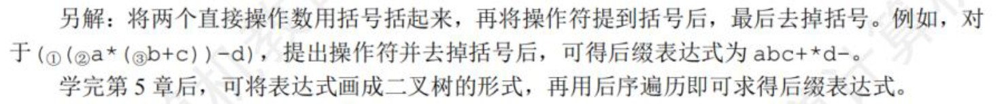
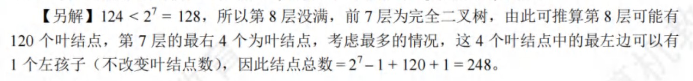

# 数据结构


## 线性表
- 数据的逻辑结构独立于其存储结构
- 有序表是逻辑结构

```C++
int Func(int n) {
    if (n==1) return 1;
    else return 2 * Func(n / 2) + n;
}
```
该段代码的时间复杂度是$O(log_2 n)$的，因为其递归调用$log_2 n$次，**而每次递归最终执行的都是`if (n==1) return 1;`，因此可以认为是单层循环，执行1次**。即总的执行次数是$T=log_2 n * 1$，因此时间复杂度是$O(log_2 n)$


- 线性表的定义要求为：相同数据类型、**有限序列**
    - 所有整数组成的序列，并不是一个线性表，因为它违反了线性表定义中的**有限序列**
- 线性表并不能方便地运用于各种逻辑结构的存储表示
  > 如，对于树形结构，顺序表显然不如链表表示起来方便
- 顺序存储方式同样适合存储树和图
- 链式存储结构比顺序存储结构能更方便地表示各种逻辑结构
- 顺序表是顺序存储的线性表，表中所有元素的类型必须**相同**，**必须连续存放（需要连续的存储空间）**，逻辑上相邻的元素，在物理上也相邻
- 顺序存储需要连续的存储空间，在申请时需要申请n+m个连续的存储空间，然后将线性表原来的n个元素复制到新申请的n+m个连续的存储空间的前n个单元
- 操作：“交换第3个元素与第4个元素的值”，对于顺序表，只需要进行3次交换操作；而对于链表，需要分别找到两个结点的前驱，在第4个结点断链后再插入到第2个结点后，相比于顺序表，效率较低
- 链式存储中，各个不同结点的存储空间可以不连续；但是结点内的存储单元地址必须连续
- 队列需要在表头删除元素，表尾插入元素，采用带尾指针的循环链表较为方便，插入和删除的时间复杂度都是O（1）
- 线性表有顺序存储和链式存储两种存储方式。线性表中有元素$n_0, n_1, ..., n_100$，则删除元素$a_{50}$需要移动0或50个元素（分别为在链式存储和顺序存储两种方式下）
- 给定n个元素的一维数组，建立一个有序单链表的复杂度为$O(n^2)$或$O(nlog_2 n)$
    - 若先建立链表，然后依次插入建立有序表，则每插入一个元素就需要遍历链表寻找插入位置，即直接插入排序，时间复杂度为$O(n^2)$
    - 若先将数组排好序，然后建立链表，建立链表的时间复杂度为$O(n)$，数组排序的最好时间复杂度是$O(nlog_2 n)$
- 将2个长度为n的循环单链表进行头尾相接的时间复杂度为$O(1)$，由于并未指明哪个链表接在哪个链表之后，所以需要对两个链表都要在$O(1)$的时间内找到头结点和尾结点，因此对这两个循环单链表各设置一个指针时，应该分别指向它们的尾结点
- 有一个长度为n的循环单链表，讨论从表中删除首元节点的时间复杂度
    - 在循环单链表中，删除首元结点后，**要保持链表的循环性**，因此需要找到首元结点的前驱
    - 当链表带有头结点时，其前驱就是头结点，因此不论是表头指针还是表尾指针，删除首元结点的时间都是$O(1)$
    - 当链表不带头结点时，其前驱是尾结点。因此
        - 若有表尾指针，则可在$O(1)$的时间找到表尾结点；
        - 若只有表头指针，则需要遍历整个链表找到尾结点；
- 静态链表采用数组表示，需要预先分配较大的存储空间（存储空间是一次性申请的）。静态链表插入、删除不需要移动元素，查找时仍然需要按链依次进行


## 栈、队列

- 上溢是指存储器满，还往里面写；下溢是指存储器空，还往外读
- 入队操作是`rear = (rear + 1) % M`，其中`M`是队列的长度
- 队列长度`(rear - front + M) % M`，其中`M`是队列的长度
- 每删除或插入一个元素，队头指针和队尾指针加1（% M）
- 队空`rear = front`
- 队满`front = (rear + 1) % M`
- 队列中只有一个元素时，front指向该元素的前一个位置，rear指向该元素
- 对于顺序队列，可以通过队头指针和队尾指针计算队列中的元素个数；而链式队列则不能
- 队列采用链式存储时，删除元素从表头删除，通常仅需修改头指针；但是若队列中仅有一个元素，则尾指针也需要被修改，当仅有一个元素时，删除后队列为空，需要修改尾指针为`rear = front`
- FIFO页面替换算法用到了队列
- 执行函数时，系统会为调用者构造一个由参数表和返回地址组成的活动记录，并将记录压入系统提供的栈中，若被调用函数有局部变量，也要压入栈中
- 通常使用栈来处理函数或过程调用


### 中缀表达式转后缀表达式

**手算**


**程序**
遇到操作数时直接输出

扫描到操作符时，有下列规则：
- 遇到`(`，则直接入栈
- 遇到`)`，则不入栈，且依次弹出栈顶运算符，直到遇到`(`为止，并删除`(`
- 若当前运算符的优先级高于栈顶运算符或者遇到栈顶为`(`，则直接入栈
- 若当前运算符的优先级低于或等于栈顶运算符，则依次弹出，直到遇到一个优先级高于它的运算符或者遇到`(`为止，之后将运算符入栈

**利用栈求表达式值**
设立运算数栈、运算符栈
..........


### 矩阵存储

- 注意存储的矩阵的下标的起始
- 行优先 还是 列优先
- **注意三对角矩阵中对角线元素的位置**
- 稀疏矩阵采用三元组来压缩存储，存储矩阵元素的行列下标和相应的值。不能够再根据矩阵元素的行列下标快速定位矩阵元素的，失去了随机存取的特性
- 用三元组表存储结构存储稀疏矩阵M时，每个非零元素都由三元组（行标、列标、关键字值）组成。但是仅通过三元组表中的元素无法判断稀疏矩阵M的大小，还要保存M的行数和列数。此外，还可以保存矩阵非零元素的个数
- 稀疏矩阵中**非零元素的值**较少


## KMP算法


## 树🌳

### 二叉树

**二叉树和度为2的树**

- 树的度为2，表示存在结点正好有2个孩子
- 度为2的树至少有3个结点，而二叉树可以为空
- 度为2的有序树的孩子的左右次序是相对于另一个孩子而言，若只有一个孩子，则无需区分左右；而二叉树，无论有一个还是两个孩子，都需要区分左右


**性质**

- 非空二叉树叶结点数等于度为2的结点数加1，即$n_0=n_2+1$
- 对于完全二叉树，结点i所在的深度为$\lfloor log_2 i \rfloor + 1$
- 具有n个结点的完全二叉树的高度为$\lceil log_2 (n+1) \rceil$ 或 $\lfloor log_2 n \rfloor + 1$
- 在含有n个结点的二叉链表中，含有n+1个空链域（与线索链表有关）


### 二叉树的遍历

- 中序遍历 + 其他三种遍历中任何一个 ->  可以唯一确定一颗二叉树
- 而其他三种遍历任意组合，却无法唯一确定一颗二叉树


**后序遍历**

后序遍历访问一个结点P时，从栈底到栈顶，再加上P结点，刚好构成了从根节点到P结点的一条**路径**
> 可以用来求根到结点的路径、两个结点的最近公共祖先


**线索二叉树**

- 后序线索二叉树中，找结点x的后继时，需要知道结点双亲，即需要采用带标志域的三叉链表作为存储结构
    - 若结点x是二叉树的根，则后继为空
    - 若x是其双亲的右孩子，或是其双亲的左孩子且其双亲没有右子树，则其后继为双亲
    - 若结点x是其双亲的左孩子，且其双亲有右子树，则其后继为双亲的右子树上按后序遍历列出的第一个结点


### 森林

**存储结构**

- 双亲表示法：连续存储空间来存储每一个结点，在每个结点中设置一个伪指针，指向其双亲结点的数组下标
    > 可以很快得到结点的双亲，但是求孩子得遍历整个结构

- 孩子表示法：连续存储空间来存储每一个结点，在每个结点中设置一个伪指针，指向每个结点的孩子结点构成的链表
    > 找孩子方便，找双亲不方便

- 孩子兄弟表示法（二叉树表示法）：n+1个空链域


**森林的遍历**

| 树       | 森林     | 二叉树   |
| -------- | -------- | -------- |
| 先根遍历 | 先序遍历 | 先序遍历 |
| 后根遍历 | 中序遍历 | 中序遍历 |


### 哈夫曼树

- 哈夫曼树也叫最优二叉树

- n个权值构成的哈夫曼树共有2n-1个结点

- 哈夫曼树中不存在度为1的结点

- 哈夫曼树构造哈夫曼编码（编码不唯一，但带权路径长度唯一），可以设计出总长度最短的二进制前缀编码：频率越高的字符，编码越短


### 并查集

- 采用双亲表示法存储，每个数组元素表明该元素双亲结点的信息，若该数组元素为祖宗节点，则显示其孩子及自身的所有数量

- <font color="red">对于状态压缩、时间复杂度具体看书上的笔记</font>


## 第6章 图

- 线性表、树都可以为空，但是图中，结点必须不能为空，边可以为空

### 图的存储

1. 邻接矩阵
    - 适合存储稠密图
    - 用一维数组存储顶点信息，二维数组存储每对顶点之间的边
    - 无向图的邻接矩阵是对称矩阵，实际存储时，只需要存储上（或下）三角矩阵
    - 遍历对应行、列的时间复杂度为$O(V)$
    - 删除边很方便，删除点不方便

2. 邻接表
    - 适合存储稀疏图
    - 找有向图的入度必须遍历整个邻接表

3. 十字链表
    - 有向图的链式存储
    - 表示不唯一
    - 既容易找到$V_i$为尾的弧，也容易找到$V_i$为头的弧，因而容易求得顶点的入度和出度

4. 临界多重表
    - 无向图的链式存储


### 图的遍历

- 图的遍历算法可以用来判断图的连通性

**广度优先搜索BFS**

- Dijkstra单源最短路径算法和Prim最小生成树算法与广度优先搜索算法的思想类似

- BFS算法可以求解非带权图的单源最短路径算法
    > 最短路径是指边数最少的路径

- 广度优先生成树既是唯一的（图的邻接矩阵是唯一的），又是不唯一的（图的邻接表不是唯一的）


**深度优先搜索DFS**

- 对同一个图，基于邻接矩阵的遍历得到的DFS序列和BFS序列是唯一的，基于邻接表的遍历得到的DFS和BFS序列不唯一

- 只有对深度连通图调用DFS才会产生深度优先生成树，否则产生深度优先森林

- 深度优先生成树既是唯一的（图的邻接矩阵是唯一的），又是不唯一的（图的邻接表不是唯一的）


### 图的应用


**最小生成树**

- 只能保证权值之和最小

- 图的不同的生成树，其对应的权值和也不一定相同

- 图中存在权值相同的边，则其最小生成树可能不唯一，即最小生成树的树形不唯一；图中各个权值互不相等，则唯一

*Prim算法*

- 从顶点开始扩充

- 适用于求解边稠密的图的最小生成树

- 时间复杂度$O(V^2)$，不依赖于E

*Kruskal算法*

- 从边开始扩充，按权值递增顺序

- 利用堆来存放边的集合，每次选择最小权值的边需要$O(log_2E$)的时间；总的时间复杂度为$O(Elog_2E)$

- 适用于边稀疏而顶点较多的图


**最短路径**

*单源最短路径Dijkstra算法*

- 求某一顶点到其他各个顶点的最短路径

- 可追溯最短路径

- Dijkstra算法和Prim算法
    - 均是贪心
    - Prim算法只适用于带权无向图，Dijkstra算法用于带权有向图和带权无向图
    - 时间复杂度不同

- Dijkstra算法不适用于带有负权值的边


*多源最短路径Floyd*

- 图中每一个顶点到其他顶点的最短路径均可得到（所有顶点之间的最短路径，对任意两个结点，求它们之间的最短路径）

- $A^{(k)}[i][j]$表示从顶点$v_i$到顶点$v_j$的路径长度，k表示绕行第k个顶点的运算步骤

- 每一轮选择一个中间结点作为中转点；第一轮以$v_0$为中转，第二轮以$v_1$为中转，...

- Flody算法允许图中有带负权值的边，但不允许有包含带负权值的边组成的回路；适用于带权无向图


*BFS、Dijkstra、Flody算法求解最短路径比较*

|                | BFS            | Dijkstra       | Flody          |
| -------------- | -------------- | -------------- | -------------- |
| 用途           | 求单源最短路径 | 求单源最短路径 | 求单源最短路径 |
| 无权图         | 适用           | 适用           | 适用           |
| 带权图         | 不适用         | 适用           | 适用           |
| 带负权值的边   | 不适用         | 不适用         | 适用           |
| 带负权回路的边 | 不适用         | 不适用         | 不适用         |


**有向无环图**

- 有向图中不存在环，称为有向无环图，DAG图

- 描述含有公共子式的工具


**拓扑排序**

- 针对有向无环图而言

- 每个顶点只出现一次；若顶点A在排序中出现在B前面，则不存在从B到A的路径

- AOV网中存在*一个或多个*拓扑排序；AOV网中，边没有权值，仅表示相邻节点的先后顺序

- 求解拓扑排序时，若图中不存在无前驱的结点，则表示有向图中必然存在环

- 利用深度优先遍历也可以实现拓扑排序

- 对于一般的图，若其邻接矩阵是三角矩阵，则存在拓扑排序；否则，不一定


**关键路径**

<font color="red" size=20>实现算法还没有看</font>


- 只有加快那些包含在所有关键路径上的关键活动才能达到缩短工期的目的


## 第7章 查找

- 查找成功的ASL=$\sum_{i=1}^{n} p_ic_i$，有n个数据，其中$p_i$为每个元素的查找概率，$c_i$为查找成功的比较次数

### 顺序查找

- 适用于顺序表或链表

- 可以按元素被查找到的概率从大到小进行排序，可以提高查找效率

- 查找成功ASL=$\frac{n+1}{2}$；查找失败ASL=(n+1)

- 对于有序线性表的顺序查找
    - 构造顺序查找判定树；若有n个结点，则有n+1个查找失败结点
    - 查找成功ASL=$\frac{n+1}{2}$ 
    - 查找失败ASL=$\frac{1+2+...+n+n}{n+1}=\frac{n}{2}+\frac{n}{n+1}$
        > 失败结点是虚拟的，实际不存在，因此到达失败结点的查找长度为失败结点所在层的上一层
    
### 折半查找

- **仅适用于有序的顺序表**

- 取mid时，在同一个题中，向上取整和向下取整只能选一个进行

- 折半判定树，若有n个结点，则有n+1个失败结点
    - 判定树是一个平衡二叉树
    - 查找成功的查找长度为根节点到目的节点路径上的结点数
        > 查找成功ASL=查找长度求和/n
    - 查找失败的查找长度为根节点到对应失败结点的父节点的路径上的结点数
        > 查找失败ASL=$\frac{查找长度求和}{n+1}$

- 折半查找的比较次数最多不会超过树的高度
    > 树高为$\lceil log_2 (n+1) \rceil$

- 折半查找的时间复杂度为$O(log2n)$


### 分块查找（索引顺序查找）

- 若有n个记录，则将其分为$\sqrt{n}$个块，每块都有$\sqrt{n}$个记录，平均查找长度为$\sqrt{n}+1$


### 二叉排序树（BST）

- 目的：提高查找、插入和删除关键字的速度

- 左子树的值均小于根节点，根节点均小于右子树的值；中序遍历的结果是一个递增序列

- 查找成功的查找长度为根节点到目的节点路径上的结点数（同折半查找法）
    > 查找成功ASL=查找长度求和/n

- 二分查找的判定树唯一，但是二叉排序树不唯一，相同的关键字其插入顺序不同可能生成不同的二叉排序树

- 就维护表的有序性而言
    - 二叉排序树无需移动结点，只需要修改指针即可完成插入删除，平均执行时间为$O(log2n)$
    - 二分查找的对象是有序顺序表，若有插入和删除的操作，代价是$O(n)$

- 静态查找表，采用顺序表作为存储结构，使用二分查找实现操作
- 动态查找表，采用二叉排序树作为其逻辑结构

**二叉排序树的插入和*删除***


### 平衡二叉树（AVL树）

- 左右子树高度差为平衡因子，取值为-1，0，1

- AVL树可以为空树

**平衡二叉树的插入**

调整最小不平衡子树（以最小不平衡子树为基准进行调整）


**平衡二叉树的删除**

从被删除的结点开始向上回溯，找到第一个不平衡的结点，以这个结点为根，对这个树进行调整

**平衡二叉树的查找**

以$n_h$表示深度为h的平衡二叉树中含有的最少结点数。有$n_0=0，n_1=1，n_2=2$，且有递推关系$n_h = n_{h-2} + n_{h-1} + 1$

- 可用于求解给定结点数的平衡二叉树的查找所需的最多比较次数

- 含有n个结点的平衡二叉树的最大深度为$O(log_2n)$，因此查找效率为$O(log_2n)$


### 红黑树

<font color="red" size="5">后面再看</font>


### B树

- 可以为空
- m阶B树是所有结点的**平衡因子均为0**的m路平衡查找树
  - 每个节点最多有m棵字树
  - 根节点至少有2棵子树
  - 除根节点的非叶节点至少有$\lceil \frac{m}{2} \rceil$棵子树，即至少有$\lceil \frac{m}{2} \rceil - 1$个关键字
  - 所有叶节点都出现在同一层
  - 结点的孩子数等于结点关键字+1
  - 关键字个数：非根$\lceil \frac{m}{2} \rceil - 1 \leq n \leq m - 1$，根结点$1 \leq n \leq m-1$
- B树存储在**磁盘**上，其查找分为两步
  1. 在B树中查找结点（磁盘中操作，目标节点在B树上的层次决定了B树查找效率）磁盘存取次数与B树高度有关
  2. 在结点中查找关键字
- n个关键字、高度为h、阶数为m的B树
  - 最小高度：$h \geq log_m (n+1)$
  - 高度最大：$h \leq log_{\lceil \frac{m}{2} \rceil} (\frac{n+1}{2}) + 1$

**B树插入**

- 插入的位置一定在最底层的非叶节点（即终端节点）
- 若插入后结点中关键字的个数超过的上限$m-1$，则取节点中第$\lceil \frac{m}{2} \rceil$个结点，将其向上提升到父节点位置

**B树删除**

- 删除节点不是终端节点，则用其前驱或后继结点替换
- 删除节点是终端节点
  1. 删除前其关键字个数$\geq \lceil \frac{m}{2} \rceil$，直接删
  2. 删除前其关键字个数$= \lceil \frac{m}{2} \rceil - 1$
     - 兄弟够借：左右兄弟节点关键字$\geq \lceil \frac{m}{2} \rceil$，父子换位法
     - 兄弟不够借：被删除节点兄弟结点及双亲进行合并


### B+树

- 应用数据库
- 每个结点最多有m个子树
- 非叶节点至少2个子树，其他结点至少$\lceil \frac{m}{2} \rceil$个子树
- 子树个数与关键字个数相同
- 叶节点包含全部关键字
- 分支节点只包含它的各个子结点中关键字的最大值和指向其子结点的指针：使得磁盘中可以存储更多关键字，使得磁盘读写次数更少、查找速度更快
  > 分支节点的关键字是其子树中最大的关键字
- 关键字个数：非根$\lceil \frac{m}{2} \rceil \leq n \leq m$，根结点$2 \leq n \leq m$
- B+树中无论查找成功与否，每次查找都是一条从根节点到叶节点的路径


### Hash表

- 散列函数：把查找表中的关键字映射成该关键字对应地址的函数：Hash(key)=Address
- H(key)=key%p：其中p选取小于等于m但最接近m的质数p
- 处理冲突的方法
  - **开放定址法**
    - 不能随便物理删除表中已有的元素。若要删除，则可进行标记，进行逻辑删除
  - **拉链法**
    - 邻接表存储，将经过hash之后相同的结果的key放在同一组链中
- 装填因子：表中记录数/散列表长度
- <font color="red" size=5>求ASL</font>
  - ASL成功除以的是元素个数$n$
  - ASL失败除以的是散列函数的模数。例：模数若为n，则只能映射到0~n-1，共n种可能


## 第8章 排序

- 内部排序算法在执行过程中，要进行两种操作：比较和移动
- 基数排序不需要进行比较
- 内部排序性能取决于时间复杂度和空间复杂度，而时间复杂度是由比较和移动的次数决定的

### 插入排序

将待排序记录按其关键字大小插入前面已经排好序的子序列中

**直接插入排序**

- 适用于顺序和链式存储
- 边比较边移动
- 比较和移动次数取决于待排序表的初始状态
- 若初始序列为正序，则为$O(n)$

**折半插入排序**

- 适用于顺序存储
- 先折半查找出元素的待插入位置，再统一移动待插入位置之后的所有元素
- 比较次数与待排序表的初始状态无关，仅取决于表中元素的个数n；元素的移动次数不改变，依赖于排序表的初始状态

**希尔排序**

- 先取一个小于n的增量d，对各个子序列进行直接插入排序；再取更小的增量，...，直到增量为1


### 交换排序

**冒泡排序**

- 若序列有序，则在第一趟冒泡结束后，比较n-1次，移动次数为0，最好情况的时间复杂度为$O(n)$
- 若初始序列为逆序，则比较n-1次，且第i趟比较n-i次；且移动元素次数是比较次数的3倍
- 有序子序列是全局有序的：**每趟排序后都会将一个元素放到其最终的位置上**
- 适用于顺序存储和链式存储


**快速排序**

- 一趟快速排序后，使得枢轴之前的元素均小于枢轴元素，之后的元素均大于枢轴元素，且枢轴元素放在了其最终的位置上，称为一次划分
- 快速排序是递归的，需要借助**递归工作栈**，其容量与递归调用的最大层数一致。最好为$log_2 n$，最差为$n-1$次递归调用。
- 初始排序基本有序时，效率最低，为$O(n^2)$
- 快速排序是所有内部排序算法中平均性能最好的算法
- 只适用于顺序存储


### 选择排序

第i趟在后面n-i+1个待排序元素中选取关键字最小的元素，作为有序序列的第i个元素，直到第n-1趟做完

**简单选择排序**

- 同上述思想
- 元素的比较次数始终是$n(n-1)/2$，移动次数不会超过$3(n-1)$（最好情况是移动0次）
- 适用于顺序、链式


**堆排序**

- 堆是一个完全二叉树
- 堆调整时，只需要将双亲结点与其左右孩子中的最值进行比较（不需要额外插入比较左右孩子的比较）
- 建堆的时间复杂度是$O(n)$的，即可以在线性时间内将无序数组建立成为一个堆
- 堆调整一次的时间复杂度是$O(log_2 n)$
- 堆排序适合关键字较多的情况（一亿个数中选前100个最大值）
- 仅适用于顺序存储的线性表


### 归并排序

- 将两个（二路归并）或以上（多路归并）的有序表合成一个新的有序表。
- 使用了大小为n的辅助数组，因此空间复杂度是$O(n)$


### 基数排序

......


### 外部排序

<font color="red" size=6>未看</font>


## 各种算法的时空间复杂度


| 应用                       | 时间复杂度                                                       | 空间复杂度                      |
| -------------------------- | ---------------------------------------------------------------- | ------------------------------- |
| **树**                     |
| 遍历二叉树（前、中、后序） | $O(n)$                                                           | $O(n)$                          |
| **图存储**                 |
| 邻接矩阵                   |                                                                  | $O(V^2)$                        |
| 邻接表                     |                                                                  | 无向图$O(V+E)$，有向图$O(V+2E)$ |
| 十字链表或临界多重表       |                                                                  | $O(V+E)$                        |
| **图遍历**                 |
| BFS                        | 邻接表$O(V+E)$，邻接矩阵$O(V^2)$                                 | 最坏情况结点都需要入队列$O(V)$  |
| DFS                        | 邻接表$O(V+E)$，邻接矩阵$O(V^2)$                                 | 递归工作栈$O(V)$                |
| **图的应用**               |
| Prim算法                   | 邻接矩阵$O(V^2)$                                                 |                                 |
| Kruskal算法                | 邻接表$O(Elog_2E)$                                               |                                 |
| Dijkstra算法               | 邻接矩阵$O(V^2)$                                                 |                                 |
| Floyd算法                  | 邻接矩阵$O(V^3)$                                                 |                                 |
| 拓扑排序                   | 邻接表$O(V+E)$，邻接矩阵$O(V^2)                                  |                                 |
| 关键路径                   | 邻接表$O(V+E)$，邻接矩阵$O(V^2)$                                 |                                 |
| **查找**                   |
| 折半查找                   | $O(log_2n)$                                                      |                                 |
| 二叉排序树                 | 若为平衡二叉树$O(log_2n)$，若为单分支树$O(n)$                    |                                 |
| 平衡二叉树                 | $O(log_2 n)$                                                     |                                 |
| **排序**                   |
| 直接插入排序（稳定的）     | $O(n^2)$                                                         | $O(1)$                          |
| 折半插入排序（稳定的）     | $O(n^2)$ （比较时间复杂度$O(nlog_2 n)$，移动时间复杂度$O(n^2)$） |                                 |
| 希尔排序（不稳定）         | $O(n^2)$                                                         | $O(1)$                          |
| 冒泡排序（稳定的）         | $O(n^2)$                                                         | $O(1)$                          |
| 快速排序（不稳地）         | $O(log_2 n)$，最坏为$O(n^2)$                                     | $O(log_ n)$，最坏为$O(n)$       |
| 简单选择排序 （不稳定）    | $O(n^2)$                                                         | O(1)                            |
| 堆排序（不稳地）           | $O(nlog_2 n)$                                                    | $O(1)$                          |
| 二路归并排序（稳定的）     | $O(nlog_2 n)$（每趟归并的时间复杂度是$n$，共归并$log_2 n$次）    | $O(n)$                          |
| 基数排序（稳定的）         | $O(d(n+r))$                                                      | $O(r)$                          |

- 对于基数排序，有n个元素，进行d趟排序，每趟排序需要合并r个队列并且遍历所有关键字