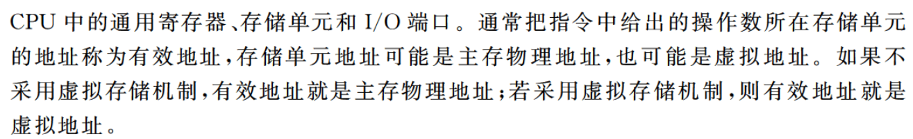

# 计算机组成原理

## 第2章 机器数、浮点数

**计算机标志位**

- 无符号数A与B做差
    - ZF = 1时，说明A = B
    - ZF = 0 & CF=0，A > B
    - CF = 1时，A < B
    

- 有符号数A与B做差
    - OF = SF & ZF = 0，说明A > B
    - OF ≠ SF & ZF = 0，说明A < B
    - ZF = OF = 0 & SF = 1，说明A < B
    

**定点乘法运算**

- 乘积的符号位由两个乘数的符号位异或得到
- 乘积的数值位是两个乘数的绝对值之和（看作无符号数）
- 两个n位无符号数相乘需要n次加法和n次移位运算（类比小学乘法步骤）

**定点除法运算**

- 跟乘法一样，不懂

## 第3章 存储系统

- 主存由RAM和ROM构成，两者统一编制

- 计算机的操作系统保存在硬盘上，所以需要BIOS的引导程序将操作系统引导到主存（RAM）中，而引导程序则固化于ROM中

- **固件**：将程序固化在ROM中组成的部件称为固件，是具有软件特性的硬件，其执行速度快于软件，灵活性优于硬件（操作系统已经实现了部分固化，将软件永恒地存储在ROM中）

- Cache由SRAM组成

- U盘采用Flash存储技术，是ROM的一种，但是不是随机存取的

**DRAM**

- 一次完整的刷新过程需要占用一个存储周期

- 地址线复用：地址线每增加1根，则行地址和列地址各增加1位，容量就提高到原来的4倍

- 对于大小为8192 x 8192 x 8bit的DRAM芯片，其行缓冲为8192 x 8bit，即列数*位平面

- DRAM芯片的刷新，只看DRAM芯片，不看其构成的存储器！！！
    - 构成存储器的所有芯片同时按行刷新，因此只需要看一个DRAM芯片的行数即可
    - 对于异步刷新，其相邻两次刷新信号的时间间隔为`刷新周期 / DRAM芯片行数`
    - 对于集中刷新，其刷新过程中，存储器不能进行读写，且刷新一行用时一个存储周期。故存储器刷新一遍最少用时`存储周期 * DRAM芯片的行数`
    - 刷新也是一个读取的过程，根据读出的内容对相应单元进行重写（**DRAM芯片刷新的原理**）。因此也会与CPU的访存发生冲突，影响到CPU的正常访存（会存在访存死时间）。

- SDRAM（同步DRAM）
    - DRAM芯片与CPU采用异步方式交换数据
    - SDRAM芯片与CPU采用同步方式交换数据
    - DRAM芯片和SDRAM芯片都需要定期刷新
    - SDRAM的行缓冲器（用来缓存指定行中整行的数据）通常用SRAM实现

### 多模块存储器

多模块存储器中，各模块有独立的读/写电路，可以实现并行操作，因此多模块存储器可以进行高速的读/写操作

**低位交叉编址多模块存储器**

- 低位交叉编址多模块存储器中，各单元的地址不连续

- 保证某个模块启动时，其上次操作已经完成（即要求两次启动间隔的时间要>=一个存储周期）---> 模块数 >= 存储周期/总线周期

- 理想情况下，认为存储器在每个总线周期都能给CPU提供一个字，即流水线充分流动起来后，每隔总线周期后都能完成一个字的读/写

**单体多字存储器**

- 主要解决访存速度的问题，可以提高存储器的吞吐率

- 在单体多字存储器中，每个存储单元存储多个字，当指令和数据连续存放，且没有过多的跳转指令时，单体多字存储器能有效提高主存的读写速度

## 第4章 指令系统

- 零地址指令：空操作指令、停机指令、堆栈指令

- 操作数的有效地址既可能是物理地址，也可能是虚拟地址。若采用虚拟存储机制，则有效地址就是虚拟地址，否则，有效地址就是物理地址

- 偏移寻址
    - 基址寻址：逻辑地址->物理地址
    - 变址寻址：数组循环
    - 相对寻址：程序浮动、相对转移

- 移位指令
    > 通常用一个`桶型移位器`实现一次移动多位的功能

    > 对于移位操作，比如算术左移，可以将高位移出的那一位移入进位标志位。这样，可以通过判断符号标志和CF位是否相等来判断是否发生了溢出。同理，其他的移位操作也可以采用该方法。
        >> 由于左移，数值扩大，可能产生溢出，因此，有些机器的左移指令也会使用OF溢出标志

    > 半字交换：寄存器的前半部分和后半部分内容进行交换

- 跳步指令：跳过下一条指令

- 对于逻辑运算指令，通常只有零标志ZF才有意义

**MIPS**

- MIPS是按字节编址，指令字长32位。因此其一条指令占用4个字节（即4个存储单元），说明每一条指令的指令地址均为4的倍数。而二进制中4的倍数的二进制表示中，32位中的**最后两位始终为0**。
    > 因此处理器在计算下一条指令的地址时，只需要将当前地址的非00位加1即可
        >> 若为转移指令时，则对偏移量进行符号扩展，再乘以指令长度（指令长度为4字节），即新地址=当前地址非00位+1+偏移量符号扩展（此时不需要乘4了，因为已经没有加入最后两位，相当于已经达到了左移乘4的效果了）
    
    > 顺序执行时，PC<31:2> <--- PC<31:2> + 1
      转移执行时，PC<31:2> <--- PC<31:2> + 1 + 偏移量符号扩展
      取指令时，PC<31:2> <--- PC<31:2> 拼上 "00"
      无条件转移时（含有26位的目标地址），PC<31:2> <--- PC<31:28> 拼上 目标地址<25:0> 拼上"00"
    
    > 指令地址中最后两位始终为0，无需在指令中显示给出，只要在实现指令功能的数据通路中具有添加00的电路即可（地址压缩，省略传输这两位）

    > 对齐检查：如果指令地址的最后两位不是00，说明这个地址是错误的，或指令未对齐

- 每条指令只能处理一件事情，比如：a = i * 4 + 3
    > 要分两条指令进行
        >> 首先进行乘法（或移位或若干次加法）指令计算i * 4；再执行加法指令a = i * 4 + 3，得到结果

- **对数组进行循环**时，要先得到对应数组元素的地址（①）；再对该地址访存，获得对应的数据元素值（②）
    > 对于获得数组元素地址，计算方法为`基址 + 偏移量`，其中偏移量还要乘以编址单位

    > 执行完循环体内最后一条指令后，要执行一条无条件转移指令，转移到循环开始。（跳出循环在该方法中设置在了循环开始，即进行条件判断时设置的）

- **过程调用**

    1. 过程调用指令：
        - 保存下一条指令地址（返回地址）到寄存器；
        - 跳转到指定地址处执行过程（函数）
    
    2. 返回指令是无条件转移指令，跳转到返回地址

    3. **过程调用过程**
        
        - 被调用程序Q先将其结果返回，再将控制权转交给调用程序P
        - 调用过程Q：
            - 计算（调用过程先使用临时寄存器，用完了再考虑使用保存寄存器（需要在栈帧中保存调用程序的现场））。若不需要使用保存寄存器，即无需保存任何寄存器的值（若同时也不需要分配任何局部变量，则栈帧为空）
            - 设置栈帧指针fp（当前栈指针sp+栈帧大小）
                - 返回地址存储在栈帧指针fp的上面一个单元
            - 返回结果
            - 清理释放Q所使用的资源（局部变量，存储在栈中），同样也就把P的环境恢复了（将P用到的寄存器中的值都恢复了）
            - 释放栈帧（即将栈指针sp指向栈帧指针fp）
            - 执行跳转指令，跳转到返回地址，返回控制权到P
        - 若被调用程序需要使用调用程序P所使用的保存寄存器，则需要将保存寄存器中的值保存到被调用过程的栈中，才能使用，并且在返回P之前恢复保存寄存器的值；P在临时寄存器中的值由P自行保存，Q不需对其进行保存
        - 若栈帧为空（无需保存任何寄存器的值、不需要分配任何局部变量或者分配了存储在寄存器的局部变量，即局部变量未存储在栈中），同时也不再调用其他过程，则无需保存返回地址和帧指针
        - 若栈帧不空，则需要保存返回地址和栈帧指针

## 第5章 CPU

- 单总线数据通路和多总线数据通路都不适合指令流水线
    > 单总线系统的串行特性与流水线的并行本质相矛盾。
    
    > 多总线系统虽然提供了一定的并行能力,但复杂度和成本的增加可能抵消了性能gains。

    > 对于指令流水线，可以考虑指令存储器和数据存储器分离，并且各自使用独立的总线

**数据通路的基本结构**

- 组合逻辑单元：加法器(Adder)、算数逻辑部件（ALU）、三态门、译码器（Decoder）、多路选择器（MUX）
    > 组合逻辑单元不受时钟信号控制

- 时序逻辑单元：通用寄存器组（也叫寄存器堆）、PC、状态/移位/暂存/锁存寄存器
    > 时序逻辑单元受时钟信号控制
    
    > 对于通用寄存器组（也叫寄存器堆），读操作是组合逻辑操作，不受时钟信号的控制；写操作是时序逻辑操作，受到时钟信号控制

**数据通路和控制部件**

- CPU由数据通路和控制部件组成

- 数据通路：ALU、通用寄存器、状态寄存器、Cache、MMU、浮点运算逻辑、异常和中断处理逻辑
    > 数据通路中专门进行数据运算的部件称为执行部件或功能部件

- 控制部件：数据通路由控制部件进行控制

**ALU**

- 在多总线数据通路中，若将一个寄存器内容传送到另一个寄存器，则需要通过ALU来完成（ALU的直送功能）

- 多总线结构中，临时寄存器Y和Z都可以不要：这是因为ALU的输入通路分别为总线A和总线B，输出通路为总线C，三者无冲突；而单总线通路中，若缺少了Y或Z，则ALU的输入操作数和输出结果中必定有两个数据同时被送到同一个总线上，因而会发生总线数据冲突

**单周期处理器**

单周期处理器时钟周期取最复杂指令所用的指令周期，远远大于许多指令实际的执行时间，因而效率低下

**多周期处理器**

把每条指令的执行分为若干阶段，每个阶段执行用一个时钟周期，各阶段最多一次访存/寄存器读写/ALU操作

时钟周期宽度通常取一次存储器读写时间

**硬件多线程**

硬件多线程为每个线程提供了单独的通用寄存器组、单独的PC，进程切换只需要选中寄存器、PC

1. 细粒度多线程：每个线程执行的指令是不相关的，可以乱序执行。处理器能之每个时钟周期切换线程`指令级并行`

2. 粗粒度多线程：可以连续几个时钟周期都执行同一线程的指令序列，仅当前线程出现了较大开销的阻塞时，才切换线程（如Cache缺失），线程切换占用一个时钟周期。新线程的指令在执行前需要重载流水线，开销比细粒度要大 `指令级并行`

3. 同时多线程：一个时钟周期中可以执行多个不同线程的多条指令 `线程级并行`

****

## 第6章 总线

## 第7章 I/O

