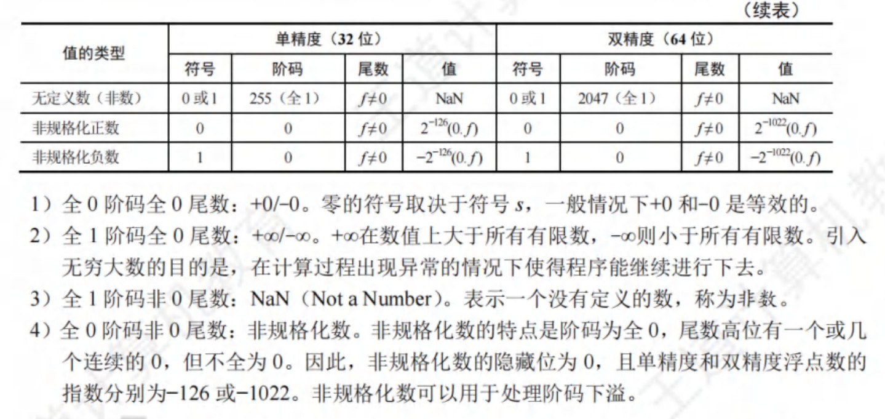
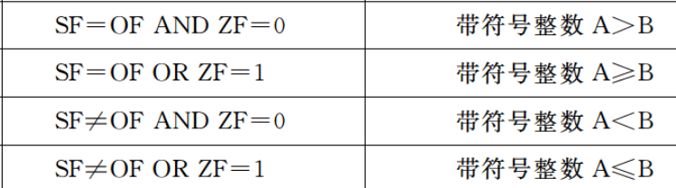

# 计算机组成原理

* 明确主存的编址方式：按字节、按半字、还是按字


## 第2章 机器数、浮点数

- 二进制小数只能表示$1/2、1/4、1/8、...、1/2^n$，因此无法表示所有的十进制小数
- [x]移表示以移码进行表示。对于由6个1、2个0组成的二进制整数，采用移码进行表示。当偏置值为128时，要使得数值最大，就有$1111 1100B - 1000 0000B = 252 - 128 = 124$；当偏置值为127时，要使得数值最小，就有$0011 1111B - 0111 1111B = 1100 0000B = -64$
- 模4补码具有模2补码的全部优点且更容易检查加减运算中的溢出问题。存储模4补码仅需要一个符号位，因为任何一个正确的数值，模4补码的两个符号位总是相同的。只在把两个模4补码的数送往ALU完成加减运算时，才把每个数的符号位的值同时送到ALU的双符号位中，即只在ALU中采用双符号位
- 补码左移时，若移出的高位不同于移位后的符号位，即左移前后的符号位不同，则发生溢出。
- 原码的一位乘法中，符号位与数值位是分开进行运算的（符号位不参与运算，单独处理）。运算结果的数值部分是乘数与被乘数数值位的乘积，符号是乘数与被乘数的符号位的异或
- 对于左移，逻辑左移和算数左移的结果都一样，高位移出，低位补0
- 逻辑移位不考虑符号位的问题，逻辑左移时，若最高位移出的是1，表示发生溢出
- 算术左移时，若移出的最高位不同于移位后的符号位，即左移前后的符号位不同，表示发生溢出
- 长度相同、格式相同的两种浮点数，前者阶码大、尾数短，后者阶码短、尾数长，其他规定均相同。则前者可表示的数的范围大但是精度低
    - 基数越大，阶码每变化一位，尾数小数点需要移动的位数就越多，表示的数的绝对值就越大，范围就越大
    - 浮点数总位数不变的情况下，能表示的不同状态的个数是一定的。若范围增大，则意味着浮点数的离散程度增大，相邻两个浮点数之间的间隔就越大，精度就越低
- 变形补码，即用两个二进制位来表示数字的符号位，其余与补码相同
- 定点运算中，运算结果超出数的表示范围后，就发生溢出；浮点运算中，运算结果超出尾数的表示范围却不一定溢出，只有规格化后阶码超出所能表示的范围后，才发生溢出
- 规格化浮点数：尾数的最高数值位必须是一个有效值。目的在于增加数据的表示精度
    - 补码表示的尾数规格化：尾数的最高数值（即小数点后的第一位）位必须与尾数的符号位（即整数部分）相反
    > 1.0xxx或0.1xxx才是规格化的
    - 源码表示的尾数规格化：尾数的最高数值位（即小数点后的第一位）必须是1
    > 对于正数，0.1xxx；对于负数，1.1xxx才是规格化的
    - 若基数为4，尾数用原码表示，则其规格化数的形式是**小数点的后两位不全为0**
- 对阶，是较小的阶码调整到较大的阶码。只存在尾数右移的情况（阶码增大）
- 阶码的取值
    - 8位阶码是1~254
    - 11位是1~2046
- 正数的源码、反码、补码都相同
- 浮点数运算是否溢出：取决于阶码是否上溢
- 阶码下溢可以通过非规格化数来表示
- 尾数上溢或下溢，可以通过左移或右移进行调整
- IEEE754中，**阶码全为0，尾数不全为0表示非规格化数**，其值为$2^{-126} * 0.f$（其中f表示尾数部分（小数点后面））。非规格化数用于处理阶码下溢，使得出现比最小规格化数还小的数时，程序也可以继续运行下去
- 在位数相同的情况下，移码和补码的表示范围是相同的。因此若将阶码部分的移码表示改为补码表示，则浮点数的表示范围**不变**
- IEEE754省去尾数部分的整数1；而其他的浮点数格式中，尾数部分的整数部分为0（若规格化，则尾数为0.1xxx）
- 舍入是浮点数的概念，定点数没有舍入的概念
- 浮点数的舍入有两种情况：对阶、右规格化；浮点数舍入不一定产生误差（如向下舍入11.00到11.0时没有误差）
- 结构体按边界对齐存放的要求：数据成员的起始地址是其数据类型大小的整数倍
- 大端方式：内存的低地址存放高位字节
- IEEE754尾数部分有效位为24为，可以精确表示24位的int
    - 即将int型变量转成二进制，写成真值为$±1.xxx*2^n$，若小数点后的位数超过23位，则转换成float后会有精度损失
- 右规和尾数舍入可能引起阶码上溢

对于下列程序
```C++
// x, y, z都是int型
double dx = (double)x;
double dy = (double)y;
double dz = (double)z;
```
1. `dx + dy == (double)(x + y)`并非永真。`x + y`可能会溢出，而`dx + dy`不会溢出

2. `dx * dx >= 0`永真。double型采用IEEE754，尾数采用原码小数，符号和数值部分分开计算，不管结果是否溢出，都不会影响乘积的符号

3. `dx / dx == dy / dy`并非永真。若dx或dy为0，则不成立

4. `(dx + dy) + dz == dx + (dy + dz)`永真。dx、dy、dz都是由int转换为double的，double可以精确的表示int


 


**计算机标志位**
- 无符号数A与B做差
    - ZF = 1时，说明A = B
    - ZF = 0 & CF=0，A > B
    - CF = 1时，A < B
    
- 有符号数A与B做差
    - OF = SF & ZF = 0，说明A > B
    - OF ≠ SF & ZF = 0，说明A < B
    - ZF = OF = 0 & SF = 1，说明A < B
    

**定点乘法运算**

- 乘积的符号位由两个乘数的符号位异或得到
- 乘积的数值位是两个乘数的绝对值之积（看作无符号数）
- 两个n位无符号数相乘需要n次加法和n次移位运算（类比小学乘法步骤）

**定点除法运算**

- 跟乘法一样，不懂


## 第3章 存储系统


- 主存由RAM和ROM构成，两者统一编址
- 计算机的操作系统保存在硬盘上，所以需要BIOS的引导程序将操作系统引导到主存（RAM）中，而引导程序则固化于ROM中
- **固件**：将程序固化在ROM中组成的部件称为固件，是具有软件特性的硬件，其执行速度快于软件，灵活性优于硬件（操作系统已经实现了部分固化，将软件永恒地存储在ROM中）
- Cache由SRAM组成
- U盘采用Flash存储技术，是ROM的一种，但是不是随机存取的
- 芯片扩展所需片数：字扩展倍数*位扩展倍数
  > 芯片扩展不可能出现位数变小的情况
- 片选信号低电平有效：所有信号经过取交集后，若为0，则信号有效；否则，信号无效


**磁盘**

- RAID是将多个物理盘组成像单个逻辑盘
- **磁盘驱动器**
    - 磁盘地址由柱面号（磁道号）、盘面号（磁头号）、扇区号组成
    - 控制磁头移动到指定的磁道，并发回“寻道结束”信号
    - 控制磁盘片转过指定的扇区，并发回“扇区符合”信号
    - 控制对指定盘面的指定扇区进行数据的读或写操作
- 最小读写单位是**扇区**
- 采用直接存储器存取DMA方式进行输入输出
- 按批处理方式进行一个数据块的读写
- 磁盘存储器和主存交换信息，不能直接和CPU通话
- SSD的读写以页为单位，擦除以块为单位


**DRAM**

- 一次完整的刷新过程需要占用一个存储周期

- 地址线复用：地址线每增加1根，则行地址和列地址各增加1位，容量就提高到原来的4倍

- 对于大小为8192 x 8192 x 8bit的DRAM芯片，其行缓冲为8192 x 8bit，即列数*位平面

- DRAM芯片的刷新，只看DRAM芯片，不看其构成的存储器！！！
    - 构成存储器的所有芯片同时按行刷新，因此只需要看一个DRAM芯片的行数即可
    - 对于异步刷新，其相邻两次刷新信号的时间间隔为`刷新周期 / DRAM芯片行数`
        - 异步刷新：在一个刷新周期内，每一行仅刷新一次。
    - 对于集中刷新，其刷新过程中，存储器不能进行读写，且刷新一行用时一个存储周期。故存储器刷新一遍最少用时`存储周期 * DRAM芯片的行数`
    - 分散刷新：存储器的工作周期分为两部分，前半部分用于正常的读写操作；后半部分用于刷新。增加了系统的存储周期。eg：存储芯片的存取周期为0.5us，则系统的存取周期为1us
    - 刷新也是一个读取的过程，根据读出的内容对相应单元进行重写（**DRAM芯片刷新的原理**）。因此也会与CPU的访存发生冲突，影响到CPU的正常访存（会存在访存死时间）。

- SDRAM（同步DRAM）
    - DRAM芯片与CPU采用异步方式交换数据
    - SDRAM芯片与CPU采用同步方式交换数据
    - DRAM芯片和SDRAM芯片都需要定期刷新
    - SDRAM的行缓冲器（用来缓存指定行中整行的数据）通常用SRAM实现


### 多模块存储器

多模块存储器中，各模块有独立的读/写电路，可以实现并行操作，因此多模块存储器可以进行高速的读/写操作

**低位交叉编址多模块存储器**

- 低位交叉编址多模块存储器中，各单元的地址不连续
- 保证某个模块启动时，其上次操作已经完成（即要求两次启动间隔的时间要>=一个存储周期）---> 模块数 >= 存储周期/总线周期
- 理想情况下，认为存储器在每个总线周期都能给CPU提供一个字，即流水线充分流动起来后，每个总线周期后都能完成一个字的读/写
- 对于n体多模块低位交叉存储器，若单个存储体的准备一个数据的时间（访问时间、存取时间）为T，则理想情况下（流水线充分流动后），平均每个数据的准备时间为T/n


**单体多字存储器**

- 主要解决访存速度的问题，可以提高存储器的吞吐率

- 在单体多字存储器中，每个存储单元存储多个字，当指令和数据连续存放，且没有过多的跳转指令时，单体多字存储器能有效提高主存的读写速度


### Cache

- cache完全由硬件实现
- cache替换时的单位是块（cache与主存是以块为单位进行数据交换的）
- cache地址空间和主存地址空间相互独立，通过**地址映射**把主存地址空间映射到cache地址空间
- 指令cache比数据cache有更好的空间局部性（指令大部分情况下都是顺序存放、顺序执行的）
- cache不命中时，先访问cache，再访问内存
- cache写不命中时
    - 回写法的写主存操作次数少于全写法
    - 写分配法（更新主存单元，然后把这个主存块调入cache）：加载低一层的块到cache中，更新cache块（搭配回写法）
        - 写操作比较密集，采用回写法速度快，更适合访问密集型的应用
    - 非写分配法（只更新主存单元，不把主存块调入cache）：避开cache，直接把字写到主存中（搭配全写法）
        - 全写法能够随时保持主存数据的一致性，适合安全性要求高的应用
- 对于由高速缓存、主存、硬盘构成的三级存储结构，CPU直接根据**主存物理地址**进行访问
  > 只有在虚拟存储器中，CPU发出的才是虚拟地址；CPU不能直接访问磁盘
- `第2593号存储单元`表示存储地址（主存地址）是2593
- `块号`表示主存单元的块号，不包含块内地址
- 主存块或大或小，都会使cache的命中率降低


### 虚存

- 程序局部性原理的基本含义是指，在程序的执行过程中，程序对主存的访问是不均匀的
- 虚拟内存需要通过**操作系统**实现地址映射，因此虚存对系统程序员不是透明的；而应用程序员写程序使用的就是虚拟地址（逻辑地址），因此对其是透明的
- 虚拟存储器中，程序正在执行时，由**操作系统**完成地址映射，但需要一些硬件支持（由CPU中的MMU进行逻辑地址到物理地址的转换。转换过程中，MMU需要查对应的页表项，根据页表项的装入位（有效位）是否为1，来确定是否发生缺页
- 页表不命中，表示该页面没有调入主存，而cache是页面的副本，因此cache也一定不命中
- cache缺失处理由硬件完成；TLB缺失处理既可以由硬件完成也可以由软件完成
- 虚拟存储器的实际容量<=主存和辅存的容量之和
- 页表只能由操作系统和硬件进行访问，虚拟存储管理机制对用户**进程**来说是透明的；即用户进程不能访问其页表
- 分段方式对低级语言程序员和编译器来说是不透明的（低级语言程序员需要使用段号来编程，编译器需要通过段号来链接）
- 
- cache和TLB都由SRAM组成


## 第4章 指令系统

??? note "机器字长32位，容量为16MB的存储器，CPU按半字寻址，寻址单元数为"
    问寻址单元数，不看虚拟内存，看物理内存<br></br>
    16MB，按2B寻址，则有$2^{23}$个存储单元，每个存储单元中存放2B    

!!! note "指令构成"
    操作码OP + （寻址方式） + 地址码

- 主存地址非负
- 零地址指令：空操作指令、停机指令、堆栈指令
- ISA（指令集体系结构）：是低级语言程序员能够看到的，对其不透明
    - 规定了基本数据类型、指令集、寄存器（个数和位数）、寻址模式、存储体系、中断和异常处理、外部I/O
    - 规定了执行每条指令时所需要的操作码、操作数、寻址方式、指令的功能和效果、指令格式和类型
- 控制信号是由控制单元生成的
- 对于堆栈指令的访存次数
    - 若软堆栈（堆栈区由内存实现），对于双目运算符需要访问4次内存：取指令、取操作数1、取操作数2、存结果
    - 若硬堆栈（堆栈区由寄存器实现），则只需要在取指令时访问1次内存即可
- 操作数的有效地址既可能是物理地址，也可能是虚拟地址。若采用虚拟存储机制，则有效地址就是虚拟地址，否则，有效地址就是物理地址


- 寄存器寻址可以缩短指令中某个地址段的位数
- 偏移寻址
    - 基址寻址：逻辑地址->物理地址
    - 变址寻址：数组循环
    - 相对寻址：程序浮动、相对转移
    > 相对寻址中，指令提供的相对地址实际上是**以下一条指令在内存中的首地址为基准位置的偏移量**

- 移位指令
> 通常用一个`桶型移位器`实现一次移动多位的功能

> 对于移位操作，比如算术左移，可以将高位移出的那一位移入进位标志位。这样，可以通过判断符号标志和CF位是否相等来判断是否发生了溢出。同理，其他的移位操作也可以采用该方法。    

> >> 由于左移，数值扩大，可能产生溢出，因此，有些机器的左移指令也会使用OF溢出标

> 半字交换：寄存器的前半部分和后半部分内容进行交换

- 跳步指令：跳过下一条指令
- 对于逻辑运算指令，通常只有零标志ZF才有意义

<center>

| 寻址方式       | 有效地址  | 访存次数 |
| -------------- | --------- | -------- |
| 立即寻址       | A即操作数 | 0        |
| 直接寻址       | EA=A      | 1        |
| 间接寻址       | EA=(A)    | 2        |
| 寄存器寻址     | EA=R      | 0        |
| 寄存器间接寻址 | EA=(R)    | 1        |
| 相对寻址       | EA=(PC)+A | 1        |
| 基址寻址       | EA=(BR)+A | 1        |
| 变址寻址       | EA=(IX)+A | 1        |

</center>


- CISC
    - 微程序控制
    - 指令种类多，难以编译优化，但是便于汇编程序员编程
    - 寄存器数量少
    - 指令多
- RICS
    - 硬布线控制器（组合逻辑控制）
    - 优化的编译程序
    - 寄存器数量多
    - 只有LOAD/STORE可以访问存储器，其余指令的操作均在寄存器间进行
    - 指令种类少
    - 流水线技术
    - RISC不可能兼容CISC


**MIPS**

- MIPS是按字节编址，指令字长32位。因此其一条指令占用4个字节（即4个存储单元），说明每一条指令的指令地址均为4的倍数。而二进制中4的倍数的二进制表示中，32位中的**最后两位始终为0**。

    > 因此处理器在计算下一条指令的地址时，只需要将当前地址的非00位加1即可
        >> 若为转移指令时，则对偏移量进行符号扩展，再乘以指令长度（指令长度为4字节），即新地址=当前地址非00位+1+偏移量符号扩展（此时不需要乘4了，因为已经没有加入最后两位，相当于已经达到了左移乘4的效果了）
    
    > 顺序执行时，PC<31:2> <--- PC<31:2> + 1
      转移执行时，PC<31:2> <--- PC<31:2> + 1 + 偏移量符号扩展
      取指令时，PC<31:2> <--- PC<31:2> 拼上 "00"
      无条件转移时（含有26位的目标地址），PC<31:2> <--- PC<31:28> 拼上 目标地址<25:0> 拼上"00"
    
    > 指令地址中最后两位始终为0，无需在指令中显示给出，只要在实现指令功能的数据通路中具有添加00的电路即可（地址压缩，省略传输这两位）

    > 对齐检查：如果指令地址的最后两位不是00，说明这个地址是错误的，或指令未对齐

- 每条指令只能处理一件事情，比如：a = i * 4 + 3
    > 要分两条指令进行
        >> 首先进行乘法（或移位或若干次加法）指令计算i * 4；再执行加法指令a = i * 4 + 3，得到结果

- **对数组进行循环**时，要先得到对应数组元素的地址（①）；再对该地址访存，获得对应的数据元素值（②）
    > 对于获得数组元素地址，计算方法为`基址 + 偏移量`，其中偏移量还要乘以编址单位

    > 执行完循环体内最后一条指令后，要执行一条无条件转移指令，转移到循环开始。（跳出循环在该方法中设置在了循环开始，即进行条件判断时设置的）

- **过程调用**

    1. 过程调用指令：
        - 保存下一条指令地址（返回地址）到寄存器；
        - 跳转到指定地址处执行过程（函数）
    
    2. 返回指令是无条件转移指令，跳转到返回地址

    3. **过程调用过程**
        
        - 被调用程序Q先将其结果返回，再将控制权转交给调用程序P
        - 调用过程Q：
            - 计算（调用过程先使用临时寄存器，用完了再考虑使用保存寄存器（需要在栈帧中保存调用程序的现场））。若不需要使用保存寄存器，即无需保存任何寄存器的值（若同时也不需要分配任何局部变量，则栈帧为空）
            - 设置栈帧指针fp（当前栈指针sp+栈帧大小）
                - 返回地址存储在栈帧指针fp的上面一个单元
            - 返回结果
            - 清理释放Q所使用的资源（局部变量，存储在栈中），同样也就把P的环境恢复了（将P用到的寄存器中的值都恢复了）
            - 释放栈帧（即将栈指针sp指向栈帧指针fp）
            - 执行跳转指令，跳转到返回地址，返回控制权到P
        - 若被调用程序需要使用调用程序P所使用的保存寄存器，则需要将保存寄存器中的值保存到被调用过程的栈中，才能使用，并且在返回P之前恢复保存寄存器的值；P在临时寄存器中的值由P自行保存，Q不需对其进行保存
        - 若栈帧为空（无需保存任何寄存器的值、不需要分配任何局部变量或者分配了存储在寄存器的局部变量，即局部变量未存储在栈中），同时也不再调用其他过程，则无需保存返回地址和帧指针
        - 若栈帧不空，则需要保存返回地址和栈帧指针


## 第5章 CPU

- 单总线数据通路和多总线数据通路都不适合指令流水线
    > 单总线系统的串行特性与流水线的并行本质相矛盾。
    
    > 多总线系统虽然提供了一定的并行能力,但复杂度和成本的增加可能抵消了性能gains。

    > 对于指令流水线，可以考虑指令存储器和数据存储器分离，并且各自使用独立的总线

- 控制器由PC、IR、MAR、MDR、指令译码器、时序电路和微操作信号发生器等组成
- PSW属于运算器，PSW包括两个部分，一是状态标志（如CF、ZF等）；二是控制标志（如中断标志、陷阱标志）
    - 不需要像通用寄存器那样，对标志寄存器进行编号
    - 不能在指令中直接指定编号来访问
    - 用户不能直接访问或修改它的值，对用户不透明


**数据通路的基本结构**

- 数据通路基本结构分为总线结构和专用数据通路结构。其中总线结构又分为单总线结构、双总线结构、多总线结构

- 组合逻辑单元：加法器(Adder)、算数逻辑部件（ALU）、三态门、译码器（Decoder）、多路选择器（MUX）
    > 组合逻辑单元不受时钟信号控制

- 时序逻辑单元：**通用寄存器组**（也叫寄存器堆）、PC、状态/移位/暂存/锁存寄存器
    > 时序逻辑单元受时钟信号控制
    
    > 对于通用寄存器组（也叫寄存器堆），读操作是组合逻辑操作，不受时钟信号的控制；写操作是时序逻辑操作，受到时钟信号控制

**数据通路和控制部件**

- CPU由数据通路和控制部件组成

- 数据通路：ALU、通用寄存器、状态寄存器、Cache、MMU、浮点运算逻辑、异常和中断处理逻辑
    > 数据通路中专门进行数据运算的部件称为执行部件或功能部件

- 控制部件：数据通路由控制部件进行控制


**ALU**

- 在多总线数据通路中，若将一个寄存器内容传送到另一个寄存器，则需要通过ALU来完成（ALU的直送功能）

- 多总线结构中，临时寄存器Y和Z都可以不要：这是因为ALU的输入通路分别为总线A和总线B，输出通路为总线C，三者无冲突；而单总线通路中，若缺少了Y或Z，则ALU的输入操作数和输出结果中必定有两个数据同时被送到同一个总线上，因而会发生总线数据冲突


**单周期处理器**

单周期处理器时钟周期取最复杂指令所用的指令周期，远远大于许多指令实际的执行时间，因而效率低下


**多周期处理器**

把每条指令的执行分为若干阶段，每个阶段执行用一个时钟周期，各阶段最多一次访存/寄存器读写/ALU操作

时钟周期宽度通常取一次存储器读写时间


- CPU周期=机器周期，是指指令执行中每步操作所需的时间
- 取指（取指令字）操作结束后，PC中存放的是下一条指令的地址
- 取指操作是控制器自动进行的，控制器并不需要获得相应的指令，并不需要在操作码的控制下完成
- 不同长度的指令，其取指操作可能是不同的。如，双字指令、三字指令与单字指令的取指操作是不同的
- 在指令执行完成后，处理器会判断是否出现了中断请求，只有出现了中断请求时，才会进入中断周期
- 多周期CPU，执行各条指令的机器周期数可变，各机器周期的长度可变
- 指令字长一般取字节或存储字长的*整数倍*，若指令字长等于存储字长的2倍，则需要2次访存，取指周期等于机器周期的2倍
- **单周期CPU的时钟周期取决于最复杂指令的执行时间**，通常比多周期CPU的时钟周期长
- 在一条指令执行过程中，单周期CPU中每个控制信号取值一直不变（一个时钟周期内，控制信号不会发生变化），每个部件只能使用1次；而多周期CPU中的控制信号可能会发生改变，同一个部件可使用多次
- 
- 采用CPU内部总线方式的数据通路：结构简单、容易实现、性能低、存在较多冲突；不采用CPU内部总线方式的数据通路：结构复杂，硬件量大，不易实现，性能高，不存在冲突


微指令


??? note "辨析：处理器总是在每来一个时钟脉冲信号时，就开始执行一条新的指令"
    对于单周期CPU，一个指令周期就是一个时钟周期，每个时钟周期执行一条新指令；对于多周期CPU，每个指令周期（含若干时钟周期）执行一条新指令；对于流水线CPU，只有在理想情况下才能实现每个时钟周期执行一条新指令

- 微操作控制信号的形成主要与*指令译码信号和时钟信号*有关
- 微程序入口地址是由机器指令的操作码字段形成的
- 一条水平型微指令能定义并执行几种**并行**的基本操作；一条垂直型微指令只能定义并执行一种基本操作
- 垂直型微指令是一种微指令格式，相比于水平型微指令，**并不是指令格式垂直表示**，而是指在微指令中设置了微操作码字段，结构类似于机器指令格式；控制信号经过编码产生是一种控制字段的编码方法，属于水平型微指令，强调并行控制功能
- **微处理器根处理器是否采用微程序控制器无关**
- uPC无法取代PC
- 断定法是在微指令（的后继地址字段）中直接明确指出下一条微指令的地址，相当于每一条都是转移微指令，后继地址字段可由微程序设计者指定，或根据微指令所规定的转移控制字段控制产生
- 字段直接编码还要留出1个状态，表示不发出任何微命令
- 控制存储器由ROM组成，只读不写


**中断和异常**

- 自陷是人为设定的特殊中断机制，不是出现了某种异常情况而产生的
- 指令执行结果出现异常而引起的中断是*故障*
- 终止异常（指令执行过程出现了使计算机无法继续执行的硬件故障，只能终止，严重时甚至要调出中断服务程序来重启系统），例如，控制器出错、存储器校验错、总线错误等，不由特定指令产生，而是随机发生的
- 进程上下文切换和异常/中断响应，都会产生异常控制流
- 
- 进程上下文切换由操作系统内核程序实现；异常/中断的响应由硬件实现；响应异常/中断请求后，CPU执行的是异常/中断服务程序，是操作系统的内核程序
- 自陷处理完成后返回到陷阱指令的下一条指令执行（自陷指令包括系统调用、trap指令等）
- 外部中断后，返回到下一条指令执行


流水线技术


??? note "辨析：前面的分支指令和后面的ALU运算指令之间一定不会发生数据冒险" 
    若ALU运算指令的某个操作数是分支指令转移后的执行结果，就会发生数据冒险。<br></br>
    例如：分支指令`slt r1, r2, r3`，含义为若(r2)<(r3)，则r1=1；否则r1=0。如果下一条ALU运算指令需要用到r1的值，就会发生数据相关
- 流水线CPU是时间并行技术（在相同的时间段内，充分利用不同的设备。在多个功能部件在时间上相互错开
- 空间并行，即资源重复，多个功能部件共同执行同一任务的不同部分。如多处理机系统
- **指令译码得到的控制信号**需要通过流水段寄存器传递到下一个流水段，需要在随后的时钟周期内被使用
- 在某个时钟周期内，不同的流水段受不同指令的控制信号控制，执行不同指令的不同功能段
- 流水段寄存器对用户是透明的，不可以访问
- **取指令阶段和指令译码阶段不需要控制信号的控制**，是公共流水段，且控制信号是指令译码后才产生的
- 在流水线数据通路中中
    - 没有阻塞时，PC的值在每个时钟周期都会改变
    - 控制信号仅作用在功能部件上，时钟信号不仅作用在流水段寄存器上，还作用于PC、寄存器、存储器等状态元件上
- 结构冒险是指同时有多条指令使用同一个资源
    - 避免方法：每给指令在相同流水段使用相同部件；重复设置功能部件
- 数据相关处理：加阻塞；旁路（转发）技术（旁路转发不能解决load-use数据冒险）
- load-use数据冒险是指下一条指令需要用到本条指令的访存结果，会引起一个或多个时钟周期的阻塞
- 分支预测技术只能用来处理控制冒险
    - 静态预测技术假定分支总是发生或总是不发生，每次预测结果都是一样的
    - 动态预测技术根据之前的条件跳转的比较结果来预测，基于*局部性原理*，其预测成功率高于静态
    - 预测错误，已被错误放入流水线执行的指令必须被舍弃
- 超标量流水线指运算操作、取指、译码、访存、写回等操作。让CPU在同一时间内执行多条指令
- 有利于实现指令流水线的系统
    - 指令格式规整
    - 指令和数据按边界对齐
    - 只有LOAD/STORE指令才能对操作数进行存储访问
- IF：取指令；ID：译码、取操作数；EX：运算；M：访存；WB：写回
- 若两条指令之间存在数据相关，且没有旁路技术，则下一条指令必须在上一条指令的WB段之后（不是在WB下面，而是在WB的后一个位置）才能开始ID段（译码/取数）
- 转移指令
    - **直接转移指令**在EX段确定转移的目标地址（好像也在EX段直接更新了PC的值，确定了下一条指令的地址），会发生控制冒险；目标地址直接包含在指令中，或可以直接在EX段计算出来
    - 流水段个数越多，意味着在转移结果确定前，可能取出更多的错误指令，从而需要更多的时间和资源来处理错误指令
    - **条件转移指令**在EX段设置条件码，在MEM段控制是否将转移地址送到PC（需要等待条件判断的结果，同时给处理器更多时间来处理分支预测），这之后才开始根据PC内容取指令。因此条件转移指令的下一条指令取指令阶段IF必须与条件转移指令的WB段对齐


- 单处理器属于SISD，多处理器属于MIMD
- 阵列处理器有一个计算阵列，由多个处理单元组成，使用单一的控制部件控制多个处理单元，使每个处理单元对各自的数据进行同一的操作，属于SIMD结构
- 属于SIMD结构（由一个指令控制部件、多个处理单元组成）的有：并行处理机、阵列处理机、向量处理机
- 标量流水线处理机属于SISD结构
- 超线程技术：在一个CPU中，提供两套线程处理单元，让单个处理器实现线程级并行
    - 超线程技术在CPU内部仅复制必要的线程资源，共享CPU的高速缓存和功能部件，让两个线程可以并行执行，模拟双核CPU
    - 超线程技术不可以让4核处理器变成8核
- 时间并行是指流水线技术；空间并行是指硬件资源的重复
- 多核CPU的核心是对称的，因此2.4GHZ双核CPU中两个核的主频也是2.4GHZ
- 多核CPU共有一组内存，数据共享。各个核心既可以有独自的Cache、又可以共享同一个Cache
- 在多核CPU上运行一个不支持多线程的程序，显然不能发挥多核CPU的优势
- 只有支持多线程的并行处理程序才能同时在多个核心上运行，发挥多核的优势
- SMP（共享内存多处理器）为对称多处理器，一般采用偶数路，具有共享的单一物理地址空间，所有的核都可以通过存取指令来访问同一片主存地址空间
- 多核处理器实际上就是在一个CPU上集成了多个执行内核
- MIMD结构分为多计算机系统和多处理器系统
- 向量处理器是SIMD的变体


**硬件多线程**

硬件多线程为每个线程提供了单独的通用寄存器组、单独的PC，进程切换只需要选中寄存器、PC

1. 细粒度多线程：每个线程执行的指令是不相关的，可以乱序执行。处理器能之每个时钟周期切换线程`指令级并行`

2. 粗粒度多线程：可以连续几个时钟周期都执行同一线程的指令序列，仅当前线程出现了较大开销的阻塞时，才切换线程（如Cache缺失），线程切换占用一个时钟周期。新线程的指令在执行前需要重载流水线，开销比细粒度要大 `指令级并行`

3. 同时多线程：一个时钟周期中可以执行多个不同线程的多条指令 `线程级并行`


## 第6章 总线

- 总线结构便于增减外设，同时减少了信息传输线的条数
- **地址总线**是用于CPU选择主存单元地址和I/O端口地址的**单向总线**，不能回传
- 控制信息和状态信息是单向传输，它们的传输方向是相反的。控制信息通过控制总线由CPU发送至内存或外设，状态信息则通过状态总线由内存或外设发送至CPU
    - 握手信号属于总线定时的控制信号，应在控制总线上传输
- 数据总线是双向的，CPU既可以从主存或外设读数据，也可以发送数据
    - 传输指令、操作数、中断类型号（指出中断向量（中断服务程序的入口地址）的地址，CPU响应某外部中断后，会从数据总线上获取该中断源的中断类型号，据此计算对应中断向量在中断向量表（存放在内存）的位置）
- 控制总线传输控制信息，包括控制命令、反馈信号、定时信号、各种请求/回答信号、响应信号
- 串行传输：数据的传输按位进行；并行传输：所有数据位同时传输
    - USB是串行总线
- 地址和数据在不同的总线上传输，根据总线传输信息的内容进行区分，地址在地址总线上传输，数据在数据总线上传输
- 图像的分辨率为`n*m`像素，则其占用的空间为`n*m`位；像素的颜色数量为`M`个，则其占用的位数为$n=log_2 M$；图像的颜色深度为`n`位，则其所占位数位`n`


**同步、异步传输**

- 不同速度的设备之间传送数据，即可采用同步（但是不能发挥快速设备的高速性能）、又可采用异步方式（主要用于在不同的设备间进行通信）
- 同步控制指由统一的时序控制的通信方式。同步通信采用公共时钟，有统一的时钟周期。同步控制即可用于CPU控制、又可用于高速的外部设备控制
- 异步通信中，没有时钟控制信号，完全靠双方相互制约的握手信号来实现定时控制（一次握手过程完成多位数据交换），按需分配时间。适用于**速度差异大的设备间通信**
- 总线的传输周期分为寻址阶段、申请分配阶段、传输阶段
- 分离事务通信是总线复用（一种信号线在不同的时间传输不同的信息）的一种，相比单一的传输线路可以提高总线的利用率
- PCI-Expressx16采用串行数据包传输数据
- 一次总线事务不一定在一个时钟周期内完成，即时钟频率不一定等于工作频率
- 若无突发传输，每次传输需要经过传输地址、准备数据、传输数据三个过程
- 突发传输：一个总线周期中，可以传输多个存储地址连续的数据，即一次传输一个地址和一批地址连续的数据


## 第7章 I/O

- I/O设备通过*设备控制器*来与主板的系统总线相连
- 图像的分辨率为`n*m`像素，则其占用的空间为`n*m`位；像素的颜色数量为`M`个，则其占用的位数为$n=log_2 M$；图像的颜色深度为`n`位，则其所占位数位`n`
- 在统一编址的方式下，没有专门的I/O（输入输出）指令，用访存指令来实现I/O操作，区分存储单元和I/O设备是靠**指令中它们各自不同的地址码**
- 在独立编址下，存储单元和I/O设备是靠不同的指令来区分的，使用专门的I/O指令来访问访问I/O端口。I/O指令的格式与通用指令的格式不同
- I/O接口功能
    - 数据格式转换
    - I/O过程中错误与状态检测
    - I/O操作的控制与定时
    - 与主机和外设通信
- 按照不同的数据传送格式，可将接口分为并行接口和串行接口
- I/O接口中的寄存器主要有数据缓冲寄存器、命令/状态寄存器（前两者的内容都通过数据总线来传送的）、控制寄存器
- 磁盘驱动器向盘片刺刀记录数据时，采用串行方式写入
- 逻辑地址是供编程使用的、不唯一；物理地址是外部连接使用的、唯一，与地址总线相对应
- 采用中断方式进行打印控制时  在打印控制接口与打印机之间交换的信息有打印字符点阵信息、打印控制信息、打印机状态信息
- 中断请求信号是设备控制器通过中断控制器发送给CPU的
- CPU和主存-I/O总线-I/O接口-通信总线（电缆）-外设
  > I/O总线的数据宽度与通信总线的数据宽度不一定相同
- I/O接口是类似于网卡、显卡的一种外设控制逻辑
- CPU从I/O接口读取状态信息；CPU向I/O接口传送用来对设备进行控制的命令
- 地址线用以传送与CPU交换数据的端口地址
- 控制线用于给I/O端口发送读/写命令，仅用于对端口进行读/写控制
- 中断类型号用于指出中断向量的地址。CPU响应某一外部中断后，就从数据总线上获取该中断源的中断类型号，然后据此计算对应中断向量在中断向量表（存放在内存）的位置
- 在执行一条指令时，CPU使用地址总线选择所请求的I/O端口，使用数据总线在CPU寄存器和端口之间传输数据
- 磁盘驱动器即磁盘本身
  
**中断、DMA** <font color="red">【重点】</font>

- **中断排队**判优逻辑：使同时提出的请求中的优先级别最高者得到及时**响应**
    - 排队的规则由软件通过对中断屏蔽寄存器进行设置来确定
- 中断向量是中断服务程序的入口地址；中断向量地址是内存中存放中断向量的地址，即中断服务程序入口地址的地址
- DMA方式不需要CPU干预传送操作，仅在开始和结尾借用CPU一点时间，其余不占用CPU任何资源。因此一个完整的DMA过程，主要由DMA控制器控制，但也需要CPU参与控制，只是CPU干预比较少，只需要在数据传输开始和结束时干预
    - DMA不需要中断现行程序，CPU仅作一些辅助性工作，因为主存和DMA之间有一条数据通路，所以无需使用CPU内部寄存器，**也就无需保护现场**
    - DMA方式传送数据的过程中，因为没有破坏PC和寄存器的值，所以CPU可以正常工作
    - DMA中断，是为了报告CPU数据的传输结束
    - DMA方式每次申请的是总线的使用权，传送的数据是从设备直接送入内存的（或相反）
    - DMA方式只是在后处理阶段需要用中断方式请求CPU做结束处理，但在整个数据传输过程中，并不需要中断请求；DMA方式的中断请求是在DMA传送结束时后请求CPU做DMA结束处理
    - 磁盘存储器进行读/写操作前，CPU需要对磁盘控制器或DMA控制器进行初始化，包含在初始化信息中的是（数据是直接通过DMA控制器进行数据传输的，与CPU无关）
        - 传送信息所在的主存起始地址
        - 传送方向（读磁盘还是写磁盘）
        - 传送数据的字数或字节数
    - DMA方式下，数据从内存传送到外设经过的路径是：内存-数据总线-DMA-外设
        > DMA方式的数据传送不经过CPU，但需要经过DMA控制器中的数据缓冲寄存器。输入时，数据由外设（磁盘）先送往DMA的数据缓冲寄存器，再通过数据总线送到主存。反之，输出时，数据由主存通过数据总线送到DMA的数据缓冲寄存器，然后送到外设
    - DMA方式中，**由外部设备向DMA控制器发出DMA请求信号**，然后由**DMA控制器向CPU发出总线请求信号**
    - DMA在与主存交互数据时通过周期窃取方式，窃取的是**存取周期**；周期窃取中，CPU对DMA的响应可以在指令执行过程中的任何两个存取周期之间；
    - 周期挪用是单字传输的，采用周期挪用进行DMA数据传送时，每传送一个数据要占用1个**存取周期** 
    - CPU在每个存储周期（总线周期）结束后检查是否有DMA请求
    - 只有具有DMA接口的设备才能产生DMA请求
    - 总线周期、机器周期、存取周期、流水段长度是等价的
    - 只要CPU不占用总线，DMA请求的响应时间可以发生在每个机器周期结束时
    - 每个机器周期结束后，CPU就可以响应DMA请求
    - CPU与外设并行工作，传送与主程序并行工作
    - DMA方式只能用于数据传输，不具备对异常事件的处理能力，不能中断现行程序
    - 中断优先级：DMA>不可屏蔽中断>内部异常>可屏蔽中断，其中前3个是不可屏蔽的，即使关中断也可以响应
- 程序中断需要中断现行程序，因此需要保护现场，以便中断执行完后还能回到原来的点去继续没有完成的工作
    - 不适合高速设备
    - 程序中断，是为了传送数据
    - CPU与外设并行工作，传送与主程序串行工作
    - 程序中断方式在数据传输时，首先发出中断请求，此时CPU中断正在进行的操作，转而进行数据传输，直到数据传输结束，CPU才返回中断前执行的操作；程序中断方式的中断请求是为了进行数据传送
    - 中断服务程序的最后一条指令是中断返回指令。与无条件转移指令不同的是，它不仅要修改PC值，而且要将CPU中的所有寄存器都恢复到中断前的状态
    - CPU执行中断服务程序时会执行相应的I/O指令，实现CPU的通用寄存器和外设接口中的寄存器之间的直接数据交换
    - 中断请求的是CPU时间，要求CPU执行程序来处理发生的相关事件。在I/O设备输入每个数据的过程中，无需CPU的干预。传输完数据后，才需要CPU进行中断处理
    - 在中断响应周期中，由*中断隐指令*将允许中断触发器置0。在恢复现场和屏蔽字的时候也需要关中断，此时是由*关中断指令*来完成的 
    - 中断响应周期中，采用硬件方法保护并更新PC内容，而不由软件完成，可以避免因为软件保护和恢复PC内容而造成的时间开销和错误风险，提高中断处理的效率和正确性
- 程序查询方式
    - 按启动查询方式的不同，查询程序分为定时查询方式和独占查询
    - 在程序查询中，CPU只负责数据传输
    - 每完成一次数据传送后，会修改主存地址和计数值（主存地址+1，计数值-1）
    - 
- 用户程序需要输入输出时，需要调用操作系统提供的接口（请求操作系统服务），进行访管中断，系统由用户态变为核心态
- CPU无法对发生的中断请求立即进行处理，因此需要在I/O接口中设置中断触发器，以保存是哪些外设发出了中断请求，等CPU当前的指令周期结束后，响应中断并进行处理
- 中断优先级包括：响应优先级、处理优先级
    - 中断屏蔽标志改变**处理优先级**，反应了多个中断服务程序执行完的次序。方便改动，可以利用屏蔽字技术来动态调整。中断屏蔽字：1越多，优先级越高
    - 中断响应优先级是由中断查询**程序**或中断判优**电路**决定的（不便于改动），反应的是多个中断同时请求时哪个先被响应，即**中断服务程序开始执行的顺序**
    - 多重中断系统中，中断处理优先级决定了本中断是否能打断正在执行的中断服务程序，决定了多个中断服务程序执行完的次序
- **DMA方式是靠纯硬件实现的**；3种基本的程序控制方式即程序查询方式、程序中断、**通道控制**都需要程序的干预
- 数据通路在CPU中
- 外部中断是指来自CPU与内存以外的中断
- 多重中断在保护被中断进程现场时关中断，执行中断处理程序时开中断


## 真题

### 2009年

- 读存储器：M(MAR)->MDR
- 写存储器：(MDR)->M(MAR)


### 2012年

- Cache缺失，才会进行访存


### 2013年

- 存储器（采用多体交叉存储）总线完成一次突发传送的时间
    1. 传送地址
    2. 多体交叉存储器准备数据（时间为$T+(m-1)t$）
    3. 传送数据（一个体的数据大小，时间为$t$）

- CPU执行一条指令的时间=Cache命中时指令执行时间+Cache未命中时额外的访存开销（平均访存次数\*一次突发传送总线时间）*缺失率


### 2014年

- 指令与上一条指令存在数据相关，则该指令阻塞3个时钟周期，该指令的ID段在上一条指令的WB段之后
- 若该指令是条件转移指令，则下一条指令的IF段在该指令的WB段的正下方
- 只有访存指令才会产生**缺页异常**；问哪条指令会产生缺页异常，就找访存指令


### 2015年

- 程序员可见的寄存器：通用寄存器组、PC、PSW、基址寄存器
- ALU为什么要设置暂存寄存器：由于采用了**单总线结构**，每一时刻总线上只有一个数据有效，因此若无暂存器，则ALU的两个输入端口会**同时获得两个相同的数据**，使数据通路不能正常工作


### 2016年

- `块号`表示主存单元地址的块号，不包含块内地址
- CPU参与到了中断响应阶段、在CPU执行中断服务程序


### 2018年

- `Cache总容量=行数（=组数*路数）*(tag+脏位+算法位+数据位+有效位)`
- Cache中的有效位的作用是指出所在Cache行中的信息是否有效


### 2020年

- 若CPU最先开始的访问操作是读取主存单元0001 0003H中的指令，简要说明从Cache中访问该指令的过程，包括Cache缺失处理过程：
    - 根据主存地址划分可知，组索引为0，故该地址所在主存块被映射到指令Cache的第0组；因为Cache初始为空，所有Cache行的有效位均为0，所以Cache访问缺失。此时，将主存块取出后存入指令Cache的第0组的任意一行，并将主存地址高20位填入该行标记字段，设置有效位，**修改LRU位，最后根据块内地址000011B从该行中取出相应的内容**


### 2022年

- 读取通用寄存器中对应编号的寄存器，编号来自于IR中的指令中的操作数


