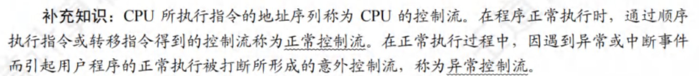

# 计算机组成原理

* 明确主存的编址方式：按字节、按半字、还是按字

## 第2章 机器数、浮点数

**计算机标志位**

- 无符号数A与B做差
    - ZF = 1时，说明A = B
    - ZF = 0 & CF=0，A > B
    - CF = 1时，A < B
    

- 有符号数A与B做差
    - OF = SF & ZF = 0，说明A > B
    - OF ≠ SF & ZF = 0，说明A < B
    - ZF = OF = 0 & SF = 1，说明A < B
    

**定点乘法运算**

- 乘积的符号位由两个乘数的符号位异或得到
- 乘积的数值位是两个乘数的绝对值之和（看作无符号数）
- 两个n位无符号数相乘需要n次加法和n次移位运算（类比小学乘法步骤）

**定点除法运算**

- 跟乘法一样，不懂

## 第3章 存储系统

- 主存由RAM和ROM构成，两者统一编制
- 计算机的操作系统保存在硬盘上，所以需要BIOS的引导程序将操作系统引导到主存（RAM）中，而引导程序则固化于ROM中
- **固件**：将程序固化在ROM中组成的部件称为固件，是具有软件特性的硬件，其执行速度快于软件，灵活性优于硬件（操作系统已经实现了部分固化，将软件永恒地存储在ROM中）
- Cache由SRAM组成
- U盘采用Flash存储技术，是ROM的一种，但是不是随机存取的
- 芯片扩展所需片数：子扩展倍数*位扩展倍数
  > 芯片扩展不可能出现位数变小的情况
- 片选信号低电平有效：所有信号经过取交集后，若为0，则信号有效；否则，信号无效

**磁盘**

- RAID是将多个物理盘组成像单个逻辑盘
- **磁盘驱动器**
    - 磁盘地址由柱面号（磁道号）、盘面号（磁头号）、扇区号组成
    - 控制磁头移动到指定的磁道，并发回“寻道结束”信号
    - 控制磁盘片转过指定的扇区，并发回“扇区符合”信号
    - 控制对指定盘面的指定扇区进行数据的读或写操作
- 最小读写单位是**扇区**
- 采用直接存储器存取DMA方式进行输入输出
- 按批处理方式进行一个数据块的读写
- 磁盘存储器和主存交换信息，不能直接和CPU通话
- SSD的读写以页为单位，擦除以块为单位

**DRAM**

- 一次完整的刷新过程需要占用一个存储周期

- 地址线复用：地址线每增加1根，则行地址和列地址各增加1位，容量就提高到原来的4倍

- 对于大小为8192 x 8192 x 8bit的DRAM芯片，其行缓冲为8192 x 8bit，即列数*位平面

- DRAM芯片的刷新，只看DRAM芯片，不看其构成的存储器！！！
    - 构成存储器的所有芯片同时按行刷新，因此只需要看一个DRAM芯片的行数即可
    - 对于异步刷新，其相邻两次刷新信号的时间间隔为`刷新周期 / DRAM芯片行数`
    - 对于集中刷新，其刷新过程中，存储器不能进行读写，且刷新一行用时一个存储周期。故存储器刷新一遍最少用时`存储周期 * DRAM芯片的行数`
    - 刷新也是一个读取的过程，根据读出的内容对相应单元进行重写（**DRAM芯片刷新的原理**）。因此也会与CPU的访存发生冲突，影响到CPU的正常访存（会存在访存死时间）。

- SDRAM（同步DRAM）
    - DRAM芯片与CPU采用异步方式交换数据
    - SDRAM芯片与CPU采用同步方式交换数据
    - DRAM芯片和SDRAM芯片都需要定期刷新
    - SDRAM的行缓冲器（用来缓存指定行中整行的数据）通常用SRAM实现

### 多模块存储器

多模块存储器中，各模块有独立的读/写电路，可以实现并行操作，因此多模块存储器可以进行高速的读/写操作

**低位交叉编址多模块存储器**

- 低位交叉编址多模块存储器中，各单元的地址不连续
- 保证某个模块启动时，其上次操作已经完成（即要求两次启动间隔的时间要>=一个存储周期）---> 模块数 >= 存储周期/总线周期
- 理想情况下，认为存储器在每个总线周期都能给CPU提供一个字，即流水线充分流动起来后，每隔总线周期后都能完成一个字的读/写
- 对于n体多模块低位交叉存储器，若单个存储体的准备一个数据的时间（访问时间、存取时间）为T，则理想情况下（流水线充分流动后），平均每个数据的准备时间为T/n

**单体多字存储器**

- 主要解决访存速度的问题，可以提高存储器的吞吐率

- 在单体多字存储器中，每个存储单元存储多个字，当指令和数据连续存放，且没有过多的跳转指令时，单体多字存储器能有效提高主存的读写速度

### Cache

- cache完全由硬件实现
- cache替换时的单位是块（cache与主存是以块为单位进行数据交换的）
- cache地址空间和主存地址空间相互独立，通过**地址映射**把主存地址空间映射到cache地址空间
- 指令cache比数据cache有更好的空间局部性（指令大部分情况下都是顺序存放、顺序执行的）
- cache不命中时，先访问cache，再访问内存
- cache写不命中时
    - 回写法的写主存操作次数少于全写法
    - 写分配法：加载低一层的块到cache中，更新cache块（搭配回写法）
      - 写操作比较密集，采用回写法速度快，更适合访问密集型的应用
    - 非写分配法：避开cache，直接把字写到主存中（搭配全写法）
      - 全写法能够随时保持主存数据的一致性，适合安全性要求高的应用
- 对于由高速缓存、主存、硬盘构成的三级存储结构，CPU直接根据**主存物理地址**进行访问
  > 只有在虚拟存储器中，CPU发出的才是虚拟地址；CPU不能直接访问磁盘
- `第2593号存储单元`表示存储地址（主存地址）是2593
- 主存块或大或小，都会使cache的命中率降低

### 虚存

- 程序局部性原理的基本含义是指，在程序的执行过程中，程序对主存的访问是不均匀的
- 虚拟内存需要通过**操作系统**实现地址映射，因此虚存对系统程序员不是透明的；而应用程序员写程序使用的就是虚拟地址（逻辑地址），因此对其是透明的
- 虚拟存储器中，程序正在执行时，由**操作系统**完成地址映射，但需要一些硬件支持（由CPU中的MMU进行逻辑地址到物理地址的转换。转换过程中，MMU需要查对应的页表项，根据页表项的装入位（有效位）是否为1，来确定是否发生缺页
- 页表不命中，表示该页面没有调入主存，而cache是页面的副本，因此cache也一定不命中
- cache缺失处理由硬件完成；TLB缺失处理既可以由硬件完成也可以由软件完成
- 虚拟存储器的实际容量<=主存和辅存的容量之和
- 页表只能由操作系统和硬件进行访问，虚拟存储管理机制对用户**进程**来说是透明的；即用户进程不能访问其页表
- 分段方式对低级语言程序员和编译器来说是不透明的（低级语言程序员需要使用段号来编程，编译器需要通过段号来链接）
- 
- cache和TLB都由SRAM组成

## 第4章 指令系统

??? note "机器字长32位，容量为16MB的存储器，CPU按半字寻址，寻址单元数为"
    问寻址单元数，不看虚拟内存，看物理内存  
    16MB，按2B寻址，则有$2^{23}$个存储单元，每个存储单元中存放2B    

!!! note "指令构成"
    操作码OP + （寻址方式） + 地址码

- 主存地址非负
- 零地址指令：空操作指令、停机指令、堆栈指令
- ISA（指令集体系结构）：是低级语言程序员能够看到的，对其不透明
    - 规定了基本数据类型、指令集、寄存器（个数和位数）、寻址模式、存储体系、中断和异常处理、外部I/O
    - 规定了执行每条指令时所需要的操作码、操作数、寻址方式、指令的功能和效果、指令格式和类型
- 控制信号是由控制单元生成的
- 对于堆栈指令的访存次数
    - 若软堆栈（堆栈区由内存实现），对于双目运算符需要访问4次内存：取指令、取操作数1、取操作数2、存结果
    - 若硬堆栈（堆栈区由寄存器实现），则只需要在取指令时访问1次内存即可
    - 
- 操作数的有效地址既可能是物理地址，也可能是虚拟地址。若采用虚拟存储机制，则有效地址就是虚拟地址，否则，有效地址就是物理地址

- 寄存器寻址可以缩短指令中某个地址段的位数
- 偏移寻址
    - 基址寻址：逻辑地址->物理地址
    - 变址寻址：数组循环
    - 相对寻址：程序浮动、相对转移
    > 相对寻址中，指令提供的相对地址实际上是**以下一条指令在内存中的首地址为基准位置的偏移量**

- 移位指令
> 通常用一个`桶型移位器`实现一次移动多位的功能
> 对于移位操作，比如算术左移，可以将高位移出的那一位移入进位标志位。这样，可以通过判断符号标志和CF位是否相等来判断是否发生了溢出。同理，其他的移位操作也可以采用该方法。    
> >> 由于左移，数值扩大，可能产生溢出，因此，有些机器的左移指令也会使用OF溢出标
> 
> 半字交换：寄存器的前半部分和后半部分内容进行交换

- 跳步指令：跳过下一条指令
- 对于逻辑运算指令，通常只有零标志ZF才有意义

| 寻址方式       | 有效地址  | 访存次数 |
| -------------- | --------- | -------- |
| 立即寻址       | A即操作数 | 0        |
| 直接寻址       | EA=A      | 1        |
| 间接寻址       | EA=(A)    | 2        |
| 寄存器寻址     | EA=R      | 0        |
| 寄存器间接寻址 | EA=(R)    | 1        |
| 相对寻址       | EA=(PC)+A | 1        |
| 基址寻址       | EA=(BR)+A | 1        |
| 变址寻址       | EA=(IX)+A | 1        |

- CISC
    - 微程序控制
    - 指令种类多，难以编译优化，但是便于汇编程序员编程
    - 寄存器数量少
    - 指令多
- RICS
    - 硬布线控制器（组合逻辑控制）
    - 优化的编译程序
    - 寄存器数量多
    - 只有LOAD/STORE可以访问存储器，其余指令的操作均在寄存器间进行
    - 指令种类少
    - 流水线技术
    - RISC不可能兼容CISC

**MIPS**

- MIPS是按字节编址，指令字长32位。因此其一条指令占用4个字节（即4个存储单元），说明每一条指令的指令地址均为4的倍数。而二进制中4的倍数的二进制表示中，32位中的**最后两位始终为0**。
    > 因此处理器在计算下一条指令的地址时，只需要将当前地址的非00位加1即可
        >> 若为转移指令时，则对偏移量进行符号扩展，再乘以指令长度（指令长度为4字节），即新地址=当前地址非00位+1+偏移量符号扩展（此时不需要乘4了，因为已经没有加入最后两位，相当于已经达到了左移乘4的效果了）
    
    > 顺序执行时，PC<31:2> <--- PC<31:2> + 1
      转移执行时，PC<31:2> <--- PC<31:2> + 1 + 偏移量符号扩展
      取指令时，PC<31:2> <--- PC<31:2> 拼上 "00"
      无条件转移时（含有26位的目标地址），PC<31:2> <--- PC<31:28> 拼上 目标地址<25:0> 拼上"00"
    
    > 指令地址中最后两位始终为0，无需在指令中显示给出，只要在实现指令功能的数据通路中具有添加00的电路即可（地址压缩，省略传输这两位）

    > 对齐检查：如果指令地址的最后两位不是00，说明这个地址是错误的，或指令未对齐

- 每条指令只能处理一件事情，比如：a = i * 4 + 3
    > 要分两条指令进行
        >> 首先进行乘法（或移位或若干次加法）指令计算i * 4；再执行加法指令a = i * 4 + 3，得到结果

- **对数组进行循环**时，要先得到对应数组元素的地址（①）；再对该地址访存，获得对应的数据元素值（②）
    > 对于获得数组元素地址，计算方法为`基址 + 偏移量`，其中偏移量还要乘以编址单位

    > 执行完循环体内最后一条指令后，要执行一条无条件转移指令，转移到循环开始。（跳出循环在该方法中设置在了循环开始，即进行条件判断时设置的）

- **过程调用**

    1. 过程调用指令：
        - 保存下一条指令地址（返回地址）到寄存器；
        - 跳转到指定地址处执行过程（函数）
    
    2. 返回指令是无条件转移指令，跳转到返回地址

    3. **过程调用过程**
        
        - 被调用程序Q先将其结果返回，再将控制权转交给调用程序P
        - 调用过程Q：
            - 计算（调用过程先使用临时寄存器，用完了再考虑使用保存寄存器（需要在栈帧中保存调用程序的现场））。若不需要使用保存寄存器，即无需保存任何寄存器的值（若同时也不需要分配任何局部变量，则栈帧为空）
            - 设置栈帧指针fp（当前栈指针sp+栈帧大小）
                - 返回地址存储在栈帧指针fp的上面一个单元
            - 返回结果
            - 清理释放Q所使用的资源（局部变量，存储在栈中），同样也就把P的环境恢复了（将P用到的寄存器中的值都恢复了）
            - 释放栈帧（即将栈指针sp指向栈帧指针fp）
            - 执行跳转指令，跳转到返回地址，返回控制权到P
        - 若被调用程序需要使用调用程序P所使用的保存寄存器，则需要将保存寄存器中的值保存到被调用过程的栈中，才能使用，并且在返回P之前恢复保存寄存器的值；P在临时寄存器中的值由P自行保存，Q不需对其进行保存
        - 若栈帧为空（无需保存任何寄存器的值、不需要分配任何局部变量或者分配了存储在寄存器的局部变量，即局部变量未存储在栈中），同时也不再调用其他过程，则无需保存返回地址和帧指针
        - 若栈帧不空，则需要保存返回地址和栈帧指针

## 第5章 CPU

- 单总线数据通路和多总线数据通路都不适合指令流水线
    > 单总线系统的串行特性与流水线的并行本质相矛盾。
    
    > 多总线系统虽然提供了一定的并行能力,但复杂度和成本的增加可能抵消了性能gains。

    > 对于指令流水线，可以考虑指令存储器和数据存储器分离，并且各自使用独立的总线

- 控制器由PC、IR、MAR、MDR、指令译码器、时序电路和微操作信号发生器等组成
- PSW属于运算器，PSW包括两个部分，一是状态标志（如CF、ZF等）；二是控制标志（如中断标志、陷阱标志）
    - 不许要像通用寄存器那样，对标志寄存器进行编号
    - 不能在指令中直接指定编号来访问
    - 用户不能直接访问或修改它的值，对用户不透明

**数据通路的基本结构**

- 数据通路基本结构分为总线结构和专用数据通路结构。其中总线结构又分为单总线结构、双总线结构、多总线结构

- 组合逻辑单元：加法器(Adder)、算数逻辑部件（ALU）、三态门、译码器（Decoder）、多路选择器（MUX）
    > 组合逻辑单元不受时钟信号控制

- 时序逻辑单元：**通用寄存器组**（也叫寄存器堆）、PC、状态/移位/暂存/锁存寄存器
    > 时序逻辑单元受时钟信号控制
    
    > 对于通用寄存器组（也叫寄存器堆），读操作是组合逻辑操作，不受时钟信号的控制；写操作是时序逻辑操作，受到时钟信号控制

**数据通路和控制部件**

- CPU由数据通路和控制部件组成

- 数据通路：ALU、通用寄存器、状态寄存器、Cache、MMU、浮点运算逻辑、异常和中断处理逻辑
    > 数据通路中专门进行数据运算的部件称为执行部件或功能部件

- 控制部件：数据通路由控制部件进行控制

**ALU**

- 在多总线数据通路中，若将一个寄存器内容传送到另一个寄存器，则需要通过ALU来完成（ALU的直送功能）

- 多总线结构中，临时寄存器Y和Z都可以不要：这是因为ALU的输入通路分别为总线A和总线B，输出通路为总线C，三者无冲突；而单总线通路中，若缺少了Y或Z，则ALU的输入操作数和输出结果中必定有两个数据同时被送到同一个总线上，因而会发生总线数据冲突

**单周期处理器**

单周期处理器时钟周期取最复杂指令所用的指令周期，远远大于许多指令实际的执行时间，因而效率低下

**多周期处理器**

把每条指令的执行分为若干阶段，每个阶段执行用一个时钟周期，各阶段最多一次访存/寄存器读写/ALU操作

时钟周期宽度通常取一次存储器读写时间

- CPU周期=机器周期，是指指令执行中每步操作所需的时间
- 取指（取指令字）操作结束后，PC中存放的是下一条指令的地址
- 取指操作是控制器自动进行的，控制器并不需要获得相应的指令，并不需要在操作码的控制下完成
- 不同长度的指令，其取指操作可能是不同的。如，双字指令、三字指令与单字指令的取指操作是不同的
- 在指令执行完成后，处理器会判断是否出现了中断请求，只有出现了中断请求时，才会进入中断周期
- 多周期CPU，执行各条指令的机器周期数可变，各机器周期的长度可变
- 指令字长一般取字节或存储字长的*整数倍*，若指令字长等于存储字长的2倍，则需要2次访存，取指周期等于机器周期的2倍
- **单周期CPU的时钟周期取决于最复杂指令的执行时间**，通常比多周期CPU的时钟周期长
- 在一条指令执行过程中，单周期CPU中每个控制信号取值一直不变（一个时钟周期内，控制信号不会发生变化），每个部件只能使用1次；而多周期CPU中的控制信号可能会发生改变，同一个部件可使用多次
- 
- 采用CPU内部总线方式的数据通路：结构简单、容易实现、性能低、存在较多冲突；不采用CPU内部总线方式的数据通路：结构复杂，硬件量大，不易实现，性能高，不存在冲突

微指令

??? note "辨析：处理器总是在每来一个时钟脉冲信号时，就开始执行一条新的指令"
    对于单周期CPU，一个指令周期就是一个时钟周期，每个时钟周期执行一条新指令；对于多周期CPU，每个指令周期（含若干时钟周期）执行一条新指令；对于流水线CPU，只有在理想情况下才能实现每个时钟周期执行一条新指令

- 微操作控制信号的形成主要与*指令译码信号和时钟信号*有关
- 微程序入口地址是由机器指令的操作码字段形成的
- 一条水平型微指令能定义并执行几种**并行**的基本操作；一条垂直型微指令只能定义并执行一种基本操作
- 垂直型微指令是一种微指令格式，相比于水平型微指令，**并不是指令格式垂直表示**，而是指在微指令中设置了微操作码字段，结构类似于机器指令格式；控制信号经过编码产生是一种控制字段的编码方法，属于水平型微指令，强调并行控制功能
- **微处理器根处理器是否采用微程序控制器无关**
- uPC无法取代PC
- 断定法是在微指令（的后继地址字段）中直接明确指出下一条微指令的地址，相当于每一条都是转移微指令，后继地址字段可由微程序设计者指定，或根据微指令所规定的转移控制字段控制产生
- 字段直接编码还要留出1个状态，表示不发出任何微命令
- 控制存储器由ROM组成，只读不写

**中断和异常**

- 自陷是人为设定的特殊中断机制，不是出现了某种异常情况而产生的
- 指令执行结果出现异常而引起的中断是*故障*
- 终止异常（指令执行过程出现了使计算机无法继续执行的硬件故障，只能终止，严重时甚至要调出中断服务程序来重启系统），例如，控制器出错、存储器校验错、总线错误等，不由特定指令产生，而是随机发生的
- 进程上下文切换和异常/中断响应，都会产生异常控制流
- 
- 进程上下文切换由操作系统内核程序实现；异常/中断的响应由硬件实现；响应异常/中断请求后，CPU执行的是异常/中断服务程序，是操作系统的内核程序
- 自陷处理完成后返回到陷阱指令的下一条指令执行（自陷指令包括系统调用、trap指令等）
- 外部中断后，返回到下一条指令执行

流水线技术

??? note "辨析：前面的分支指令和后面的ALU运算指令之间一定不会发生数据冒险" 
    若ALU运算指令的某个操作数是分支指令转移后的执行结果，就会发生数据冒险。  
    例如：分支指令`slt r1, r2, r3`，含义为若(r2)<(r3)，则r1=1；否则r1=0。如果下一条ALU运算指令需要用到r1的值，就会发生数据相关
- 流水线CPU是时间并行技术（在相同的时间段内，充分利用不同的设备。在多个功能部件在时间上相互错开
- 空间并行，即资源重复，多个功能部件共同执行同一任务的不同部分。如多处理机系统
- **指令译码得到的控制信号**需要通过流水段寄存器传递到下一个流水段，需要在随后的时钟周期内被使用
- 在某个时钟周期内，不同的流水段受不同指令的控制信号控制，执行不同指令的不同功能段
- 流水段寄存器对用户是透明的，不可以访问
- **取指令阶段和指令译码阶段不需要控制信号的控制**，是公共流水段，且控制信号是指令译码后才产生的
- 在流水线数据通路中中
    - 没有阻塞时，PC的值在每个时钟周期都会改变
    - 控制信号仅作用在功能部件上，时钟信号不仅作用在流水段寄存器上，还作用于PC、寄存器、存储器等状态元件上
- 结构冒险是指同时有多条指令使用同一个资源
    - 避免方法：每给指令在相同流水段使用相同部件；重复设置功能部件
- 数据相关处理：加阻塞；旁路（转发）技术（旁路转发不能解决load-use数据冒险）
- load-use数据冒险是指下一条指令需要用到本条指令的访存结果，会引起一个或多个时钟周期的阻塞
- 分支预测技术只能用来处理控制冒险
    - 静态预测技术假定分支总是发生或总是不发生，每次预测结果都是一样的
    - 动态预测技术根据之前的条件跳转的比较结果来预测，基于*局部性原理*，其预测成功率高于静态
    - 预测错误，已被错误放入流水线执行的指令必须被舍弃
- 超标量流水线指运算操作、取指、译码、访存、写回等操作。让CPU在同一时间内执行多条指令
- 有利于实现指令流水线的系统
    - 指令格式规整
    - 指令和数据按边界对齐
    - 只有LOAD/STORE指令才能对操作数进行存储访问
- IF：取指令；ID：译码、取操作数；EX：运算；M：访存；WB：写回
- 若两条指令之间存在数据相关，且没有旁路技术，则下一条指令必须在上一条指令的WB段后才能开始ID段（译码/取数）
- 
- 转移指令
    - **直接转移指令**在EX段确定转移的目标地址（好像也在EX段直接更新了PC的值，确定了下一条指令的地址），会发生控制冒险；目标地址直接包含在指令中，或可以直接在EX段计算出来
    - 流水段个数越多，意味着在转移结果确定前，可能取出更多的错误指令，从而需要更多的时间和资源来处理错误指令
    - **条件转移指令**在EX段设置条件码，在MEM段控制是否将转移地址送到PC（需要等待条件判断的结果，同时给处理器更多时间来处理分支预测），这之后才开始根据PC内容取指令。因此条件转移指令的下一条指令取指令阶段IF必须与条件转移指令的WB段对齐

**硬件多线程**

硬件多线程为每个线程提供了单独的通用寄存器组、单独的PC，进程切换只需要选中寄存器、PC

1. 细粒度多线程：每个线程执行的指令是不相关的，可以乱序执行。处理器能之每个时钟周期切换线程`指令级并行`

2. 粗粒度多线程：可以连续几个时钟周期都执行同一线程的指令序列，仅当前线程出现了较大开销的阻塞时，才切换线程（如Cache缺失），线程切换占用一个时钟周期。新线程的指令在执行前需要重载流水线，开销比细粒度要大 `指令级并行`

3. 同时多线程：一个时钟周期中可以执行多个不同线程的多条指令 `线程级并行`

****

## 第6章 总线

## 第7章 I/O

