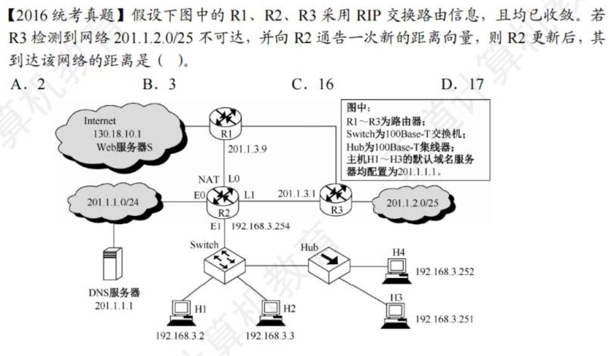

# 计算机网络

## 第1章 计算机网络体系

- 区分**传输时延**和**传播时延**：传播时延与传播介质、通信双方距离有关
    - 电路交换：传输时延小，但是不能保证数据无差错的传送
    - 报文交换和分组交换：传输时延大；分组交换的传输时延又小于报文交换
- 注意单位：B和b的转换
- 主机A给主机B发送数据的最高理论速率取决于：链路带宽、主机A的网卡速率、主机B的网卡速率中的最小者，是数据传输的瓶颈
- 网络协议三要素
    - 语法：数据与控制信息的格式（如何讲：传输数据的格式）
    > 例如：IPv4数据报的首部格式、TCP报文段格式
    - 语义：需要发出何种控制信息、完成何种动作、做出何种应答（讲什么：所要完成的功能）
    > 例如：TCP连接的三次握手时所执行的操作
    - 时序：执行各种操作的条件、时序关系等，即事件实现顺序的说明（信息交流的次序）
    > 例如：TCP连接的三次握手的时序关系
- 物理层只负责透明传输比特，不涉及流量控制的功能
- 网络层和传输层才有拥塞控制功能
- 数据链路层向上提供可靠的传输服务，保证了数据正确的顺序和完整性
- 会话层使用**检验点**使通信会话在通信失效时从检验点继续恢复通信，实现数据同步
- 表示层负责数据格式转换、数据加密解密
- 为网络层实体提供数据发送和接收功能及过程的是数据链路层
  > 下一层为上一层提供服务
- 各层的SAP说明（N层的SAP是N+1层可以访问N层服务的地方
    - 数据链路层的SAP是帧的“类型”字段（由LLC子层实现）
    - 网络层的SAP是IP数据报的“协议”字段
    - 传输层的SAP是“端口号”字段
    - 应用层的SAP是用户接口

## 物理层

- $比特率 = 波特率 * log_2 n$，n表示码元的不同的离散值
- 曼彻斯特编码的效率是50%
  > 波特率 = 比特率 * 2
- 每秒采样$N$次，表示频率是$N$ HZ。
    - 采样定理：采样率需要大于等于有效信号最高频率或其带宽的2倍
    - 波特率的上限是2W（无噪声下，奈奎斯特定理）
    - 若每秒采样次数大于2W，则该信息无意义，不能用于计算
    - 若给定的未给频率（即$W$），只给出采样率，则最大数据传输速率为$采样率*log_2 V$
      > 是否是因为`采样率=2W`？？？
    - 若只给定频率，未说明是否无噪声，但是又给出编码信息，则利用**采样率至少是最大频率的2倍**，计算最大数据传输速率为$采样率*log_2 V$
- 编码
    - RN：归零编码
    - NRZ：非归零编码
    - NRZI：反向非归零编码（翻转为0，不变为1
- 香农定理：$Wlog_2 (1+S/N)$，其中$分贝数=10log_{10} S/N$
- 题中同时出现奈奎斯特定理、香农定理，则数据传输速率取其最小值
    - 若给出的**码元数与比特数之间的关系**、**信噪比**，则同时受到二者约束
    - ??? success "二进制信号在信噪比为127:1的4kHZ信道上传输，最大数据传输速率可以达到多少？"
          
        **分析**：由于给定了`二进制信号`，则说明有两个电平的变化，所用编码为1bit，即$log_2 V=1$，由曼彻斯特编码$2Wlog_2 V$可知，数据传输率为8kb/s；又由于给定`信噪比`，则由香农定理，有$Wlog_2 (1+S/N)$，其中$S/N=127$，计算得28kb/s。取最小值，为8kb/s
??? note "补充"
    
    1路信号的最大频率为1kHz，则采样率至少是2kHz，同时编码为4位二进制数，因此1路最大数据传输率为$2k*4=8kb/s$。又由于**复用的每条支路的数字信号速率要相等**，而另外7路数字信号的速率均低于8kb/s，所以它们要采用脉冲填充方式，将数据率提高到8kb/s。然后复用这8路信号。复用线路需要的最小通信能力是$8kb/s*8=64kb/s$

- 转发器是物理层设备，只具有放大信号的功能
- 两个网段在物理层进行互连时，要求：**数据传输速率要相同**，但是数据链路层协议可以不同（前提是不进行链路层是互联互通。如果要达到在链路层的互联互通，则要求数据传输速率和数据链路层协议都要相同）
    - 

## 数据链路层

- 数据链路层的功能：组帧（帧定界）、帧在物理信道的传输（处理差错传输）（差错检验）、数据链路的建立维护和释放（链路管理）、帧的传输速率（流量控制）、提供结点间的可靠传输、控制对物理传输介质的访问（由介质访问控制MAC子层完成）
  > 为终端结点隐藏物理传输细节是物理层的功能
- 为避免传输过程帧丢失，采用*计时器超时重发*；为保证接收方不会收到重复帧，采用*帧编号机制*

**停止等待、BGN、SR协议**

- 当源主机和目的主机之间的距离很远，且数据传输速率很高时，停止等待协议的效率变得非常低
    - $信道利用率=\frac{发送数据所需的时间（大于等于一个数据帧）（准确来讲分子应该是发送窗口大小*一个数据帧的发送时间）}{发送周期}$，其中**发送周期=发送一个数据帧所需的时间+往返时延+确认帧的发送时延**（即从开始发送数据帧到接收到第一个数据帧的确认帧为止）。因此，当数据传输率很高，则数据的发送时间就很短，而源主机和目的主机的距离很远时，往返时延就很高，最终导致信道利用率很低
    - 由公式可知，数据帧长越大，信道利用率越高
- 若连续出现了相同序号的数据帧，则发送方超时重传；若连续出现了相同序号的确认帧，则接收方收到了重复帧
- 停止等待协议，每发送完一个帧，就要停下来等待接收方发回确认帧，收到确认帧才能发送下一帧，经过超时时间后未收到ACK帧则自动重传
- SR协议中，接收方对正确收到的每个数据帧单独进行确认，不要求收到的数据帧是有序的。只要没有发生超时，发送方就不进行重传
- GBN协议中，接收方采用累计确认的方式，接收方检测到某个帧出错时，会简单丢弃该帧及所有的后续帧，发送方超时后，需要重传该数据帧及所有的后续帧
- 滑动窗口协议中，序列号个数要大于等于窗口数（**发送窗口+接收窗口**）
- 对于窗口大小为n的滑动窗口，最多可以有$n-1$帧已发送但是没有确认
  - 对于**窗口大小**为n的滑动窗口，其发送窗口最大为n-1，所以最多可以有n-1帧已发送但是没有确认
  - 确认**窗口大小**时，时刻牢记**窗口大小=发送窗口+接收窗口**，以此计算序列号
- SR协议中，对窗口大小的规定
    - $发送窗口\geq  接收窗口$
    - $发送窗口+接收窗口\leq 2^n$
    - $接收窗口\leq 2^{n-1}$
    - 发送窗口的大小可以大于$2^{n-1}$
    > 之前一直是搞错的状态
- 为了使信道利用率达到最大（100%），需要让发送方在发送周期内持续发送数据帧，直到发送方接收到所发的第一个数据帧的确认帧为止
    - BGN和SR协议都可能达到100%，只要发送窗口足够大
    - **最大的数据传输率一定是小于等于信道带宽的**
- 简单来讲，信道利用率=$\frac{发送窗口大小*发送一个数据帧的时间}{一个数据帧的发送周期}$

**介质访问控制、最短帧长**

- TDM（时分复用技术）：在发送端将不同用户的信号相互交织在不同的时间片内，沿同一个信道传输，在接收端再将各个时间片内的信号提取出来，还原为原始信号。要满足：
    - 介质的位速率（每秒传输的二进制位数）大于单个信号的位速率
    - 介质的带宽大于结合信和的总带宽
- FDM适合传输模拟信号、TDM适合传输数字信号
- 划分信道的方法
    - 静态：TDM、FDM、CDM...（不发生冲突）
    - 动态划分信道：
        - CSMA、CSMA/CD（可能发生冲突）
        - 轮询访问控制（不发生冲突）

**CSMA/CD**

- 争用期为$2\delta$
- 最小帧长=$2\delta*数据传输速率$
- 保证发送帧的时间>=争用期的时间
- 二进制指数退避算法
    1. 取$r=0至2^{min(k, 10)}-1$之间的随机数
    > 其中k表示取已经发生冲突的次数为k，或将进行第k次重传
    2. 重传时间为$2\delta t$
    3. 若超过16次冲突，则丢弃
- 减少线路中中继器的数量会降低传播时延（传播时延变小了）
    - 因为信号在中继器会有时间损耗（信号处理时延、排队时延）
- CSMA/CD和CSMA/CA不能同时收发，无法在发送时接收信号

**CSMA/CA**

- CSMA/CA检测到信道空闲后，还必须等待DIFS的时间才能开始发送
- CSMA/CA不会进行冲突检测
- 预约信道不是CSMA/CA的强制规定，可以不预约信道
- 发送后等待确认帧，在规定时间内未收到确认帧就重传

**令牌环局域网**

- 每个结点都可以在一定的时间内（持有令牌的时间）获得发送数据的权限，并非无限制的持有令牌
- 在令牌传递过程中，没有数据要发送的结点收到令牌后将立刻传递下去，而不能持有
- 网络空闲时，环路中只有令牌帧在循环传递；若某个站点要发送数据，必须等待令牌到来，修改令牌中的标志位，附加数据，将令牌变为一个数据帧

**局域网**

- 以太网是无连接、无确认的（无需对广播进行确认）
- 局域网（以太网）仅工作在物理层和数据链路层；广域网工作在物理层、数据链路层、网络层
- 以太网处于半双工时，才采用CSMA/CD协议；10吉比特以太网只工作在全双工（不适用CSMA/CD协议）；速率<=1Gb/s的以太网可工作在半双工或全双工下
- 以太网MAC帧的数据部分长度在46B~1500B之间不需要填充，低于46B才需要填充
- **MAC子层**控制和协调所有站点对共享介质的访问、组帧、拆帧、比特差错检测、寻址
- **LLC子层**建立和释放数据链路层的逻辑连接、提供与高层的接口、差错控制、帧加序号
- 设置VLAN后，两台主机之间的通信也不一定使用802.1Q帧
    - 当两台主机，各自位于一个交换机一端时，且这两个主机属于同一个VLAN，则交换机与交换机之间传送的帧是802.1Q帧，到达目的交换机，目的交换机在向目的主机转发帧之前，要拿走已经插入的VLAN标签
- 802.11帧的地址分布
    - 地址1：目的地址
    - 地址2：源地址
    - 地址3：剩下的一个地址

**广域网**

- PPP协议是面向字节的，所有帧长都是整数个字节。为实现透明传输，使用字符填充
- PPP两端可以运行不同的网络层协议
- PPP协议由LCP（链路控制协议）、NCP（网络控制协议）和一个将IP数据报封装到串行链路的方法
- IP数据报在PPP帧中就是其信息部分，这个信息部分的长度受到最大传送单元MTU的限制
- PPP协议是数据链路层协议
- PPP协议是面向连接的有连接不可靠服务
- PPP是全双工的
- PPP是点对点的，不是总线型，无需使用CSMA/CD协议，也就没有最短帧长的限制
    - 因此PPP帧中信息部分（即IP数据报）的长度范围为0~1500B
- 交换机能在全双工方式下支持多对结点同时通信
- 半双工的交换机，有24个10Mb/s的接口，其总容量为24/2*10
- 全双工的交换机，有24个10Mb/s的接口，其总容量为24*10
- 当一个局域网中80%的通信量在本局域网中进行，相对于集线器，使用交换机能够将不同网段的通信隔开，可以提高网络性能
- 当以太网的某个接口收到帧，且在表中未能找到目的MAC地址，则该帧从除了本接口的其他所有接口发出去
- 若一个接口所在的网段内，机器B的地址已经登记在了交换机中，发送帧的机器A向同一网段（仍是该接口所连的网段）的机器B发送帧，通过广播，帧给了B。但是当帧到达交换机时，由于其目的地址就是该接口，于是交换机仅登记机器A在这个接口，然后丢弃这个帧
- 交换机直通交换只检查帧的目的地址（6B）

## 网络层

- 路由器连接的异构网络是指数据链路层和物理层均不同 
- 路由器互连的多个局域网的结构中，要求每个局域网在物理层、数据链路层、网络层的协议都可以不同，而网络层以上的高层协议必须相同（使用特定的路由器连接IPv4与IPv6的网络，就是典型的网络层协议不同而实现互连的例子）
- 路由器转发一个分组的过程
- 报文交换
    - 数据单元是报文（大小不固定）
    - 报文经过中间结点的接收、存储和转发时间较长而且不固定，不能用于实时通信环境（语音、视频等）
- 电路交换不具备差错控制能力
- 分组交换（对每个分组的最大长度有规定）分为数据报和虚电路两种。只要是分组交换，都具有存储转发的功能
    - 数据报
        - 无连接不可靠服务，通过高层协议确保传输的可靠性
        - 同一报文中的分组可以由不同的传输路径通过通信子网
        - 每个分组都必须携带源地址和目的地址
        - 适用于出错率很高的系统
    - 虚电路
        - 面向连接（逻辑连接，因此不需要为每条虚电路分配带宽）的可靠服务，本身就可以实现差错控制，保证数据的可靠性和有序性
        - 分组仅在连接建立时才需要携带完整的源地址和目的地址，之后的每个分组只需要携带这条虚电路的标号即可
        - 多站点同时使用一段物理链路实现虚电路交换，不会产生冲突（每个分组都有虚电路号来标识所属的虚电路）
        - 虚电路上同一个会话的数据分组所走的路径是固定的
        - 属于同一条虚电路的分组，根据该分组的相同虚电路标识，按照同一路由转发，保证分组的有序到达（分组中携带虚电路标识）
        - 一旦虚电路某个结点出故障，必须重新建立一条虚电路
        - 虚电路的连接包括永久性虚电路（不需要建立时间，提前定义好的）、交换型虚电路（会话结束就释放连接）
        - 对于出错率很高的系统，容易出现结点故障
- SDN（软件定义网络）：路由器之间不再相互交换路由信息，而由远程控制器计算出最佳路由
    - 新型网络体系结构
    - 控制与转发功能分离
    - 控制平面集中化
    - 接口开发可编程
    - Openflow协议是控制平面与数据平面之间的接口
    - Openflow交换机基于**流表**（取代路由器中的转发表）来转发分组
    - SDN远程控制器是控制平面的一种实现方式，由一个远程的服务器来计算和分发流表给网络设备，SDN远程控制器不在Openflow交换机中
    - SDN对上层开发者提供的编程接口是北向接口，南向接口负责控制平面和数据平面之间的通信

### IPv4

- IPv4分组头的长度是可变的
- 总长度（1B）、首部长度（4B，取值范围为5~15，最少为20B）、片偏移（8B）
- 协议字段表示使用IP的上层协议，如值为6表示TCP，值为17表示UDP
- 版本字段表示IP的版本，值为4表示IPv4
- 检验和字段
    - 只检查数据报的首部，不包括数据部分
    - 接收方的网络层发现检验和字段出错后，就丢弃收到的数据报，**但是不会发送差错报文**
    - 计算检验和的方法：把数据报的首部划分为许多16比特的序列，用反码算术运算把所有16比特相加后，将得到的和的反码写入检验和字段
- UDP、TCP的校验和的计算才需要加入伪首部；IPv4的检验和字段不需要加入伪首部
- 与分片和重组有关的字段：标识（分片是否属于同一个数据报）、标志（DF、MF）、片偏移（除了最后一个分片，其他**每个分片的数据部分**都是8B的整数倍）
- 片偏移值为100，表示该数据报片的第1个字节是原数据报的第800个字节
- 默认路由：0.0.0.0/0，只有当前面的所有目的网络都不能和分组的目的IP地址匹配时才使用
- A类地址（网络号1~126）前8位为网络位，后24位为主机位；B类地址（网络号128~191）前16位为网络位，后16位为主机位；C类地址（网络号192~223）...；D类地址（网络号224~239）是多播地址
- 127.xx.yy.zz的IP地址都作保留地址，用于回路测试（不用作主机IP地址）
- 划分子网可以增加子网的数量（即把一个大网络划分为许多小网络，是子网划分的结果），子网之间的数据传输需要通过路由器进行，因此减少了广播域的大小。划分子网后，各个子网中主机号全0和全1的地址不能使用，会减少总的主机数量，但是划分子网提高了IP地址的利用率
- 划分子网是在ABC类网络中**主机号的基础**上进行的
    - 一个网段的网络号为198.90.10.0/27，主机号还有5位。若主机号只有1位，则没有可供分配的主机地址（不能全0或全1），因此主机号至少要占2位。子网号最多占用3位。即该地址最多可以划分为8个子网。若当主机号中的5位都表示主机地址，则只有一个子网，该子网最多有30个有效IP地址
- 在网络中，允许一台主机有2个或2个以上的IP地址，若一台主机有2个或2个以上的IP地址，则说明该主机属于2个或2个以上的网络（2个或2个以上不同的网络号）
- CIDR通过路由聚合可以减少路由表数目，提高网络性能。可以把大的网络划分成小的子网。
    - 将网络前缀都相同的IP地址组成CIDR地址块，**网络前缀越短，地址块越大**
    - CIDR聚合不会引入多余地址，是指聚合后的新的CIDR地址块包含了原来未聚合前IP地址可表示的范围，且仅包含这些，而不包含其他地址
        - 如：172.16.166.192/26和172.16.166.128/26这两个IP地址进行聚合，这两个IP地址各包含64个IP地址（主机号有6位），共可表示128个IP地址，经过CIDR聚合后，得到172.16.166.128/25，该聚合后的CIDR地址块中主机号有7位，可表示128个IP地址，恰好是上面两个CIDR块可表示的范围，没有引入多余地址
        - 如：172.16.166.192/26和172.16.166.0/26这两个IP地址进行聚合，这两个IP地址各包含64个IP地址（主机号有6位），共可表示128个IP地址，经过CIDR聚合后，得到172.16.166.0/24，该聚合后的CIDR地址块中主机号有8位，可表示256个IP地址，超过了上面两个CIDR块可表示的范围，引入多余地址
- 若将默认网关设置为其所在子网的广播地址，则导致无法识别网关，而被当作一个广播目标，导致分组无法正确地转发给其他网络，而被分发给本网络的所有主机
- 主机168.16.84.24/20所在子网
    - 最小IP地址为168.16.80.0，最大IP地址为168.16.95.255
    - 最小可分配IP地址为168.16.80.1，最大可分配IP地址为168.16.95.254
- 两台主机之间不能自己进行正常的通信，表示这两个主机处于不同的子网中，此时需要通过网关转发
- 在任何情况下，路由器都不转发目的地址为广播地址的IP分组，这种IP分组仅出现在本地网络中
- NAT保留的3个IP地址段供内部使用，不允许出现在公网上（互联网）
    - A类：**10**.0.0.0~**10**.255.255.255
    - B类：**172.16**.0.0~**172.31**.255.255
    - C类：**192.168.0**.0~**192.168.255**.255
- ARP协议工作原理
- ICMP报文封装在IP数据报中发送，但ICMP仍是网络层协议。IP协议直接为ICMP提供服务
- **TTL的作用机制**
    1. 初始值设置:
        当一个IP数据包被创建时,发送主机会为TTL字段设置一个初始值。这个值通常是64、128或255,具体取决于操作系统的实现。
    2. 每经过一个路由器递减:
        每当**IP分组到达一个路由器**时,该路由器**首先**会将TTL值减1。这是TTL机制的核心部分。
    3. 检查TTL值:    
        **在减1之后,路由器会检查TTL的新值**:
        - 如果TTL大于0,路由器会继续正常转发该分组到下一跳。
        - **如果TTL变为0或负值,路由器会丢弃该分组,并向源主机发送一个ICMP"Time Exceeded"(超时)消息**。
    4. 目的地达到:
        如果分组成功到达目的地,而TTL仍然大于0,则继续减少TTL值。
    5. 防止无限循环:
        TTL机制的主要目的是防止IP分组在网络中无限循环,特别是在出现路由环路的情况下。
    6. 跟踪路由:
        TTL还被用于实现"traceroute"等网络诊断工具,通过逐步增加TTL值来发现路径上的路由器。
    - TTL的减少和检查是在其他处理之前进行的。如果TTL在减1后变为0,分组会被立即丢弃,不会进行任何进一步的处理或转发。
    - 若路由器收到一个TTL值为1的IP数据报，则路由器丢弃该IP数据报并向源主机发送类型为时间超过的ICMP差错报告报文
        - 路由器收到TTL为1的数据报，先将TTL值减1，然后判断是否为0。若为0，则路由器丢弃该IP数据报并向源主机发送类型为时间超过的ICMP差错报告报文
- PING命令使用ICMP的询问报文中的回送请求和回答报文
- 划分网络，可能的最小子网的可分配IP地址数，考虑**变长子网划分方法**（保证有子网的可分配IP地址数尽可能小，即要让其他子网的可分配IP地址数尽可能大）。即最大子网用1位网络号，第二大子网用2位网络号，...，第n大子网用n位网络号（1111...110），第n+1大子网用n位网络号（1111...111）。（将网络划分为n+1个子网）

### IPv6

- 地址是16B
- 减少了首部字段数据，仅包含8个字段
- 支持QoS（有限带宽下，提供端到端的服务质量保证）
- **没有检验和字段**
- 冒号16进制IPv6地址规则
    - 多个连续0，则压缩
    - 每个部分中开头区域的0可以省略，结尾的0不可省略
- 首部长度固定（为40B），不需要首部长度字段；而IPv4首部长度（4B的倍数）可变
- 不允许分片
- IPv4向IPv6过度可以采用双协议栈（同时支持）和隧道技术（将IPv6数据报封装到IPv4数据报的数据部分，使得IPv6数据报可以在IPv4网络的隧道中传输）
- IPv6首部的Hop Limit字段和IPv4首部的TTL字段用于限制数据报在网络中经过的路由器数量

### 路由选择协议

- 功能
    - 获取网络拓扑结构、构建路由表、在网络中更新路由信息、选择到达每个目的网络的最优路径、识别网络的无环通路
- 发现**下一跳的物理地址**是通过ARP协议来实现的
- 静态路由不会估计流量和结构来调整其路由策略，但是其路由选择也是可以改变的，用户可以随时配置路由表
- 动态路由算法需要实时获得网络的状态
- RIP（距离向量协议）规定路由器只向相邻路由器发布路由信息
    - 水平分割用于避免距离-向量路由算法中的无穷计数问题
    - 路径不一定是最短的，但一定是具有最少跳数的
    - 路由器收到相邻路由器发来的路由更新信息时，发现有更好的路由，则直接更新自己的路由表，并向其他相邻路由器广播自己的新路由
    - 路由器发送的信息是整个路由表
    - 坏消息传得慢 
- 链路状态协议（OSPF）
    - 洪泛法
    - 快速收敛
    - 使用Hello分组来保持与其邻居的连接
    - 将链路状态信息（只是路由表的一部分）（传送受影响的路由更新报文）（该路由器的相邻路由器以及所有相邻链路状态）发送给**网络中其他的路由器**
- BGP协议（路径向量协议）
    - 交换的网络可达信息是到达某个网络所经过的路径
- 采用分层路由后，路由器被划分为区域，每个路由器知道如何将分组路由到自所在区域内的目标地址，但是对于其他区域内的结构毫不知情，即不知道如何路由到其他区域
  
| RIP | OSPF | BGP |
| --- | ---- | --- |
| UDP | IP   | TCP |
BGP是外部网关协议，在不同自治系统间交换路由信息，由于网络环境复杂，需要保证可靠传输，因此使用TCP

### 多播

- 用多个单播仿真一个多播所需要的带宽要大于一个多播所需要的带宽
- 设计多播路由时，为了避免路由环路，可以构造多播转发树（既能将多播分组传送到组内的每台主机，又能避免环路）
- 以太网的硬件多播地址构造01-00-5E-0（1bit）+多播IP地址的后23位

### 移动IP

- 移动IP的基本工作过程可以分为代理发现、注册、分组路由、注销，4个阶段
- 结点在使用移动IP进行通信时，归属代理和外部代理之间需要建立一条隧道
- 移动结点到达新的网络后，把移动结点的新的可达信息（转交地址）通知归属代理，归属代理就可以将发往移动结点的分组通过隧道转到转交地址（外部代理），再由外部代理交付给移动节点
- 移动IP的分组路由可以分为单播、广播、多播
- 移动IP给移动主机设置了两个IP地址：主地址（固定）和辅地址（动态改变）
    - 移动主机在原始本地网时，获得的是主地址
    - 当其移动到一个外地网络中时，获得临时的辅地址
    - 当其移动到另一个外地网络或返回本地网络时，辅地址改变或撤销，主地址仍不变
-  
-  

### 设备

- 冲突域：冲突域是指能产生冲突的所有设备的集合，也就是说，如果这些设备同时发送数据，则会发生信号干扰和冲突
- 路由器~~只提供延迟最小~~的最佳路由，错误。路由器使用的最多的参数是传输距离，还有一些其他参数
- 发送站与目的站在同一个网段（子网）时，就使用直接交付；反之，使用间接交付。直接交付在同一网段内，不涉及路由器；而间接交付的的最后一个路由器肯定是直接交付
- 路由表的分组转发部分由输入端口、输出端口、交换结构组成
- 路由器转发分组时（在路由表中以及找到匹配的条目），会根据路由表中的**接口标识符**字段来确定输出端口
    - 输出端口就是路由器的接口，每个接口都有一个标识符，如G0/0。路由表的每个条目都指定一个接口标识符，路由器转发分组时，根据路由表中的接口标识符来确定输出端口

## 传输层

- 传输层面向连接服务的特性是*保证可靠和顺序交付*
- 可靠传输协议中的“可靠”指的是*使用确认机制来确保传输的数据不丢失*
- 熟知端口号是0~1023，登记端口号是1024~49151，客户端使用的端口号是49152~65535
- TCP是面向连接的，提供流量控制和拥塞控制
- 传输层是指进程到进程的通信，是端到端的服务

??? note "数据报应用题"
    一个UDP数据报的数据字段长度为9192B，如果在数据链路层要采用以太网来传送，则应该将其划分为IP数据报片的片数是**7**片  
    **分析：**UDP首部长度为8B，则UDP报文长度为9200B。由于要采用以太网进行传输，而以太网数据部分的最大长度为1500B，则IP数据报的最大长度为1500B，减去IP首部20B，剩余1480B用于存放UDP数据报。因此需要将UDP数据报划分为$\lceil 9200 / 1480 \rceil=7$个IP数据报片。除了最后一个IP数据报长度为1040B，其余每个IP数据报的数据段的长度为1480B。每个IP数据报片的偏移字段依次为0、185、370、555、740、925、1110

??? note 
    某应用层数据大小为200B，传输层使用UDP，网际层使用IP（采用最大首部长度），使用以太网进行传输（不考虑前导码和VLAN），则该应用层数据的传输效率是**96.9%**  
    **分析：**以太网的数据部分是46~1500B，其余部分即MAC帧首部和尾部为18B，网际层IP首部为60B（采用最大首部长度），传输层UDP首部为8B，所以应用层数据的传输效率是$200/(200+18+60+8)=69.9\%$

### TCP

- 6表示TCP
- TCP报文的首部长度为20B
- TCP是字节流、全双工、可靠，不支持广播
- TCP报文头部长度是20~60B（数据偏移字段的单位是4B），其中固定部分为20B。报头长度总是4的倍数个字节
- RST是复位位，其为1时意味着TCP必须释放，通常用于出现严重差错的情况
- 窗口字段，指明了自己的接收窗口的尺寸

**TCP使用选择重传**

- A发送了N个报文段，其中第k个报文段丢失，其余N-1个报文段正确按序到达接收方B
    > 使用GBN时，A需要重传分组k以及所有后继分组k+1,k+2,...,N
    > 而TCP至多只需要重传一个报文段，即报文段k

### UDP

- 17表示UDP
- UDP数据报首部长度固定为8B
- 伪首部在计算检验和时临时添加，不计入UDP长度
- UDP检验和对伪首部、UDP报文头及应用层数据进行检验
- UDP数据报中的长度字段包含首部和数据部分的长度，以字节为单位
- 接收端收到有差错的UDP用户数据时的处理方式是：直接丢弃
- UDP的检验和字段是可选的，若源主机不想计算检验和，则该检验和段应全为0
- 若检验和计算结果为0，则在检验和字段填充1
- 若检验出UDP数据报出错时，可以丢弃，也可以交付给上层，但是需要告诉上层这是错误的数据报
- 使用UDP可以实现多播，给多个客户端服务
- 使用UDP的应用
    - 客户机/服务器
    - 远程调用
    - 实时多媒体应用
- 远程登陆需要依靠一个客户端到服务器的可靠连接，必须保证数据传输的安全性，应该使用TCP

### 拥塞控制

- 客户端使用的端口号仅在客户进程运行时才动态选择的
- 端口号长度为2B
- A收到确认号为100的确认报文段时，表示末字节序号为99的报文段已收到
- TCP的确认号是指明接收方下一次希望收到的报文段的数据部分的第一个字节的编号
- 为了保证数据传输的可靠性，TCP采用了对*报文段*确认的机制
  > TCP是面向字节的，对每个字节都进行编号，但并不是对接收到的每个字节都要发回确认，而是在收到整个报文段后才发回一个确认，确认的序号也是报文段的边界字节序号，并不能只对报文段中的某些字节序号进行确认
- 发送方的发送窗口=min（接收方允许的窗口，发送方根据网络拥堵情况确认的拥塞窗口）
- 拥塞窗口是发送端根据网络拥塞情况确定的窗口大小
- 拥塞控制是为了保护网络；流量控制是为了保护接收方
- 滑动窗口是一种实现流量控制的方法
- TCP滑动窗口协议中，规定重传分组的数量最多可以等于滑动窗口的大小
    - 滑动窗口太小，会产生过多的ACK（因为窗口大，可以累计确认，因此会有更少的ACK）
    - 滑动窗口太大，会由于传送的数据过多而使路由器变得拥挤，导致主机可能丢失分组
- TCP的三次握手：第一个报文是TCP连接请求，第二个报文是对TCP连接请求的确认，第三个报文是对TCP连接请求确认的确认
- seq的值应该与A发给B的报文中的ack值相同
- ack的值代表接收方期待收到对方下一个报文段数据部分的第一个字节的序号
- TCP客户请求断开连接，则从该时刻起，TCP服务器释放该连接的最短时间是1.5RTT
- 在起始时刻，纵轴的值就是最大报文段长度（MSS）？？然后在满开始门限值以前按MSS进行指数增加。一旦超过满开始门限后，就只是一个一个KB加吗？？（根据王道课后题32题）后面注意
    - 但是王道课本上说的是，刚开始时刻也是计为1，慢开始门限后也是一个一个加，只是说单位是MSS
    - 看看教材里面怎么说的
- 

## 应用层

- C/S模型中，一旦连接建立后，服务器就可以响应客户端请求的内容，服务器也能主动发送数据给客户端，用于一些信息的通知，如一些错误的通知
- 客户机是面向用户的、服务器是面向任务的

### 不同应用层协议服务器端使用的端口及传输层协议

指的是服务器端的端口

| 应用层 | FTP控制连接 | FTP数据连接 | DNS | HTTP | SMTP | POP3 |
| ------ | ----------- | ----------- | --- | ---- | ---- | ---- |
| 协议   | TCP         | TCP         | UDP | TCP  | TCP  | TCP  |
| 端口号 | 21          | 20          | 53  | 80   | 25   | 110  |

### DNS

- 域名不区分大小写
- 域名与IP地址、MAC地址、主机均不具有一一对应关系
    - 一台主机可以通过两个网卡连接到两个网络，就具有两个IP地址，每个网卡对应一个MAC地址，显然这两个IP地址可以映射到同一个域名上
    - 多台主机也可以映射到同一个域名上（如负载均衡），一台主机也可以映射到多个域名上（如虚拟主机）
- Internet上提供访问的主机一定要有IP地址，而不一定要有域名
- 域名在不同时间可以解析出不同的IP地址，因此可以由多台服务器来分担负载
- 可以把多个域名指向同一台主机IP地址
- DNS是一个基于C/S模型的联机分布式数据库系统，主要用于域名和IP地址的映射，提供从域名到IP地址或从IP地址到域名的映射服务。域名的解析是由若干域名服务器完成的
- NAT负责从内部IP地址到外部IP地址的映射
- 客户机只需要把域名解析请求发往本地域名服务器，其他事情都由本地域名服务器完成，并把最后结果返回给客户机。所以在域名解析过程中，主机上请求域名解析的软件只需要知道本地域名服务器的IP地址即可
- 每台主机都必须在权限域名服务器处注册登记，权限域名服务器一定能够将其管辖的主机名转换为该主机的IP地址
- 域名向IP地址的转换
    > 形如y.ab.com，客户机为查询得到其IP地址，整个过程共需要发送8个UDP报文段：4个查询报文（第一次是客户机发送，其他三次都是本地域名服务器发送）、4个回答报文
    >> 但是若问到，本地域名服务器时，则当前只发送了3次查询报文

### FTP

- 交互式访问
- FTP是带外传送的协议，带外传送是指控制信息和数据信息通过不同的逻辑信道传送；带内传送是指控制信息和数据信息通过同一个逻辑信道传送（如HTTP）
- 允许客户指明文件类型、格式，允许文件有存储权限
- 一个FTP用户发送了一个LIST命令来获取服务器的文件列表，这时服务器应该通过20端口的数据连接来传输该列表
    - 文件列表是通过数据连接来传输的
- 在异构网络中的任何计算机之间传送文件

- C/S模式：一个服务器，多个客户进程
    - 服务器进程由两个部分组成：主进程（接收新的请求）、若干从属进程（处理单个请求）；二者间并发进行
        - 服务器必须追踪用户在远程目录树上的位置

- 控制连接：在会话期间一直存在

- 数据连接：数据传送完就关闭连接
    - 主动模式：服务器连接到客户端（客户端主动告诉服务器开放哪个端口）
    - 被动模式：客户端连接到服务器（客户端让服务器打开服务器的某个端口，然后客户端连接这个端口）

- 控制信息是外带传送的（分离的控制连接）

### 电子邮件

用户名@邮箱所在主机的域名

**发送邮件过程**

用户->(SMTP、TCP)邮件服务器->(SMTP、TCP)邮件服务器->(POP3或IMAP、TCP)用户代理

用户浏览器->(HTTP、TCP)Gmail/Firefox邮件服务器->(SMTP、TCP)Gmail/Firefox邮件服务器->(HTTP、TCP)用户浏览器

**MIME**

SMTP只能发送7位ASCII码，通过MIME，就可以将非ASCII码转化为ASCII码，再交由SMTP进行传送

**POP3**

- 接收方的邮件服务器中运行POP服务器程序，接收方的用户代理必须允许POP客户程序
- POP3协议在传输层是使用明文来传输密码的，并不对密码进行加密
- 基于ASCII码，若要传输非ASCII码的数据，则要使用MIME将数据格式转换成ASCII码形式

### HTTP

- WWW服务的第一步操作是浏览器对服务器的"请求域名解析"
    - 建立浏览器与服务器之间的连接需要知道服务器的IP地址和端口号（80熟知端口号），而访问站点时浏览器从用户那里得到的是WWW站点的域名，所以浏览器必须首先向DNS请求域名解析，获得服务器的IP地址后，才能请求建立TCP连接
- cookie可以在无状态的HTTP之上建立一个用户会话层
- cookie是存储在用户主机中的文本文件，由服务器产生
- 万维网的每个页面都有唯一的地址，统称为统一资源定位符
- HTTP是无状态的：同一个客户第二次访问同一个网站，服务器的响应与第一次相同
- HTTP是无连接的：通信双方在交换HTTP报文之前不需要先建立HTTP连接
- Connection是指连接方式，Close表示非持续连接、Keep-Alive表示持续连接
- 连接方式
    - 非持续连接（HTTP/1.0）：每请求一个对象就要建立1次TCP连接
    - 持续连接（HTTP/1.1）
        - 非流水线方式：每次请求一个对象，1个RTT    
        - 流水线方式：请求所有对象，近乎1个RTT
- HTTP请求报文中常用的几个方法
    - GET：请求读取由URL标识的信息
    - HEAD：请求读取由URL标识的信息的首部
    - POST：给服务器添加信息（如注释）
    - CONNECT：代理服务器

## 真题

### 2010年

- 有效数据传输率（单位是b/s）
    - =发送周期内发送的数据量 / 发送周期
    - =信道利用率 X 信道带宽（最大数据传输速率）

### 2015年

- 

### 2017年

- GBN协议
    - 接收方是**按序**接收的，不按序则舍弃
    - GBN的窗口序号是循环使用的。比如数据帧的序号字段是3bit，则表示发送窗口+接收窗口<=8，GBN中发送窗口值取7，接收窗口值取1。数据帧刚开始发送时，发送窗口范围是0123456，共7个，即只有0123456落在发送窗口内，窗口7用于接收；**随着发送方不断收到确认，发送窗口也不断向前滑动，为1234567，接收窗口为0**；...
    - GBN协议最大信道利用率的计算，**要把发送窗口的总数考虑进去**

### 2022年

- DHCP协议
    - 应用层协议
    - **全程广播**，**MAC帧地址均为FF-FF-FF-FF**
    - 过程：
        - DHCP客户机**广播**DHCP发现报文（源地址：0.0.0.0、目的地址：255.255.255.255）
        - DHCP服务器收到后，**广播**DHCP提供报文（源地址：DHCP服务器地址、目的地址：255.255.255.255）
        - 客户机广播DHCP请求报文（源地址：0.0.0.0、目的地址：255.255.255.255）
        - 服务器广播DHCP确认报文（源地址：DHCP服务器地址、目的地址：255.255.255.255）

### 2024年

- **注意**问题是`从请求建立连接开始`还是`从开始发送数据时`。这两种情况差了一个连接建立的时间，即一个RTT

### 不熟的知识

- ARP协议，目的地址
- DHCP协议，各种报文、目的地址。比如DHCP Discover报文之类的
- MAC地址位数：6B
- 以太网数据帧的格式
- GBN窗口移动、最大信道利用率
- 确认帧采用捎带确认，表示需要考虑到确认帧传输时延
- 有效数据传输率
- 配置NAT转换表：在目的处所在的内网所对应的NAT路由器中设置
- 分片的数据部分的长度是8B的整数倍
- **数据传输速率的单位是b/s**
- 

